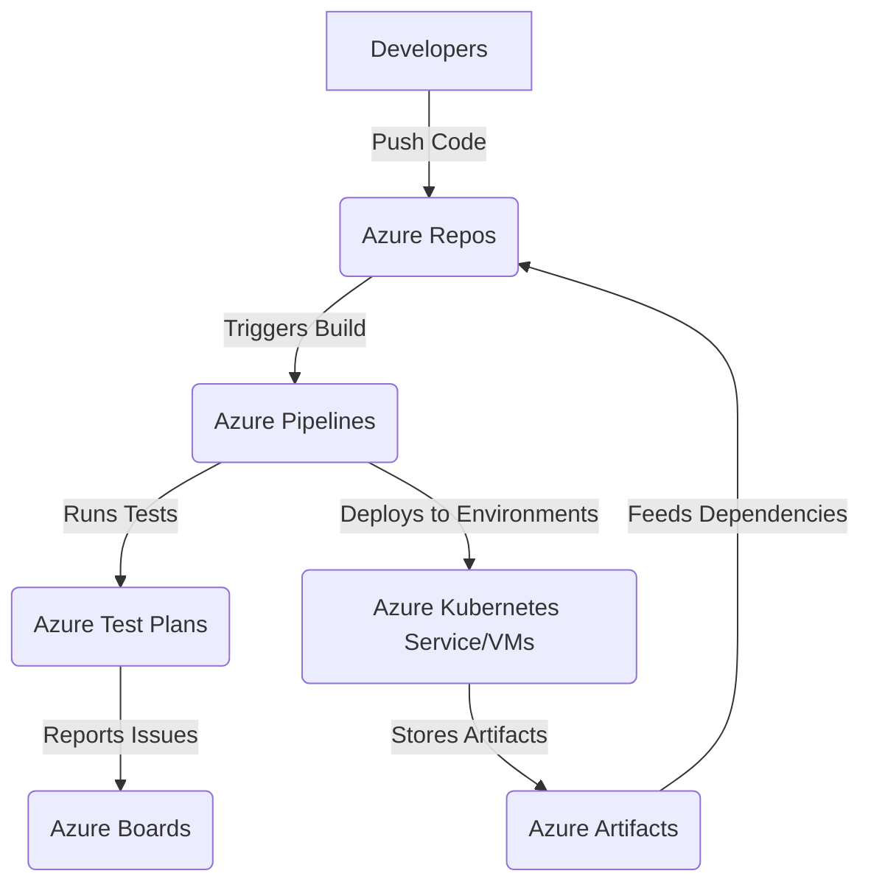

# **Microsoft Azure DevOps Tools and Resources**

### **Table of Contents**

- [**1. Introduction**](#1-introduction)
- [**2. Core Components of Azure DevOps**](#2-core-components-of-azure-devops)
- [**3. Integrating Azure DevOps with Other Tools**](#3-integrating-azure-devops-with-other-tools)
- [**4. Step-by-Step Guide: Setting Up Azure DevOps**](#4-step-by-step-guide-setting-up-azure-devops)
- [**5. Best Practices for Using Azure DevOps**](#5-best-practices-for-using-azure-devops)
- [**6. Real-World Use Cases**](#6-real-world-use-cases)
- [**7. Further Reading**](#7-further-reading)

---

## **1. Introduction**

Azure DevOps is a suite of tools designed to support the entire software development lifecycle. It provides integrated features to manage **code repositories, work tracking, build automation, deployment pipelines, and software quality assurance**.

Azure DevOps scales across teams of all sizes, from small businesses to large enterprises, offering **flexibility, automation, and streamlined collaboration**.

---

## **2. Core Components of Azure DevOps**

### **Azure DevOps Workflow**

The following diagram outlines how the core components of Azure DevOps interact.

This workflow ensures a continuous integration and deployment process that enhances software quality and reliability.

---

### **2.1 Azure Boards**

Azure Boards provides tools for Agile project management, sprint planning, and tracking development tasks.

|Feature|Benefit|
|---|---|
|Kanban and Scrum Boards|Visualize workflows and track progress.|
|Backlog Management|Plan and prioritize features efficiently.|
|Git Integration|Link work items directly to code commits.|

---

### **2.2 Azure Repos**

Azure Repos offers **Git-based version control** to enable structured collaboration.

|Feature|Benefit|
|---|---|
|Git Version Control|Manage source code with branching workflows.|
|Pull Requests|Enable structured code reviews.|
|CI/CD Integration|Automate builds and tests upon code commits.|

---

### **2.3 Azure Pipelines**

Automates **build, test, and deployment** processes across different platforms.

|Feature|Benefit|
|---|---|
|Multi-Platform Support|Build and deploy on Windows, macOS, and Linux.|
|Kubernetes Integration|Automate deployments to AKS and container platforms.|
|YAML Pipelines|Define CI/CD workflows as code.|

---

### **2.4 Azure Test Plans**

Facilitates **manual and automated testing** to maintain software quality.

|Feature|Benefit|
|---|---|
|Manual Testing|Conduct exploratory and user acceptance testing.|
|Automated Testing Integration|Execute test cases within CI/CD pipelines.|
|Bug Tracking|Identify and manage defects efficiently.|

---

### **2.5 Azure Artifacts**

Provides **package management** and dependency control within DevOps workflows.

|Feature|Benefit|
|---|---|
|Universal Package Management|Support for npm, NuGet, Maven, and Python packages.|
|Access Controls|Manage permissions and security settings.|
|CI/CD Integration|Automate package publishing within pipelines.|

---

## **3. Integrating Azure DevOps with Other Tools**

Azure DevOps integrates with a variety of **external tools and services** to enhance workflows.

|Tool|Integration Benefit|
|---|---|
|**GitHub**|Sync repositories and automate workflows.|
|**Jira**|Link Azure Boards work items with Jira tickets.|
|**Slack / Microsoft Teams**|Receive real-time work item updates and pipeline alerts.|
|**Terraform**|Automate infrastructure provisioning and management.|

Extensions from the **Azure DevOps Marketplace** further expand integration capabilities.

---

## **4. Step-by-Step Guide: Setting Up Azure DevOps**

### **Step 1: Create an Azure DevOps Organization**

1. Go to [Azure DevOps](https://dev.azure.com/).
2. Sign in with a Microsoft account.
3. Create a **new organization** and define a hosting region.

### **Step 2: Create a Project**

1. Navigate to the organization and click **New Project**.
2. Define a **project name, description, and visibility** (Public or Private).

### **Step 3: Set Up a Repository**

1. Open **Azure Repos**.
2. Create a new Git repository or import an existing one.
3. Clone the repository locally for development.

### **Step 4: Configure a Pipeline**

1. Open **Azure Pipelines** and click **Create Pipeline**.
2. Select the repository and define CI/CD tasks using **YAML or the visual editor**.

---

## **5. Best Practices for Using Azure DevOps**

1. **Use Version Control Effectively**
    - Adopt **Gitflow** or **trunk-based development** workflows.
2. **Automate Testing and Deployment**
    - Implement **unit tests, integration tests, and security scans** in pipelines.
3. **Secure Pipelines and Credentials**
    - Store secrets securely using **Azure Key Vault**.
4. **Monitor Pipeline Performance**
    - Utilize **Azure Monitor and DevOps Analytics** for insights.
5. **Enhance Collaboration**
    - Leverage **Azure Boards, pull requests, and code reviews** for visibility.

---

## **6. Real-World Use Cases**

|Scenario|Azure DevOps Component|
|---|---|
|Web Application Development|Azure Repos for version control, Pipelines for CI/CD.|
|Agile Project Management|Azure Boards for sprint planning and backlog management.|
|Microservices Deployment|Azure Pipelines for containerized deployments with AKS.|
|Package Hosting|Azure Artifacts for managing shared dependencies.|

---

## **7. Further Reading**

- [Azure DevOps Documentation](https://learn.microsoft.com/en-us/azure/devops/)
- [GitHub Actions vs. Azure Pipelines](https://docs.microsoft.com/en-us/azure/devops/compare-github-actions)
- [CI/CD Best Practices](https://learn.microsoft.com/en-us/azure/devops/pipelines/best-practices/)
- [Extending Azure DevOps](https://marketplace.visualstudio.com/azuredevops)

For additional insights, see **[Microsoft Bot Framework and Azure](#microsoft_bot_framework).**

---

### **Next Steps**

Proceed to [02_Setup_and_Configuration](../02_Setup_and_Configuration/02_Setup_and_Configuration.md) for hands-on implementation.

