# **Azure Overview**

### **Table of Contents**

- [**1. What is Azure?**](#1-what-is-azure)
- [**2. Core Azure Services**](#2-core-azure-services)
- [**3. Benefits of Using Azure**](#3-benefits-of-using-azure)
- [**4. Use Cases**](#4-use-cases)
- [**5. Getting Started**](#5-getting-started)
- [**6. Further Reading**](#6-further-reading)


---

## **1. What is Azure?**

Microsoft Azure is a **cloud computing platform** offering a wide range of services, including compute power, storage, networking, and AI solutions. It provides **scalability, security, and global availability**, making it a preferred choice for enterprises and developers.

> **Azure supports hybrid cloud deployments**, allowing businesses to integrate their **on-premises infrastructure** with cloud resources.

---

## **2. Core Azure Services**

### **Azure Service Categories**

The diagram below illustrates Azure’s **main service categories** and their interconnections.

```mermaid
graph TD;
    A[Compute Services] -->|Virtual Machines| B(Azure VMs);
    A -->|Managed Web Apps| C(Azure App Service);
    A -->|Serverless Computing| D(Azure Functions);
    A -->|Container Orchestration| E(Azure Kubernetes Service);
    
    F[Storage Solutions] -->|Unstructured Data| G(Azure Blob Storage);
    F -->|File Storage| H(Azure Files);
    F -->|Relational Databases| I(Azure SQL Database);
    F -->|NoSQL Databases| J(Azure Cosmos DB);
    
    K[Networking] -->|Virtual Private Networks| L(Azure Virtual Network);
    K -->|Traffic Management| M(Azure Load Balancer);
    K -->|Global Content Delivery| N(Azure Front Door);
    
    O[AI & ML Services] -->|Cognitive AI| P(Azure Cognitive Services);
    O -->|Machine Learning| Q(Azure Machine Learning);
    O -->|Conversational AI| R(Azure Bot Service);
```



This representation provides an **overview of Azure's service landscape**, highlighting how core components interact.

---

### **2.1 Compute Services**

Azure offers scalable **compute solutions** to meet different application needs.

|**Service**|**Purpose**|
|---|---|
|**Azure Virtual Machines**|Deploy and manage virtual machines in the cloud.|
|**Azure App Service**|Host web applications without managing infrastructure.|
|**Azure Kubernetes Service (AKS)**|Manage and orchestrate containerized applications.|
|**Azure Functions**|Execute serverless, event-driven workloads.|

> **Example:** Use **Azure Functions** for **event-driven chatbot workflows**.

---

### **2.2 Storage Solutions**

Azure provides **secure, scalable** storage for various data types.

|**Service**|**Purpose**|
|---|---|
|**Azure Blob Storage**|Store unstructured data such as images and videos.|
|**Azure Files**|Managed file shares accessible via SMB protocol.|
|**Azure SQL Database**|Fully managed relational database service.|
|**Azure Cosmos DB**|Globally distributed NoSQL database.|

> **Reference:** See **[Data Storage Solutions for Chatbots](#data_storage_chatbots)** for chatbot-specific storage strategies.

---

### **2.3 Networking Capabilities**

Azure’s networking solutions ensure **connectivity, performance, and security**.

|**Service**|**Purpose**|
|---|---|
|**Azure Virtual Network (VNet)**|Securely connect cloud resources.|
|**Azure Load Balancer**|Distribute traffic for high availability.|
|**Azure Front Door**|Optimize global content delivery.|
|**Azure VPN Gateway**|Secure hybrid cloud connectivity.|

---

### **2.4 AI and Machine Learning**

Azure provides **AI-powered services** for application intelligence.

|**Service**|**Purpose**|
|---|---|
|**Azure Cognitive Services**|Add AI capabilities like vision, speech, and NLP.|
|**Azure Machine Learning**|Train and deploy ML models.|
|**Azure Bot Service**|Develop and deploy conversational AI chatbots.|

> **Tip:** Combine **Azure Cognitive Services** with **Azure Bot Service** for **natural language processing (NLP) in chatbots**.

---

## **3. Benefits of Using Azure**

|**Benefit**|**Description**|
|---|---|
|**Scalability**|Adjust resources dynamically to match demand.|
|**Global Reach**|Operates in **60+ regions worldwide**.|
|**Security & Compliance**|Meets **GDPR, ISO 27001**, and other global standards.|
|**Hybrid Cloud Support**|Integrate **on-premises** and **cloud resources** seamlessly.|

---

## **4. Use Cases**

|**Scenario**|**Azure Services Used**|
|---|---|
|**E-commerce Platforms**|App Service, SQL Database, and CDN for high-performance applications.|
|**Chatbots**|Azure Bot Service, Cognitive Services, and Cosmos DB.|
|**Data Analytics**|Azure Synapse Analytics and Data Lake for big data processing.|
|**IoT Solutions**|Azure IoT Hub and Event Grid for device management and messaging.|

---

## **5. Getting Started**

### **Step 1: Sign Up for Azure**

1. Create an account at **[Azure Portal](https://portal.azure.com/)**.
2. Start with the **free tier** to explore services.

### **Step 2: Deploy a Resource**

Use **Azure CLI, Portal, or PowerShell** to create resources.

#### **Example CLI Command:**

```bash
az group create --name MyResourceGroup --location eastus
az vm create --resource-group MyResourceGroup --name MyVM --image UbuntuLTS
```

### **Step 3: Set Up Monitoring**

1. Enable **Azure Monitor** for performance tracking.
2. Configure **alerts** to receive notifications on critical system events.

---

## **6. Further Reading**

- [Azure Documentation](https://learn.microsoft.com/en-us/azure/)
- [Azure Free Tier](https://azure.microsoft.com/en-us/free/)
- [Azure Compute Services](https://learn.microsoft.com/en-us/azure/compute/)
- [Azure AI and ML Overview](https://azure.microsoft.com/en-us/services/machine-learning/)

---

### **Next Steps**

Proceed to [azure_services_overview](azure_services_overview.md) for deeper insights into specific Azure capabilities.
