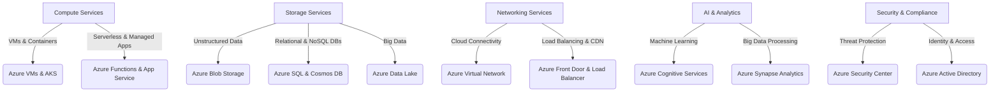

# **Azure Services: An In-Depth Look**

### **Table of Contents**

- [**1. Introduction**](#1-introduction)
- [**2. Compute Services**](#2-compute-services)
- [**3. Storage Services**](#3-storage-services)
- [**4. Networking Services**](#4-networking-services)
- [**5. AI and Analytics Services**](#5-ai-and-analytics-services)
- [**6. Security and Compliance Services**](#6-security-and-compliance-services)
- [**7. Best Practices for Choosing Azure Services**](#7-best-practices-for-choosing-azure-services)
- [**8. Further Reading**](#8-further-reading)

---

## **1. Introduction**

Azure offers a broad range of **cloud services** that cater to different workloads, including compute, storage, networking, AI, and security. This document provides an in-depth look at these services, helping users select and integrate them effectively.

> **Tip:** Azure services are designed for **seamless interoperability**, allowing users to build robust cloud solutions.

### **Azure Service Categories**

The following diagram outlines Azure's primary service domains.

---

## **2. Compute Services**

### **2.1 Virtual Machines (VMs)**

Azure Virtual Machines provide on-demand computing power for various applications.

|**Feature**|**Benefit**|
|---|---|
|**Customizable VM Sizes**|Tailor resources to specific workloads.|
|**High Availability**|Redundant infrastructure across availability zones.|
|**Hybrid Integration**|Extend on-premises workloads to Azure.|

#### **Use Case:**

Hosting legacy applications requiring specific OS environments.

---

### **2.2 Azure Kubernetes Service (AKS)**

AKS simplifies container orchestration and management.

|**Feature**|**Benefit**|
|---|---|
|**Fully Managed Kubernetes**|Reduces operational overhead.|
|**Auto-Scaling**|Adjusts resources dynamically.|
|**Integration with GitOps**|Enables infrastructure as code.|

#### **Use Case:**

Deploying **microservices-based** applications.

---

### **2.3 Azure Functions (Serverless Compute)**

Azure Functions execute **event-driven** tasks without requiring infrastructure management.

|**Feature**|**Benefit**|
|---|---|
|**Trigger-Based Execution**|Runs based on HTTP requests, queues, or schedules.|
|**Pay-As-You-Go Pricing**|Costs are based on execution time.|
|**Seamless Integration**|Works with Azure Event Grid & Logic Apps.|

#### **Use Case:**

Running **chatbot maintenance tasks** on demand.

---

## **3. Storage Services**

### **3.1 Blob Storage (Unstructured Data)**

Azure Blob Storage is designed for **large-scale unstructured data storage**.

|**Feature**|**Benefit**|
|---|---|
|**Multi-Tiered Storage**|Hot, Cool, and Archive tiers optimize costs.|
|**Redundancy Options**|Geo-replication ensures high availability.|
|**Massive Scalability**|Handles petabyte-scale data.|

#### **Use Case:**

Storing chatbot training datasets.

---

### **3.2 Azure Data Lake**

A **big data storage service** optimized for analytics workloads.

|**Feature**|**Benefit**|
|---|---|
|**Hierarchical Namespace**|Optimized for structured operations.|
|**Scalability**|Handles petabyte-scale data ingestion.|
|**Built-In Security**|Integrated role-based access control.|

#### **Use Case:**

Training AI models on **large-scale conversational datasets**.

---

## **4. Networking Services**

### **4.1 Virtual Network (VNet)**

Azure Virtual Network provides **secure** and **scalable** connectivity.

|**Feature**|**Benefit**|
|---|---|
|**Subnet Segmentation**|Organize and isolate network traffic.|
|**Hybrid Connectivity**|Secure connections to on-premises networks.|
|**Built-In Security**|Enforce access policies at the network level.|

---

### **4.2 Azure Front Door (Global Load Balancing)**

Azure Front Door **optimizes web application performance** with traffic distribution.

|**Feature**|**Benefit**|
|---|---|
|**Content Acceleration**|Improves site performance globally.|
|**DDoS Protection**|Shields applications from cyber threats.|
|**SSL Offloading**|Manages secure connections.|

#### **Use Case:**

Accelerating chatbot API responses for **global users**.

---

## **5. AI and Analytics Services**

### **5.1 Azure Cognitive Services**

Pre-built AI models for **vision, speech, and text processing**.

|**Feature**|**Benefit**|
|---|---|
|**Pre-Trained APIs**|Easily add AI capabilities.|
|**Customizable Models**|Adapt AI models to specific use cases.|
|**Multi-Language Support**|Enables global chatbot deployments.|

#### **Use Case:**

Enhancing **chatbot NLP** using Azure's text analytics API.

---

### **5.2 Azure Synapse Analytics (Big Data Processing)**

Azure Synapse enables **data integration** and **real-time analytics**.

|**Feature**|**Benefit**|
|---|---|
|**Serverless Queries**|Run SQL queries on massive datasets.|
|**Integrated AI**|Leverages machine learning for analytics.|

#### **Use Case:**

Processing chatbot interaction data for **customer insights**.

---

## **6. Security and Compliance Services**

Azure provides **enterprise-grade security** for cloud resources.

|**Service**|**Purpose**|
|---|---|
|**Azure Security Center**|Real-time **threat detection** and security monitoring.|
|**Azure Sentinel**|AI-powered **SIEM for security analytics**.|
|**Azure Key Vault**|Securely manages **API keys and credentials**.|

---

## **7. Best Practices for Choosing Azure Services**

1. **Define Workload Needs:**
    
    - Choose services based on **compute, storage, and networking** requirements.
2. **Optimize for Scalability:**
    
    - Use **auto-scaling options** for high-demand applications.
3. **Cost Efficiency:**
    
    - Estimate costs using the **Azure Pricing Calculator**.
4. **Use Azure Integrations:**
    
    - Combine services like **Cognitive Services + Bot Service** for enhanced functionality.

---

## **8. Further Reading**

- [Azure Compute Services Overview](https://learn.microsoft.com/en-us/azure/compute/)
- [Azure Networking Services](https://learn.microsoft.com/en-us/azure/networking/)
- [Azure AI and Machine Learning](https://learn.microsoft.com/en-us/azure/machine-learning/)
- [Azure Security Services](https://learn.microsoft.com/en-us/azure/security/)

---

### **Next Steps**

Proceed to [azure_devops_tools](azure_devops_tools.md) for understanding **Azure’s CI/CD capabilities**.
