# **Azure Services Overview**

### **Table of Contents**

- [**1. Introduction**](#1-introduction)
- [**2. Categories of Azure Services**](#2-categories-of-azure-services)
- [**3. Benefits of Azure Services**](#3-benefits-of-azure-services)
- [**4. Real-World Use Cases**](#4-real-world-use-cases)
- [**5. Getting Started with Azure**](#5-getting-started-with-azure)
- [**6. Best Practices for Azure Adoption**](#6-best-practices-for-azure-adoption)
- [**7. Further Reading**](#7-further-reading)

---

## **1. Introduction**

Microsoft Azure is a **cloud computing platform** offering a diverse range of services, enabling businesses to develop, deploy, and manage applications efficiently. Azure’s ecosystem includes solutions for **compute, storage, networking, AI, DevOps, and security**.

> **Azure operates in 60+ regions**, making it one of the largest global cloud platforms.

---

## **2. Categories of Azure Services**

The following diagram illustrates the **primary categories of Azure services** and how they interact.

```mermaid
graph TD;
    A[Compute Services] -->|Virtual Machines| B(Azure VMs);
    A -->|Containers| C(Azure Kubernetes Service);
    A -->|Serverless| D(Azure Functions);
    
    E[Storage Services] -->|Object Storage| F(Azure Blob Storage);
    E -->|File Storage| G(Azure Files);
    E -->|Databases| H(Azure SQL Database);
    E -->|NoSQL| I(Azure Cosmos DB);
    
    J[Networking Services] -->|VPC & Connectivity| K(Azure Virtual Network);
    J -->|Traffic Management| L(Azure Load Balancer & CDN);
    
    M[AI & Analytics] -->|Machine Learning| N(Azure Machine Learning);
    M -->|AI APIs| O(Azure Cognitive Services);
    
    P[DevOps & Development] -->|CI/CD Pipelines| Q(Azure DevOps);
    P -->|Infrastructure Automation| R(Azure Bicep & Terraform);
    
    S[Security & Compliance] -->|Threat Protection| T(Azure Security Center);
    S -->|Identity Management| U(Azure Active Directory);
```



---

### **2.1 Compute Services**

Azure provides **scalable computing** resources to host applications.

|**Service**|**Description**|
|---|---|
|**Azure Virtual Machines (VMs)**|Deploy and manage virtual servers.|
|**Azure Kubernetes Service (AKS)**|Orchestrate and manage containerized applications.|
|**Azure Functions**|Serverless compute for event-driven applications.|

---

### **2.2 Storage Services**

Azure’s **cloud storage solutions** provide secure, scalable, and cost-effective options.

|**Service**|**Description**|
|---|---|
|**Blob Storage**|Store unstructured data (images, videos, logs).|
|**Azure Files**|Managed file shares accessible over SMB.|
|**Azure SQL Database**|Fully managed relational database.|
|**Azure Cosmos DB**|NoSQL database for globally distributed applications.|

---

### **2.3 Networking Services**

Azure ensures **secure and high-performance networking** for cloud and hybrid environments.

|**Service**|**Description**|
|---|---|
|**Azure Virtual Network (VNet)**|Connect Azure resources securely.|
|**Azure Load Balancer**|Distribute traffic across multiple servers.|
|**Azure CDN**|Accelerate content delivery across global locations.|

---

### **2.4 AI and Machine Learning Services**

Azure enables businesses to **integrate AI and analytics** into their applications.

|**Service**|**Description**|
|---|---|
|**Azure Cognitive Services**|Pre-built AI APIs for vision, speech, and language.|
|**Azure Machine Learning**|Develop, train, and deploy ML models.|
|**Azure Bot Service**|Build and deploy AI-powered chatbots.|

---

### **2.5 Developer and DevOps Services**

Azure simplifies **software development, testing, and automation**.

|**Service**|**Description**|
|---|---|
|**Azure DevOps**|CI/CD, version control, and agile project management.|
|**GitHub Enterprise**|Host and manage secure code repositories.|
|**Azure Test Plans**|Organize and execute manual/automated tests.|

---

### **2.6 Security and Compliance Services**

Azure offers **built-in security** and compliance tools.

|**Service**|**Description**|
|---|---|
|**Azure Security Center**|Detect and mitigate security threats.|
|**Azure Sentinel**|Cloud-native SIEM for threat analytics.|
|**Azure Key Vault**|Securely manage API keys, secrets, and certificates.|

---

## **3. Benefits of Azure Services**

1. **Global Availability:**
    - 60+ **regions** provide **low-latency services** worldwide.
2. **Cost Optimization:**
    - Pay-as-you-go, **reserved instances**, and **spot pricing** models.
3. **Seamless Integration:**
    - Works with **Microsoft tools (Windows, SQL Server, Office 365)** and open-source platforms.
4. **Scalability & Automation:**
    - Auto-scale **applications and infrastructure** based on demand.
5. **Enterprise Security & Compliance:**
    - Meets **GDPR, HIPAA, ISO 27001, and SOC 2** standards.

> **Example:** A global **e-commerce company** uses Azure VMs for web hosting, Blob Storage for product images, and Cosmos DB for real-time inventory management.

---

## **4. Real-World Use Cases**

|**Industry**|**Azure Services Used**|
|---|---|
|**Healthcare**|AI diagnostics, SQL Database for patient records.|
|**Retail**|Azure CDN for fast content delivery, Cosmos DB for inventory.|
|**Education**|Virtual machines for online labs, Teams for collaboration.|
|**Finance**|Azure Sentinel for fraud detection, Data Lake for analytics.|

---

## **5. Getting Started with Azure**

### **Step 1: Create an Azure Account**

1. Visit the **[Azure Portal](https://portal.azure.com/)**.
2. Sign up for a **free tier** (includes $200 in credits).

### **Step 2: Deploy Resources**

1. Use **Azure Marketplace** to deploy pre-configured services.
    
2. Provision a **Virtual Machine (VM)** using **Azure CLI**:
    
    ```bash
    az group create --name MyResourceGroup --location eastus
    az vm create --resource-group MyResourceGroup --name MyVM --image UbuntuLTS
    ```
    

### **Step 3: Monitor & Optimize**

1. Enable **Azure Monitor** for real-time performance tracking.
2. Configure **cost alerts** in **Azure Cost Management**.

### **Step 4: Scale As Needed**

1. Use **Azure Auto-Scaling** to adjust compute resources dynamically.

---

## **6. Best Practices for Azure Adoption**

1. **Choose the Right Services**
    - Select **appropriate storage, compute, and networking** based on workload.
2. **Automate Deployments**
    - Use **Azure DevOps, Terraform, or Bicep** for Infrastructure as Code (IaC).
3. **Optimize Costs**
    - Utilize **Reserved Instances for predictable workloads**.
4. **Implement Security Best Practices**
    - Protect credentials using **Azure Key Vault**.
5. **Monitor and Analyze Usage**
    - Leverage **Azure Monitor and Log Analytics**.

---

## **7. Further Reading**

- [Azure Documentation](https://docs.microsoft.com/en-us/azure/)
- [Azure Compute Overview](https://learn.microsoft.com/en-us/azure/compute/)
- [Azure DevOps Documentation](https://learn.microsoft.com/en-us/azure/devops/)
- [Azure Cost Management Guide](https://learn.microsoft.com/en-us/azure/cost-management/)

---

### **Next Steps**

Proceed to [azure_services_in_depth](azure_services_in_depth.md) for a detailed exploration of Azure’s service offerings.

---
