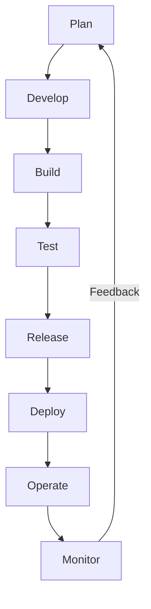

# **Introduction to DevOps**

### **Table of Contents**

- [**1. What is DevOps?**](#1-what-is-devops)
- [**2. Core Principles of DevOps**](#2-core-principles-of-devops)
- [**3. Benefits of DevOps**](#3-benefits-of-devops)
- [**4. Core Practices**](#4-core-practices)
- [**5. Common Tools in DevOps**](#5-common-tools-in-devops)
- [**6. Step-by-Step DevOps Implementation**](#6-step-by-step-devops-implementation)
- [**7. Challenges in Implementing DevOps**](#7-challenges-in-implementing-devops)
- [**8. Further Reading**](#8-further-reading)

---

## **1. What is DevOps?**

DevOps is a **collaborative approach** that combines **development (Dev)** and **IT operations (Ops)** to automate and streamline software delivery.

> **Example:** Without DevOps, a software update may take days or weeks to integrate, test, and deploy. With DevOps, automated processes can push updates within **hours or even minutes**.

### **DevOps Lifecycle**

The diagram below outlines the **continuous workflow** of DevOps.



---

## **2. Core Principles of DevOps**

### **2.1 Collaboration and Communication**

Breaking down silos between **development, operations, and security teams** fosters a culture of shared responsibility.

|**Why It Matters**|**What It Looks Like**|
|---|---|
|Teams work together from the start|Developers, testers, and operations staff jointly plan releases.|
|Shared responsibility for uptime and quality|Dev and Ops teams collaborate to maintain system reliability.|

> **Example:** Teams conduct **weekly DevOps sync meetings** to align on upcoming releases.

---

### **2.2 Continuous Integration and Continuous Delivery (CI/CD)**

CI/CD automates **code integration, testing, and deployment**.

|**Stage**|**Description**|
|---|---|
|**Continuous Integration (CI)**|Automatically integrates and tests new code.|
|**Continuous Delivery (CD)**|Ensures code is **ready for deployment** at all times.|

#### **Example CI/CD Workflow**

1. **Code Commit**: Developer pushes changes to **GitHub**.
2. **CI Pipeline Triggers**: A **GitHub Actions** workflow compiles the code.
3. **Automated Tests**: Unit and integration tests run.
4. **Approval & Deployment**: If tests pass, code is deployed **automatically**.

---

### **2.3 Automation**

Automation reduces **manual errors** and accelerates software delivery.

|**Automation Area**|**Examples**|
|---|---|
|**Testing**|Selenium, JUnit, Cypress|
|**Infrastructure Management**|Terraform, Ansible|
|**Monitoring**|Prometheus, Grafana|

---

## **3. Benefits of DevOps**

|**Benefit**|**Description**|
|---|---|
|**Faster Delivery**|Features reach users faster through CI/CD pipelines.|
|**Higher Software Quality**|Automated testing catches bugs early.|
|**Reliability**|Continuous monitoring ensures system health.|
|**Cost Efficiency**|Automation reduces manual intervention and downtime.|

> **Case Study:** Netflix deploys **thousands of updates daily** while ensuring **99.99% uptime** using DevOps.

---

## **4. Core Practices**

### **4.1 Version Control**

Version control tracks changes in **source code**.

|**Tool**|**Purpose**|
|---|---|
|**Git**|Tracks code history and collaboration.|
|**GitHub**|Centralized repository hosting with CI/CD integrations.|

> **Example:** A developer finds a bug introduced in a previous commit using **Git blame**.

---

### **4.2 Infrastructure as Code (IaC)**

IaC automates **infrastructure provisioning and management**.

|**Tool**|**Purpose**|
|---|---|
|**Terraform**|Manages infrastructure across cloud platforms.|
|**Ansible**|Automates server configurations.|

#### **Example: Deploy a Virtual Machine using Terraform**

```hcl
resource "azurerm_virtual_machine" "example" {
  name                = "example-vm"
  resource_group_name = "example-resources"
  location            = "eastus"
  size                = "Standard_B2s"
}
```

Run `terraform apply` to deploy.

---

### **4.3 Monitoring and Feedback**

Monitoring tools detect **performance issues and security threats**.

|**Tool**|**How It Helps**|
|---|---|
|**Prometheus**|Collects real-time system metrics.|
|**Grafana**|Visualizes logs and performance data.|
|**Azure Monitor**|Tracks Azure-based infrastructure.|

---

## **5. Common Tools in DevOps**

|**Category**|**Examples**|
|---|---|
|CI/CD|Jenkins, GitHub Actions, Azure DevOps|
|IaC|Terraform, Ansible|
|Monitoring|Prometheus, Grafana|
|Containers|Docker, Kubernetes|
|Collaboration|Slack, Microsoft Teams|

---

## **6. Step-by-Step DevOps Implementation**

### **6.1 Setting Up CI/CD with GitHub Actions**

1. **Initialize Repository**
2. **Create a Workflow File (`.github/workflows/main.yml`)**

```yaml
name: CI/CD Pipeline
on: [push]
jobs:
  build:
    runs-on: ubuntu-latest
    steps:
      - uses: actions/checkout@v2
      - name: Set up Node.js
        uses: actions/setup-node@v2
        with:
          node-version: '14'
      - run: npm install
      - run: npm test
      - run: npm run build
```

3. **Push Changes** → Observe CI/CD pipeline execution in **GitHub Actions**.

---

### **6.2 Deploying on Azure DevOps**

1. **Create an Azure DevOps Project**
2. **Set Up a Pipeline**:

```yaml
stages:
- stage: Build
  jobs:
  - job: BuildApp
    steps:
    - script: npm install
    - script: npm test
- stage: Deploy
  jobs:
  - job: DeployApp
    steps:
    - script: az webapp deploy --name MyApp --src-path ./build
```

3. **Run the Pipeline** to trigger **CI/CD workflow**.

---

## **7. Challenges in Implementing DevOps**

|**Challenge**|**Solution**|
|---|---|
|**Cultural Resistance**|Conduct workshops to align teams.|
|**Tool Complexity**|Start with essential tools, expand as needed.|
|**Security Risks**|Implement DevSecOps (security in DevOps).|
|**Skill Gaps**|Provide training and certifications.|

---

## **8. Further Reading**

- [Azure DevOps Documentation](https://learn.microsoft.com/en-us/azure/devops/)
- [Getting Started with GitHub Actions](https://docs.github.com/en/actions/quickstart)
- [Terraform Basics](https://learn.hashicorp.com/terraform)
- [CI/CD Pipelines Guide](https://learn.microsoft.com/en-us/devops/pipelines/)

> **Cross-Reference:** See **[CI/CD Tools Comparison](#ci_cd_tools_comparison)** for tool selection.

---

### **Next Steps**

Proceed to [azure_overview](azure_overview.md) for an introduction to **Azure cloud services**.

### **Related Topics**
- [azure_services_overview](azure_services_overview.md)
- [azure_devops_tools](azure_devops_tools.md)
