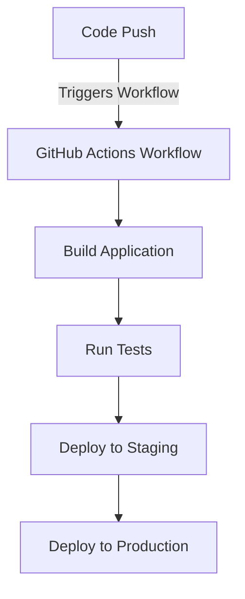

# **CI/CD with GitHub Actions: A Comprehensive Guide**

### **Table of Contents**

- [**1. Introduction**](#1-introduction)
- [**2. What is GitHub Actions?**](#2-what-is-github-actions)
- [**3. Why Use GitHub Actions for CI/CD?**](#3-why-use-github-actions-for-cicd)
- [**4. Core Components of GitHub Actions**](#4-core-components-of-github-actions)
- [**5. Step-by-Step Guide to Setting Up a CI/CD Pipeline**](#5-step-by-step-guide-to-setting-up-a-cicd-pipeline)
- [**6. Common Workflow Examples**](#6-common-workflow-examples)
- [**7. Best Practices for CI/CD with GitHub Actions**](#7-best-practices-for-cicd-with-github-actions)
- [**8. Challenges and Solutions**](#8-challenges-and-solutions)
- [**9. Further Reading**](#9-further-reading)

---

## **1. Introduction**

GitHub Actions is an **automation platform** built into GitHub that enables **continuous integration and continuous deployment (CI/CD)**. It allows developers to define workflows that **automate code testing, building, and deployment** whenever changes occur.

> **Example:** Every time a developer pushes code to `main`, GitHub Actions can automatically test and deploy the application to **Azure App Service**.

---

## **2. What is GitHub Actions?**

GitHub Actions is a **CI/CD service** that enables **event-driven automation** within a GitHub repository. It supports:

- **Continuous Integration (CI):** Automatically builds and tests code.
- **Continuous Deployment (CD):** Deploys code to production or staging environments.
- **Event-Driven Workflows:** Triggers automation based on repository events (e.g., `push`, `pull_request`).

---

## **3. Why Use GitHub Actions for CI/CD?**

|**Advantage**|**Description**|
|---|---|
|**Native GitHub Integration**|Directly connects with repositories and GitHub events.|
|**Flexible and Customizable**|Supports event-driven workflows with YAML-based configurations.|
|**Multi-Platform Support**|Works on Linux, macOS, and Windows environments.|
|**Scalability**|Handles workflows from small projects to enterprise applications.|
|**Cost-Effective**|Provides **2,000 free minutes per month** for private repositories.|

> **Tip:** GitHub-hosted runners support **Linux, Windows, and macOS** for CI/CD.

---

## **4. Core Components of GitHub Actions**

### **4.1 Workflows**

Workflows are **automated processes** that define CI/CD tasks. Stored as **YAML files** in `.github/workflows/`.

### **4.2 Events**

Events **trigger workflows**. Common triggers include:

- `push`: Runs when code is pushed to a repository.
- `pull_request`: Executes on new or updated pull requests.
- `schedule`: Runs workflows on a **cron schedule**.

### **4.3 Jobs and Steps**

- **Jobs**: Define individual **tasks** in a workflow.
- **Steps**: Commands or actions within a job.

### **4.4 Runners**

- **GitHub-hosted runners**: Managed by GitHub.
- **Self-hosted runners**: Custom environments for running workflows.

---

## **5. Step-by-Step Guide to Setting Up a CI/CD Pipeline**

### **CI/CD Workflow Diagram**

The following diagram represents a typical **GitHub Actions CI/CD pipeline**.



---

### **Step 1: Create a Workflow File**

1. **Navigate to your GitHub repository.**
2. **Create a new file** in `.github/workflows/` (e.g., `ci-cd.yml`).

### **Step 2: Define Workflow Triggers**

Specify when the workflow runs.

```yaml
on:
  push:
    branches:
      - main
  pull_request:
    branches:
      - main
```

### **Step 3: Add Jobs and Steps**

Define **tasks** for building and testing.

```yaml
jobs:
  build:
    runs-on: ubuntu-latest
    steps:
      - name: Checkout Code
        uses: actions/checkout@v3
      - name: Set Up Node.js
        uses: actions/setup-node@v3
        with:
          node-version: '18'
      - name: Install Dependencies
        run: npm install
      - name: Run Tests
        run: npm test
```

### **Step 4: Commit and Monitor**

1. **Commit the workflow file**.
2. **Monitor the pipeline** under the "Actions" tab.

---

## **6. Common Workflow Examples**

### **6.1 Basic CI Pipeline**

Runs tests on every push.

```yaml
name: CI Pipeline
on: [push]
jobs:
  test:
    runs-on: ubuntu-latest
    steps:
      - uses: actions/checkout@v2
      - name: Run Tests
        run: npm test
```

---

### **6.2 Node.js Deployment to Azure**

Deploys a Node.js application to **Azure App Service**.

```yaml
name: Deploy to Azure
on:
  push:
    branches:
      - main

jobs:
  build:
    runs-on: ubuntu-latest
    steps:
      - uses: actions/checkout@v2
      - name: Install Dependencies
        run: npm install
      - name: Run Tests
        run: npm test

  deploy:
    runs-on: ubuntu-latest
    needs: build
    steps:
      - name: Deploy to Azure
        uses: azure/webapps-deploy@v2
        with:
          app-name: "my-app"
          publish-profile: ${{ secrets.AZURE_PUBLISH_PROFILE }}
```

---

### **6.3 Docker Image Build and Push**

Builds and pushes a Docker image to **Docker Hub**.

```yaml
name: Docker CI/CD
on:
  push:
    branches:
      - main

jobs:
  docker:
    runs-on: ubuntu-latest
    steps:
      - name: Checkout Code
        uses: actions/checkout@v2
      - name: Log in to Docker Hub
        uses: docker/login-action@v2
        with:
          username: ${{ secrets.DOCKER_USERNAME }}
          password: ${{ secrets.DOCKER_PASSWORD }}
      - name: Build and Push Docker Image
        run: |
          docker build -t my-app .
          docker tag my-app mydockerhubuser/my-app:latest
          docker push mydockerhubuser/my-app:latest
```

---

## **7. Best Practices for CI/CD with GitHub Actions**

✅ **Use Secrets Management**: Store sensitive data in **GitHub Secrets**.  
✅ **Enable Parallel Jobs**: Run jobs concurrently to reduce pipeline execution time.  
✅ **Monitor Workflow Performance**: Use logs and metrics to identify inefficiencies.  
✅ **Automate Cleanup**: Add steps to **delete temporary files** post-build.  
✅ **Test Locally**: Debug workflows locally using **Act CLI**.

---

## **8. Challenges and Solutions**

|**Challenge**|**Solution**|
|---|---|
|**Long Build Times**|Use **caching** strategies to optimize dependencies.|
|**Managing Secrets**|Store credentials in **GitHub Secrets**.|
|**Debugging Workflow Errors**|Enable **verbose logging** and test workflows locally.|
|**Scaling for Self-Hosted Runners**|Add more runners for faster execution.|

---

## **9. Further Reading**

- [GitHub Actions Documentation](https://docs.github.com/en/actions)
- [Best Practices for CI/CD Workflows](https://docs.github.com/en/actions/learn-github-actions)
- [Using Secrets in GitHub Actions](https://docs.github.com/en/actions/security-guides/using-secrets-in-github-actions)
- [Deploying to Azure Using GitHub Actions](https://learn.microsoft.com/en-us/azure/developer/github/github-actions/)
---

### **Next Step**

- [Setting Up CI/CD Pipelines](Setting%20Up%20CI/CD%20Pipelines)
