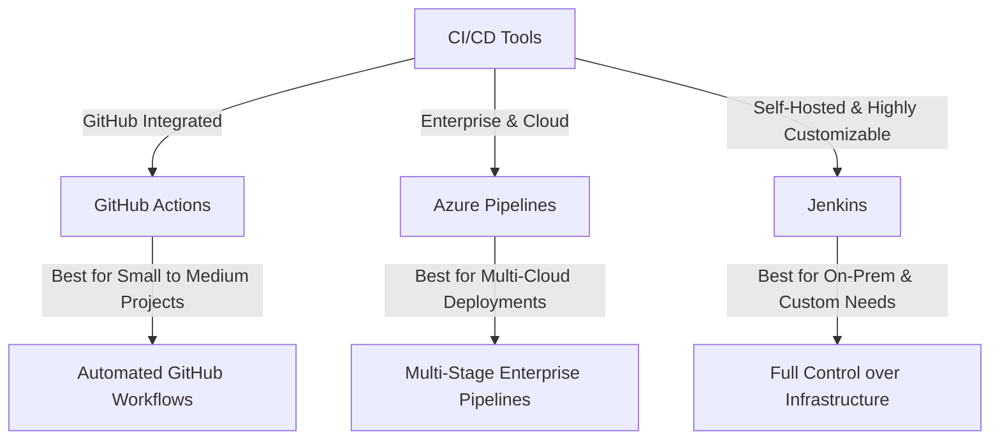

# **CI/CD Tools Comparison**

### **Table of Contents**

- [**1. GitHub Actions**](#1-github-actions)
- [**2. Azure Pipelines**](#2-azure-pipelines)
- [**3. Comparative Analysis**](#3-comparative-analysis)
- [**4. Exploring Additional Tools**](#4-exploring-additional-tools)
- [**5. Recommendations for Implementation**](#5-recommendations-for-implementation)
- [**6. Further Resources**](#6-further-resources)

---

## **1. GitHub Actions**

GitHub Actions enables **event-driven automation** within GitHub repositories. It is ideal for **small to medium-sized** projects that rely on GitHub-based development workflows.

### **Use Cases**

- Automating tests, builds, and deployments.
- Managing GitHub-native CI/CD pipelines.
- Leveraging prebuilt actions for faster implementation.

### **Strengths**

|Feature|Benefit|
|---|---|
|**Ease of Use**|Pre-configured actions simplify setup.|
|**Deep GitHub Integration**|Native support for repositories and pull requests.|
|**Flexible Workflows**|YAML-based configurations allow custom pipelines.|
|**Cost-Effective**|Free tier for open-source and small teams.|

### **Limitations**

- **Scaling Issues:** Less suited for complex, enterprise-grade workflows.
- **Limited Platform Support:** Designed primarily for **GitHub-hosted** repositories.

📌 **Resources:**

- [GitHub Actions Documentation](https://docs.github.com/en/actions)
- [GitHub Actions Marketplace](https://github.com/marketplace?type=actions)

---

## **2. Azure Pipelines**

Azure Pipelines is a **cloud-agnostic CI/CD service** supporting **multi-platform workflows** for enterprise-scale applications.

### **Use Cases**

- Large-scale, **multi-stage deployments**.
- Advanced **CI/CD workflows** with integration into **Azure services**.
- Hybrid environments combining **on-premises** and **cloud** resources.

### **Strengths**

|Feature|Benefit|
|---|---|
|**Scalability**|Ideal for large, complex workflows.|
|**Cross-Platform Support**|Works across Windows, Linux, and macOS.|
|**Built-in Test Automation**|Supports unit, integration, and functional testing.|
|**Deep Azure Integration**|Optimized for AKS, Azure Functions, and App Services.|

### **Limitations**

- **Learning Curve:** YAML-based pipelines require expertise.
- **Cost Considerations:** Pricing scales with concurrent jobs and resource usage.

📌 **Resources:**

- [Azure Pipelines Documentation](https://learn.microsoft.com/en-us/azure/devops/pipelines/)
- [Azure DevOps Pricing](https://azure.microsoft.com/en-us/pricing/details/devops/azure-pipelines/)

---

## **3. Comparative Analysis**

The following table highlights key differences:

|**Aspect**|**GitHub Actions**|**Azure Pipelines**|**Jenkins**|
|---|---|---|---|
|**Ease of Setup**|Simple, GitHub-native|More complex, but powerful|Requires manual setup|
|**Best Use Case**|Small to medium projects|Large, enterprise-grade workflows|Highly customizable, self-hosted|
|**Integration**|GitHub-only|Azure & multi-cloud|Any cloud or on-premises|
|**Customization**|YAML-based, marketplace actions|Highly customizable YAML pipelines|Extensive plugin ecosystem|
|**Cost**|Free tier available|Free for public projects, paid for enterprises|Free, but requires infrastructure|

### **CI/CD Tools Comparison Diagram**

The diagram below summarizes how these tools fit into different **scalability and integration needs**.

---

## **4. Exploring Additional Tools**

### **4.1 Jenkins**

**Description:** Open-source automation server with **extensive plugin support**.

|Attribute|Insight|
|---|---|
|**Best For**|Highly customized pipelines & self-hosted environments.|
|**Cost**|Free, but requires infrastructure management.|
|**Resource**|[Jenkins Documentation](https://www.jenkins.io/doc/)|

---

### **4.2 CircleCI**

**Description:** A cloud-based **CI/CD platform** known for **fast builds and scalability**.

|Attribute|Insight|
|---|---|
|**Best For**|Fast, scalable pipelines for teams and startups.|
|**Cost**|Paid plans start at **$30/month**.|
|**Resource**|[CircleCI Documentation](https://circleci.com/docs/)|

---

## **5. Recommendations for Implementation**

### **Choosing the Right CI/CD Tool**

- ✅ **Use GitHub Actions** for **small teams** and **GitHub-hosted projects**.
- ✅ **Use Azure Pipelines** for **enterprise-scale** and **multi-cloud environments**.
- ✅ **Use Jenkins** if you require **self-hosted** CI/CD with **high customization**.

### **Optimizing CI/CD Workflows**

- **Hybrid CI/CD**: Combine **GitHub Actions for development** and **Azure Pipelines for deployments**.
- **Infrastructure-as-Code (IaC)**: Use **Terraform or Ansible** for automated infrastructure provisioning.
- **Cost Management**: Monitor **usage limits** and **optimize parallel jobs**.

---

## **6. Further Resources**

- [Docker and Kubernetes Integration](https://kubernetes.io/docs)
- [Scaling CI/CD Workflows](https://learn.microsoft.com/en-us/azure/devops/)
- [CI/CD Best Practices](https://learn.microsoft.com/en-us/devops/pipelines/best-practices/)

---

### **Next Steps**

Proceed to [CI_CD_with_GitHub_Actions](CI_CD_with_GitHub_Actions.md) for a detailed **hands-on guide**.