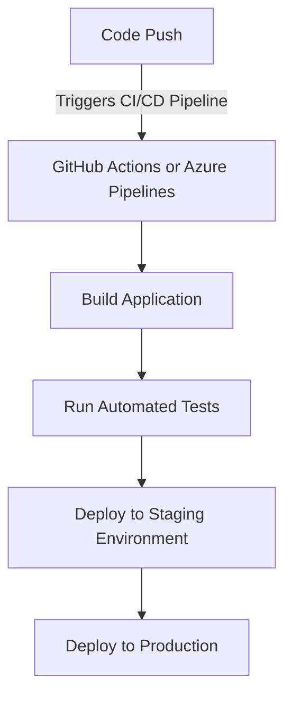

# **Setting Up CI/CD Pipelines for Chatbots**
### **Table of Contents**

- [**1. What is CI/CD?**](#1-what-is-cicd)
- [**2. Benefits of CI/CD for Chatbots**](#2-benefits-of-cicd-for-chatbots)
- [**3. Configuring GitHub Actions**](#3-configuring-github-actions)
- [**4. Configuring Azure Pipelines**](#4-configuring-azure-pipelines)
- [**5. Best Practices for CI/CD**](#5-best-practices-for-cicd)
- [**6. Enhancements and Next Steps**](#6-enhancements-and-next-steps)

---

## **1. What is CI/CD?**

CI/CD (**Continuous Integration and Continuous Deployment**) automates the software development lifecycle:

- **Continuous Integration (CI):** Automatically builds and tests the chatbot when new code is committed.
- **Continuous Deployment (CD):** Deploys the chatbot to production once it passes testing.

### **CI/CD Pipeline Workflow**



---

## **2. Benefits of CI/CD for Chatbots**

|**Benefit**|**Description**|
|---|---|
|**Automation**|Streamlines development with automated builds and deployments.|
|**Error Detection**|Identifies bugs and integration issues early.|
|**Faster Releases**|Reduces manual intervention, allowing quick feature updates.|
|**Improved Stability**|Ensures deployments only happen after successful tests.|

---

## **3. Configuring GitHub Actions**

### **3.1 Prerequisites**

- A **GitHub repository** with the chatbot’s code.
- Familiarity with **YAML** syntax for defining workflows.

### **3.2 Create a Workflow File**

1. Create a new file: `.github/workflows/ci_cd_pipeline.yml`.
2. Define the workflow:

```yaml
name: CI/CD Pipeline

on:
  push:
    branches:
      - main
  pull_request:
    branches:
      - main

jobs:
  build:
    runs-on: ubuntu-latest

    steps:
      - name: Checkout Code
        uses: actions/checkout@v3

      - name: Set up Python
        uses: actions/setup-python@v3
        with:
          python-version: '3.9'

      - name: Install Dependencies
        run: pip install -r requirements.txt

      - name: Run Tests
        run: pytest

  deploy:
    runs-on: ubuntu-latest
    needs: build

    steps:
      - name: Deploy to Azure Web App
        uses: azure/webapps-deploy@v2
        with:
          app-name: 'chatbot-webapp'
          publish-profile: ${{ secrets.AZURE_WEBAPP_PUBLISH_PROFILE }}
```

### **3.3 Workflow Breakdown**

|**Step**|**Purpose**|
|---|---|
|**Checkout Code**|Pulls the latest code from the GitHub repository.|
|**Set up Python**|Configures the correct Python environment.|
|**Install Dependencies**|Installs required chatbot libraries.|
|**Run Tests**|Executes automated test cases using `pytest`.|
|**Deploy to Azure**|Deploys the chatbot to **Azure Web Apps**.|

---

## **4. Configuring Azure Pipelines**

### **4.1 Prerequisites**

- An **Azure DevOps** account.
- Chatbot code stored in a **Git repository**.

### **4.2 Create a Pipeline File**

1. Create a new file: `azure-pipelines.yml`.
2. Define the pipeline steps:

```yaml
trigger:
- main

pool:
  vmImage: 'ubuntu-latest'

steps:
- task: UsePythonVersion@0
  inputs:
    versionSpec: '3.9'
    addToPath: true

- script: |
    pip install -r requirements.txt
    pytest
  displayName: 'Install and Test'

- task: AzureWebApp@1
  inputs:
    azureSubscription: 'Azure Subscription'
    appName: 'chatbot-webapp'
    package: $(System.DefaultWorkingDirectory)/drop
```

### **4.3 Pipeline Breakdown**

|**Step**|**Purpose**|
|---|---|
|**Use Python Version**|Ensures the correct Python environment is set up.|
|**Install and Test**|Installs dependencies and runs automated tests.|
|**Deploy to Azure**|Deploys the chatbot to **Azure Web Apps**.|

---

## **5. Best Practices for CI/CD**

✅ **Use Secrets Securely:** Store credentials (e.g., API keys) in **GitHub Secrets** or **Azure DevOps variables**.  
✅ **Fail Fast:** Detect errors early by running automated tests before deployment.  
✅ **Enable Rollbacks:** Configure rollbacks to previous versions in case of deployment failures.  
✅ **Monitor Pipeline Performance:** Track execution times and optimize steps.  
✅ **Parallel Jobs:** Use **parallel execution** to speed up workflows.

---

## **6. Enhancements and Next Steps**

### **🔹 Advanced Optimizations**

🚀 **Parallel Testing:** Run multiple test suites in parallel.  
🚀 **Containerization:** Use **Docker** to standardize build environments.  
🚀 **Advanced Testing:** Implement **load testing** using **Locust**.  
🚀 **Infrastructure as Code (IaC):** Automate cloud infrastructure setup with **Terraform**.

### **🔹 Next Steps**

Proceed to:

- [caching_strategies_for_chatbots](../Containerization_and_Deployment/caching_strategies_for_chatbots.md)
- [Monitoring and Logging for Chatbots](Monitoring%20and%20Logging%20for%20Chatbots)

📌 **Further Reading**

- [GitHub Actions Documentation](https://docs.github.com/en/actions)
- [Azure Pipelines Documentation](https://learn.microsoft.com/en-us/azure/devops/pipelines/)
