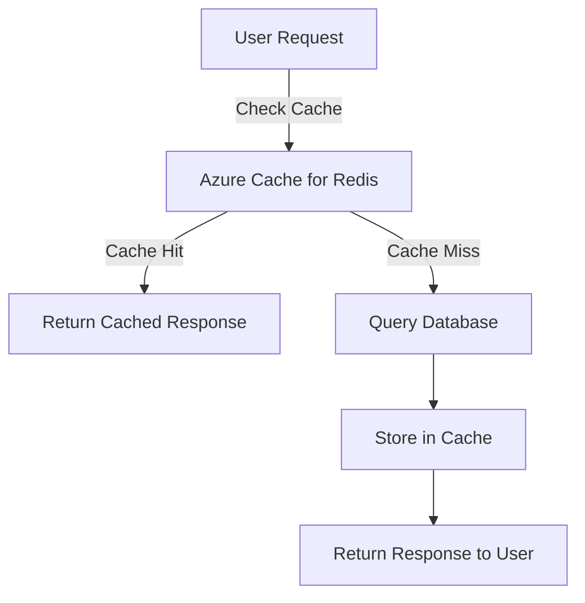

# **Caching Strategies for Chatbots**
### **Table of Contents**

- [**1. Introduction to Caching**](#1-introduction-to-caching)
- [**2. Why Use Caching?**](#2-why-use-caching)
- [**3. Azure Caching Solutions**](#3-azure-caching-solutions)
- [**4. Implementing Caching for Chatbots**](#4-implementing-caching-for-chatbots)
- [**5. Best Practices**](#5-best-practices)
- [**6. Further Reading**](#6-further-reading)


---

## **1. Introduction to Caching**

Caching improves chatbot performance by **storing frequently accessed data**, reducing backend load, and improving response times. It enhances user experience while minimizing infrastructure costs.

### **Chatbot Caching Workflow**



---

## **2. Why Use Caching?**

|**Benefit**|**Impact**|
|---|---|
|**Reduced Latency**|Faster chatbot responses by serving data from cache.|
|**Improved Scalability**|Handles higher user loads without overloading the backend.|
|**Cost Efficiency**|Reduces database queries and optimizes cloud resource usage.|
|**Increased Availability**|Ensures chatbot functionality even during backend failures.|

---

## **3. Azure Caching Solutions**

### **3.1 Azure Cache for Redis**

Azure Cache for Redis is a fully managed, in-memory caching solution with sub-millisecond latency. It supports **key-value storage, session management, and real-time message queuing**.

|**Feature**|**Benefit**|
|---|---|
|**High Throughput**|Handles millions of chatbot requests per second.|
|**Advanced Data Structures**|Supports lists, hashes, and sorted sets for chatbot logic.|
|**Security & Encryption**|Integrates with Azure Virtual Network for secure access.|
|**Automatic Clustering**|Scales automatically to handle high traffic loads.|

#### **Use Cases**

- **Session Storage** → Maintain chatbot session context for seamless conversations.
- **Database Query Caching** → Reduce load on primary databases.
- **Real-Time Event Processing** → Process chatbot events with pub/sub messaging.

---

### **3.2 Azure Content Delivery Network (CDN)**

Azure CDN caches and delivers **static and dynamic chatbot assets** (e.g., UI components, response templates) from edge locations closer to users.

|**Feature**|**Benefit**|
|---|---|
|**Global Edge Caching**|Reduces chatbot response times for global users.|
|**Compression & Optimization**|Minimizes bandwidth usage with gzip and Brotli.|
|**Seamless Azure Integration**|Works with **Azure Blob Storage** and **Azure Web Apps**.|

#### **Use Cases**

- **Static Content Delivery** → Store chatbot UI assets, multimedia, and response templates.
- **API Response Caching** → Reduce latency for frequently accessed chatbot API calls.

---

## **4. Implementing Caching for Chatbots**

### **4.1 Using Azure Cache for Redis**

#### **Step 1: Provision Azure Cache for Redis**

- Navigate to **Azure Portal** → Create a **Redis Cache** instance.
- Choose **pricing tier** based on chatbot traffic needs.

#### **Step 2: Integrate with Chatbot Code**

- Install Redis client for Python:
    
    ```bash
    pip install redis
    ```
    
- Implement caching in Python chatbot:
    
    ```python
    import redis
    
    # Connect to Redis
    cache = redis.StrictRedis(
        host='your-redis-host.redis.cache.windows.net',
        port=6380,
        password='your-access-key',
        ssl=True
    )
    
    def get_response(user_input):
        cached_response = cache.get(user_input)
        if cached_response:
            return cached_response.decode('utf-8')
    
        # Fetch from database (mock example)
        response = fetch_from_db(user_input)
        cache.set(user_input, response, ex=3600)  # Cache for 1 hour
        return response
    ```
    

---

### **4.2 Using Azure CDN**

#### **Step 1: Set Up CDN Profile**

- Navigate to **Azure Portal** → **Create a CDN Profile**.
- Choose the **origin source** (Azure Blob Storage, Web Apps, or API).

#### **Step 2: Configure Cache Rules**

- Set **Time-to-Live (TTL)** policies for chatbot assets.
- Enable **compression** for optimized performance.

#### **Step 3: Integrate CDN with Chatbot**

- Update chatbot URLs to serve static assets from **CDN endpoint**:
    
    ```html
    <script src="https://my-chatbot-cdn.azureedge.net/chatbot.js"></script>
    ```
    

---

## **5. Best Practices**

✅ **Use Cache-Aside Pattern** → Store chatbot data in cache only when requested.  
✅ **Optimize Expiry Policies** → Set appropriate TTL values to refresh stale data.  
✅ **Monitor Cache Usage** → Use **Azure Monitor** to track cache hit/miss ratios.  
✅ **Encrypt Cache Data** → Enable **TLS encryption** for secure chatbot transactions.  
✅ **Leverage Redis Pub/Sub** → Implement **event-driven messaging** for chatbot state management.

---

## **6. Further Reading**

📖 [Azure Cache for Redis Documentation](https://docs.microsoft.com/en-us/azure/azure-cache-for-redis/)  
📖 [Azure CDN Documentation](https://docs.microsoft.com/en-us/azure/cdn/)  
📖 [Caching Patterns and Practices](https://learn.microsoft.com/en-us/azure/architecture/patterns/cache-aside)

---

### **Next Step**

Proceed to:  
📌[containerizing_with_docker](containerizing_with_docker.md)  
📌 [performance_optimization_and_caching](performance_optimization_and_caching.md)
