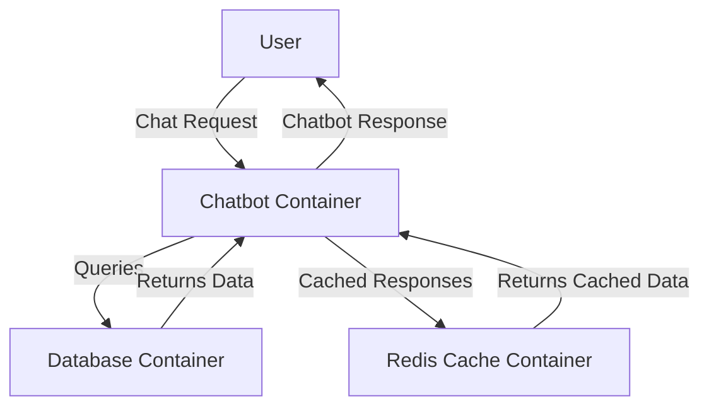

# **Containerizing a Chatbot Using Docker**
### **Table of Contents**

- [**1. Introduction to Containerization**](#1-introduction-to-containerization)
- [**2. Why Use Docker for Chatbots?**](#2-why-use-docker-for-chatbots)
- [**3. Setting Up Docker**](#3-setting-up-docker)
- [**4. Writing a Dockerfile**](#4-writing-a-dockerfile)
- [**5. Building and Running Containers**](#5-building-and-running-containers)
- [**6. Using Docker Compose for Multi-Container Setups**](#6-using-docker-compose-for-multi-container-setups)
- [**7. Best Practices for Docker**](#7-best-practices-for-docker)
- [**8. Next Steps**](#8-next-steps)

---

## **1. Introduction to Containerization**

Containerization enables **consistent execution of applications** across different environments. Docker provides an **isolated, lightweight, and portable** environment for your chatbot and its dependencies.

### **Chatbot Containerization Workflow**



---

## **2. Why Use Docker for Chatbots?**

|**Advantage**|**Impact**|
|---|---|
|**Environment Consistency**|Eliminates compatibility issues across development, testing, and production.|
|**Simplified Deployment**|Enables seamless deployment across multiple environments.|
|**Resource Efficiency**|More lightweight than virtual machines, reducing infrastructure costs.|
|**Scalability**|Supports scaling with Kubernetes and cloud orchestration tools.|

---

## **3. Setting Up Docker**

### **Prerequisites**

1. Install **Docker Desktop**:
    
    - [Download Docker](https://www.docker.com/products/docker-desktop)
2. Verify Docker installation:
    
    ```bash
    docker --version
    ```
    
3. Ensure your chatbot has a dependency file (e.g., `requirements.txt` for Python).
    

---

## **4. Writing a Dockerfile**

A `Dockerfile` defines the **blueprint** for building a Docker image.

### **Example Dockerfile for a Python Chatbot**

```dockerfile
# Use a lightweight Python base image
FROM python:3.9-slim

# Set the working directory
WORKDIR /app

# Copy application files to the container
COPY . /app

# Install dependencies
RUN pip install --no-cache-dir -r requirements.txt

# Expose the port your chatbot runs on
EXPOSE 5000

# Command to run the chatbot
CMD ["python", "app.py"]
```

### **Explanation of Key Steps**

|**Step**|**Purpose**|
|---|---|
|`FROM python:3.9-slim`|Uses a lightweight Python image for efficiency.|
|`WORKDIR /app`|Defines the working directory inside the container.|
|`COPY . /app`|Copies application files into the container.|
|`RUN pip install -r requirements.txt`|Installs required dependencies.|
|`EXPOSE 5000`|Opens port **5000** for chatbot communication.|
|`CMD ["python", "app.py"]`|Runs the chatbot application.|

---

## **5. Building and Running Containers**

### **Building the Docker Image**

```bash
docker build -t chatbot:latest .
```

### **Running the Docker Container**

```bash
docker run -p 5000:5000 chatbot:latest
```

- `-p 5000:5000` → Maps container port 5000 to host port 5000.
- `chatbot:latest` → Specifies the chatbot image.

### **Testing**

- Access the chatbot at: **`http://localhost:5000`**

---

## **6. Using Docker Compose for Multi-Container Setups**

If your chatbot requires a **database (PostgreSQL) and caching (Redis)**, use **Docker Compose** to manage multiple containers.

### **Example `docker-compose.yml`**

```yaml
version: '3.8'

services:
  chatbot:
    build: .
    ports:
      - "5000:5000"
    environment:
      - DATABASE_URL=postgres://user:password@db:5432/chatbot
      - REDIS_URL=redis://cache:6379
    depends_on:
      - db
      - cache

  db:
    image: postgres:13
    environment:
      POSTGRES_USER: user
      POSTGRES_PASSWORD: password
      POSTGRES_DB: chatbot
    ports:
      - "5432:5432"

  cache:
    image: redis:latest
    ports:
      - "6379:6379"
```

### **Running the Multi-Container Setup**

```bash
docker-compose up
```

### **How It Works**

|**Component**|**Function**|
|---|---|
|**Chatbot**|Main chatbot service running on port 5000.|
|**PostgreSQL**|Stores chatbot conversation history.|
|**Redis**|Caches chatbot responses for faster replies.|

---

## **7. Best Practices for Docker**

✅ **Use Small Base Images** → Prefer `python:3.9-slim` over `python:3.9` for efficiency.  
✅ **Optimize Layering** → Minimize `RUN` commands to reduce image size.  
✅ **Use `.dockerignore`** → Exclude unnecessary files to speed up builds.  
✅ **Secure Secrets** → Use **Docker Secrets** or environment variables for credentials.  
✅ **Automate Builds** → Implement **CI/CD pipelines** to streamline deployment.

---

## **8. Next Steps**

1. **Push Your Docker Image**
    
    - Upload the chatbot image to **Docker Hub** or **Azure Container Registry**:
        
        ```bash
        docker tag chatbot:latest mydockerhubuser/chatbot:v1.0
        docker push mydockerhubuser/chatbot:v1.0
        ```
        
2. **Scale with Kubernetes**
    
    - Deploy your chatbot to **Kubernetes** for auto-scaling:
        
        ```bash
        kubectl apply -f chatbot-deployment.yaml
        ```
        
3. **Integrate CI/CD**
    
    - Automate Docker builds with **GitHub Actions or Azure Pipelines**.

---

📌 **Further Reading**

- [Docker Documentation](https://docs.docker.com/)
- [Scaling with Kubernetes](https://kubernetes.io/docs/tasks/run-application/horizontal-pod-autoscale/)
- [Using Docker with CI/CD](https://docs.github.com/en/actions/guides/publishing-docker-images)

---

### **Next Step**

📌 Proceed to:

- [docker_and_kubernetes](docker_and_kubernetes.md)
- [performance_optimization_and_caching](performance_optimization_and_caching.md)

---
