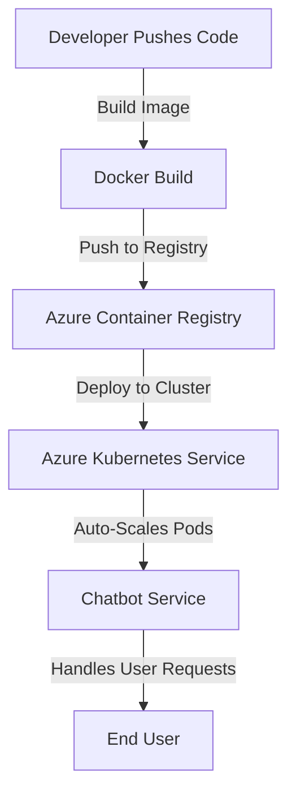

# **Docker and Kubernetes: Containerization and Deployment for Chatbots**

### **Table of Contents**

- [**1. Introduction to Containerization**](#1-introduction-to-containerization)
- [**2. Docker Overview**](#2-docker-overview)
- [**3. Azure Kubernetes Service (AKS)**](#3-azure-kubernetes-service-aks)
- [**4. Workflow: Docker and AKS Integration**](#4-workflow-docker-and-aks-integration)
- [**5. Comparison: AKS vs. Docker Swarm**](#5-comparison-aks-vs-docker-swarm)
- [**6. Best Practices for Docker and Kubernetes**](#6-best-practices-for-docker-and-kubernetes)
- [**7. Further Reading**](#7-further-reading)

---

## **1. Introduction to Containerization**

Containerization allows chatbot applications to be **packaged with dependencies**, ensuring **consistent execution** across development, testing, and production environments.

> **Tip:** For optimizing performance, refer to **[Caching Strategies for Chatbots](#caching_strategies_chatbots).**

### **Chatbot Deployment Workflow (Docker to Kubernetes)**



---

## **2. Docker Overview**

Docker is a containerization platform that simplifies **packaging, distribution, and execution** of applications.

### **Use Cases**

|**Scenario**|**Benefit**|
|---|---|
|**Application Packaging**|Consistent execution across environments.|
|**Microservices**|Deploy chatbot components separately.|
|**Dependency Isolation**|Avoids conflicts between chatbot dependencies.|
|**CI/CD Pipelines**|Automates chatbot testing and deployment.|

### **Example: Dockerfile for a Chatbot**

```dockerfile
# Use a lightweight Python base image
FROM python:3.9-slim

# Set the working directory
WORKDIR /app

# Copy application files to the container
COPY . /app

# Install dependencies
RUN pip install --no-cache-dir -r requirements.txt

# Expose the port your chatbot uses
EXPOSE 5000

# Command to run the chatbot
CMD ["python", "app.py"]
```

> **Reminder:** Pair this with **[CI/CD Pipelines](#ci_cd_pipelines_guide)** for automated deployment.

---

## **3. Azure Kubernetes Service (AKS)**

AKS is a managed Kubernetes service on Azure that **orchestrates and scales** containerized applications.

### **Use Cases**

✅ **Scalability** → Deploy chatbot applications that scale based on demand.  
✅ **Microservices Management** → Run chatbot APIs, databases, and UI separately.  
✅ **Self-Healing** → Kubernetes automatically replaces failed chatbot instances.

### **Advantages**

|**Feature**|**Benefit**|
|---|---|
|**Managed Service**|Automated upgrades, patching, and monitoring.|
|**Auto-Scaling**|Adjusts resources based on chatbot traffic.|
|**Azure Integration**|Works with **Azure Monitor, ACR, and Log Analytics**.|

**Example Cost Considerations:**  
AKS is **free**, but you **pay for underlying Azure resources** (e.g., VMs, storage).

---

## **4. Workflow: Docker and AKS Integration**

### **Steps**

1. **Containerization with Docker**
    - Build and push Docker images to **Azure Container Registry (ACR)**.
2. **Orchestration with Kubernetes**
    - Deploy the chatbot container to an **AKS cluster**.
3. **Automation with CI/CD**
    - Set up **GitHub Actions** or **Azure DevOps Pipelines** to automate deployment.

### **Example: Kubernetes Deployment File**

```yaml
apiVersion: apps/v1
kind: Deployment
metadata:
  name: chatbot-deployment
spec:
  replicas: 3
  selector:
    matchLabels:
      app: chatbot
  template:
    metadata:
      labels:
        app: chatbot
    spec:
      containers:
      - name: chatbot
        image: your-docker-image:latest
        ports:
        - containerPort: 5000
```

### **Deploy to Kubernetes**

```bash
kubectl apply -f chatbot-deployment.yaml
```

> **Note:** For private registries, **connect AKS to Azure Container Registry (ACR)**.

```bash
az aks update -n myAKSCluster -g myResourceGroup --attach-acr myACR
```

---

## **5. Comparison: AKS vs. Docker Swarm**

|**Feature**|**Azure Kubernetes Service (AKS)**|**Docker Swarm**|
|---|---|---|
|**Scalability**|Supports auto-scaling and load balancing|Manual scaling required|
|**High Availability**|Built-in redundancy across nodes|Requires additional setup|
|**Networking**|Advanced networking and service discovery|Simpler but less flexible|
|**Ease of Use**|More complex but highly scalable|Easier for beginners|

> **Tip:** Use **AKS for large-scale chatbot deployments** and **Docker Swarm for simpler setups**.

---

## **6. Best Practices for Docker and Kubernetes**

✅ **Multi-Tier Environments:** Use **Docker locally** and **Kubernetes in production**.  
✅ **Implement Auto-Scaling:** Configure **Horizontal Pod Autoscaler (HPA)** for chatbot load balancing.  
✅ **Secure Images and Clusters:**

- Regularly **scan Docker images** for vulnerabilities.
- Use **Role-Based Access Control (RBAC)** in Kubernetes.  
    ✅ **Automate Deployments:**
- Integrate **GitHub Actions** for **CI/CD pipelines**.  
    ✅ **Monitor Performance:**
- Use **Azure Monitor** for **real-time insights** into AKS.

---

## **7. Further Reading**

📖 [Docker Official Documentation](https://docs.docker.com/)  
📖 [Azure Kubernetes Service (AKS) Overview](https://learn.microsoft.com/en-us/azure/aks/intro-kubernetes)  
📖 [Kubernetes Horizontal Pod Autoscaling](https://kubernetes.io/docs/tasks/run-application/horizontal-pod-autoscale/)

---

### **Next Step**

📌 Proceed to:
- [Scalability in Modern Applications](#scalability_in_applications.md)
