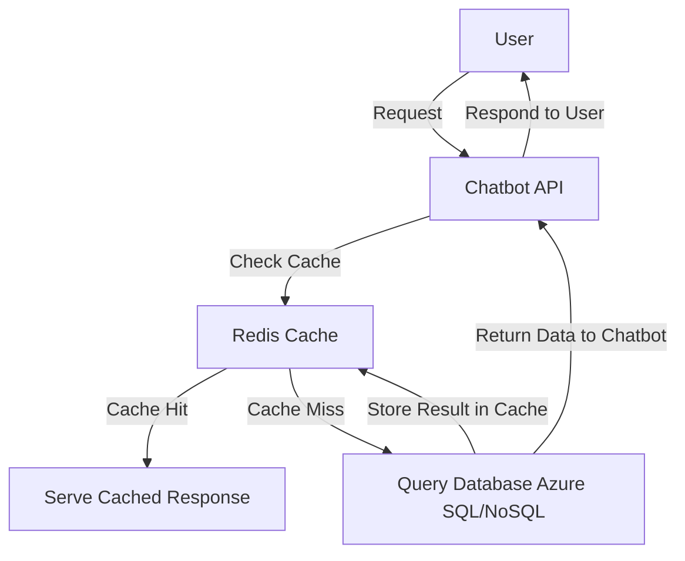

# **Performance Optimization and Caching**

### **Table of Contents**

- [**1. Why Caching is Critical**](#1-why-caching-is-critical)
- [**2. Azure Caching Solutions**](#2-azure-caching-solutions)
- [**3. Performance Monitoring Tools**](#3-performance-monitoring-tools)
- [**4. Best Practices for Caching and Optimization**](#4-best-practices-for-caching-and-optimization)
- [**5. Further Reading**](#5-further-reading)

---

## **1. Why Caching is Critical**

Caching **reduces response time, minimizes backend workload, and improves scalability** by storing frequently accessed data closer to the user.

|**Benefit**|**Impact**|
|---|---|
|**Reduced Latency**|Minimizes database queries and speeds up responses.|
|**Improved Scalability**|Handles increased user loads without performance degradation.|
|**Cost Efficiency**|Reduces infrastructure costs by lowering resource consumption.|

### **How Caching Works in a Cloud-Based Chatbot**

> **Example:** Instead of querying a database for every chatbot request, **cached responses** serve frequent queries instantly.

---

## **2. Azure Caching Solutions**

### **2.1 Azure Cache for Redis**

Azure Cache for Redis is an in-memory **key-value store** optimized for real-time caching and message brokering.

|**Feature**|**Description**|
|---|---|
|**Sub-Millisecond Latency**|Delivers ultra-fast data retrieval.|
|**Data Structures**|Supports strings, hashes, lists, sorted sets, and streams.|
|**Clustering Support**|Scales across multiple Redis nodes for high availability.|
|**Persistence**|Ensures data durability with snapshot and backup options.|
|**Security**|Supports private endpoints and access control policies.|

#### **Use Cases**

✅ **Session Management** → Store chatbot user sessions for fast authentication.  
✅ **Database Query Caching** → Cache API responses to reduce database load.  
✅ **Job Queuing** → Use Redis as a lightweight message broker.

> **Tip:** Set **TTL (Time-To-Live)** on cache entries to **auto-expire stale data**.

---

### **2.2 Azure Content Delivery Network (CDN)**

Azure CDN caches **static and dynamic content** at globally distributed **edge nodes** to minimize latency.

|**Feature**|**Benefit**|
|---|---|
|**Global Distribution**|Reduces latency for worldwide users.|
|**Edge Caching**|Accelerates delivery of images, videos, and HTML files.|
|**Dynamic Acceleration**|Optimizes caching for APIs and dynamic content.|

#### **Use Cases**

- **Static Asset Caching** → Cache images, scripts, and stylesheets.
- **Video Streaming** → Deliver multimedia content with minimal buffering.
- **Accelerated API Calls** → Reduce latency by caching frequently accessed API responses.

---

### **2.3 Azure Front Door**

Azure Front Door provides **global load balancing**, caching, and **security features** for web applications.

|**Feature**|**Description**|
|---|---|
|**Global Load Balancing**|Routes traffic to the healthiest and closest backend.|
|**Edge Caching**|Improves API and website response times.|
|**Security Features**|Includes **DDoS protection** and Web Application Firewall (WAF).|

#### **Use Cases**

✅ **Multi-Region Chatbot Deployments** → Improve chatbot response time for users in different regions.  
✅ **Failover Support** → Redirect traffic automatically during **server outages**.  
✅ **Zero-Downtime Deployments** → Route users to the latest stable version of your chatbot.

> **Tip:** **Combine Azure Front Door with Azure CDN** for enhanced **global performance**.

---

## **3. Performance Monitoring Tools**

Effective **monitoring and analytics** help fine-tune caching strategies.

|**Tool**|**Purpose**|
|---|---|
|**Azure Monitor**|Tracks response times, cache hit ratios, and overall performance.|
|**Application Insights**|Provides **deep diagnostics** into request execution times.|
|**Prometheus & Grafana**|Collects real-time **Redis cache metrics** and visualizes performance trends.|

> **Reminder:** For monitoring **Redis performance**, refer to the **[Prometheus and Grafana Overview](#prometheus_and_grafana).**

---

## **4. Best Practices for Caching and Optimization**

✅ **Layered Caching Strategy**

- Use **Azure CDN** for **static assets** and **Azure Redis** for **dynamic data**.

✅ **Optimize TTL (Time-To-Live) Policies**

- Set **appropriate expiration times** for different data types (e.g., **shorter TTLs for volatile data**).

✅ **Monitor Cache Hit Ratios**

- Ensure **high cache utilization** by tracking cache hits vs. misses.

✅ **Secure the Cache**

- Use **SSL/TLS encryption**, **private networks**, and **firewall rules**.

✅ **Use Efficient Data Structures**

- **Sorted sets** (ZSETs) for ranking systems.
- **Hashes** (HSETs) for **session storage**.

✅ **Test Under Load**

- Simulate **high traffic scenarios** to validate caching performance.

---

## **5. Further Reading**

📖 [Azure Cache for Redis Documentation](https://learn.microsoft.com/en-us/azure/azure-cache-for-redis/)  
📖 [Azure CDN Overview](https://learn.microsoft.com/en-us/azure/cdn/)  
📖 [Azure Front Door Documentation](https://learn.microsoft.com/en-us/azure/frontdoor/overview)  
📖 [Performance Optimization Guide](https://learn.microsoft.com/en-us/azure/architecture/checklist/performance-efficiency)

> **Cross-Reference:** To improve overall system performance beyond caching, review **[Scaling and Performance Optimization](#scalability_in_applications.md).**

---

### **Next Steps**

📌 Proceed to:

- [containerizing_with_docker](containerizing_with_docker.md)
