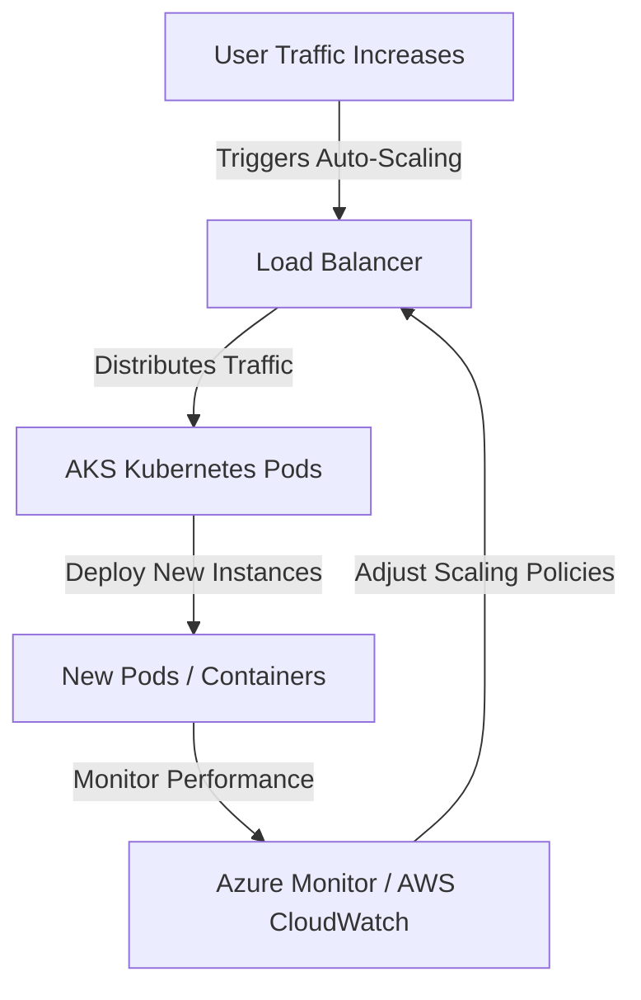

# **Scalability**

### **Table of Contents**

- [**1. Introduction to Scalability**](#1-introduction-to-scalability)
- [**2. Popular Scalability Solutions**](#2-popular-scalability-solutions)
- [**3. Comparing Scalability Options**](#3-comparing-scalability-options)
- [**4. Decision-Making Criteria**](#4-decision-making-criteria)
- [**5. Best Practices for Scalability**](#5-best-practices-for-scalability)
- [**6. Further Reading**](#6-further-reading)

---

## **1. Introduction to Scalability**

Scalability ensures that applications can **handle increased workloads** while maintaining performance and efficiency. It allows systems to **dynamically allocate resources**, preventing **bottlenecks** during peak usage and optimizing costs during low traffic periods.

> **Tip:** Combine **scalability** with **caching strategies** for even **better performance**. See **[Caching Strategies for Chatbots](#caching_strategies_chatbots).**

### **Scalability Workflow**

---

## **2. Popular Scalability Solutions**

### **2.1 Azure Kubernetes Service (AKS)**

AKS provides **container orchestration** for scaling applications **horizontally** and **automatically managing infrastructure**.

|**Feature**|**Advantage**|
|---|---|
|**Auto-Scaling**|Adjusts container instances based on demand.|
|**Self-Healing**|Restarts failed containers automatically.|
|**CI/CD Integration**|Works with GitHub Actions and Azure DevOps Pipelines.|

**Use Cases:**

- **Microservices-based architectures**
- **Batch processing and background tasks**
- **CI/CD pipelines requiring dynamic container management**

> **Cost:** Free management layer; pay only for compute and storage.

---

### **2.2 Azure Load Balancer**

Azure Load Balancer ensures **fault tolerance** by **distributing incoming traffic** across multiple resources.

|**Feature**|**Advantage**|
|---|---|
|**Health Probes**|Automatically detects failed instances and reroutes traffic.|
|**Multi-Region**|Ensures availability by routing traffic to the closest or healthiest server.|
|**Integration**|Works with virtual machines, containers, and web apps.|

**Use Cases:**

- **High-traffic web applications**
- **Disaster recovery with multi-region setups**
- **Ensuring availability for chatbot services**

> **Cost:** Based on processed data and configured rules.

---

### **2.3 AWS Lambda (Serverless Scaling)**

AWS Lambda enables **event-driven execution** without managing infrastructure. It automatically **scales to zero when idle** and **handles spikes efficiently**.

|**Feature**|**Advantage**|
|---|---|
|**Event-Driven Scaling**|Allocates resources dynamically as requests increase.|
|**Cost Efficiency**|Pay only for execution time.|
|**Zero Server Management**|Reduces operational overhead.|

**Use Cases:**

- **Real-time data processing**
- **API backends for chatbots**
- **IoT event-driven applications**

> **Cost:** Billed per request and compute time.

---

## **3. Comparing Scalability Options**

|**Solution**|**Platform**|**Best For**|**Advantages**|**Disadvantages**|
|---|---|---|---|---|
|**Azure Kubernetes Service (AKS)**|Azure|Stateful and microservice-heavy workloads|Automatic scaling, CI/CD integration|Steeper learning curve|
|**Azure Load Balancer**|Azure|Traffic distribution for web apps|High availability, fault tolerance|Limited to L4 routing|
|**AWS Lambda**|AWS|Event-driven workloads|Cost-efficient, serverless model|Cold starts increase latency|

---

## **4. Decision-Making Criteria**

### **4.1 Workload Type**

|**Workload Type**|**Recommended Solution**|
|---|---|
|**Event-Driven Applications**|AWS Lambda|
|**Persistent Long-Running Services**|AKS (Kubernetes)|
|**High-Traffic Distribution**|Azure Load Balancer|

### **4.2 Scaling Strategies**

|**Scaling Type**|**Definition**|**Example**|
|---|---|---|
|**Horizontal Scaling**|Adds more nodes to distribute the workload|Increasing Kubernetes pods in AKS|
|**Vertical Scaling**|Increases resource capacity (CPU, RAM) on an instance|Upgrading VM instance type|
|**Serverless Scaling**|Dynamically allocates resources per request|AWS Lambda autoscaling|

### **4.3 Cost Considerations**

- **Predictable Workloads:** Reserve resources (e.g., **Azure Reserved VM Instances**) to optimize costs.
- **Spiky Workloads:** Use **pay-per-use** models like **AWS Lambda** to avoid over-provisioning.

> **Reminder:** For database scaling, refer to **[Data Storage Solutions for Chatbots](#data_storage_solutions_for_chatbots).**

---

## **5. Best Practices for Scalability**

✅ **Combine Multiple Scaling Approaches**

- Use **horizontal scaling** for traffic surges and **vertical scaling** for processing-intensive tasks.

✅ **Leverage Caching to Reduce Backend Load**

- Implement **Azure Cache for Redis** to avoid frequent database queries.

✅ **Define Auto-Scaling Policies**

- Set CPU and memory thresholds for Kubernetes autoscaling.

✅ **Monitor Performance and Optimize Continuously**

- Use **Azure Monitor** and **AWS CloudWatch** to analyze workload trends.

✅ **Load Test Regularly**

- Simulate peak traffic using **JMeter** or **Locust** to identify potential bottlenecks.

---

## **6. Further Reading**

📖 [Azure Kubernetes Service Auto-Scaling](https://learn.microsoft.com/en-us/azure/aks/scale-cluster)  
📖 [AWS Lambda Best Practices](https://aws.amazon.com/lambda/)  
📖 [Azure Load Balancer Documentation](https://learn.microsoft.com/en-us/azure/load-balancer/load-balancer-overview)  
📖 [Scalability Patterns](https://learn.microsoft.com/en-us/azure/architecture/framework/scalability)

> **Cross-Reference:** Review [setting_up_ci_cd_pipelines](../CI_CD/setting_up_ci_cd_pipelines.md) for **automated scalability configurations**.

---

### **Next Steps**

📌 Proceed to:

- [data_storage_solutions](../Database_Solutions/data_storage_solutions.md)
- [performance_optimization_and_caching](performance_optimization_and_caching.md)
