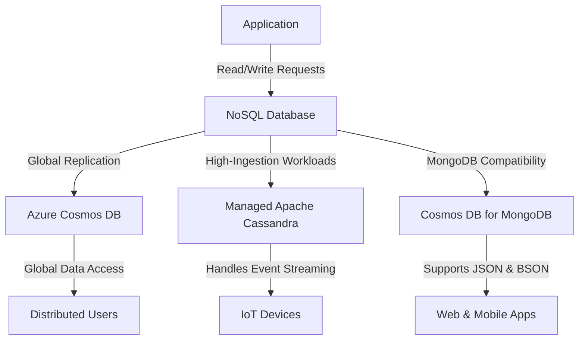

# **Azure NoSQL Database Solutions**
### **Table of Contents**

- [**1. Introduction to NoSQL Databases**](#1-introduction-to-nosql-databases)
- [**2. Azure Cosmos DB**](#2-azure-cosmos-db)
- [**3. Azure Managed Instance for Apache Cassandra**](#3-azure-managed-instance-for-apache-cassandra)
- [**4. Azure Cosmos DB for MongoDB**](#4-azure-cosmos-db-for-mongodb)
- [**5. Choosing the Right NoSQL Database**](#5-choosing-the-right-nosql-database)
- [**6. Best Practices for NoSQL Databases**](#6-best-practices-for-nosql-databases)
- [**7. Further Reading**](#7-further-reading)

---

## **1. Introduction to NoSQL Databases**

NoSQL databases are optimized for **scalability, speed, and flexible data structures**, making them ideal for **real-time applications, IoT, and distributed systems**. Unlike traditional relational databases, they can handle **large volumes of semi-structured and unstructured data**.

> **Use Case:** NoSQL is widely used for applications such as **e-commerce platforms, chatbots, IoT telemetry, and content personalization.**

---

## **2. Azure Cosmos DB**

Azure Cosmos DB is **Microsoft’s globally distributed NoSQL database** with **multi-model support** and near-instantaneous data replication across regions.

### **Key Features**

|**Feature**|**Benefit**|
|---|---|
|**Global Distribution**|Data is replicated across multiple regions for low-latency access.|
|**Multi-Model Support**|Supports document, key-value, graph, and columnar models.|
|**Elastic Scalability**|Dynamically scales throughput and storage.|
|**Consistency Levels**|Offers strong, bounded-staleness, session, consistent prefix, and eventual consistency.|

### **Ideal Use Cases**

- **Real-Time Analytics**: High-velocity data processing.
- **Personalized Recommendations**: Adapts content dynamically.
- **IoT Data Management**: Handles sensor and telemetry data.

> **Tip:** Use **partitioning and indexing** effectively to optimize performance in Cosmos DB.

---

## **3. Azure Managed Instance for Apache Cassandra**

This **fully managed service for Apache Cassandra** provides **enterprise-scale performance** with hybrid cloud capabilities.

### **Key Features**

|**Feature**|**Benefit**|
|---|---|
|**Hybrid Deployment**|Extends existing Cassandra clusters to Azure.|
|**Scalability**|Handles high-ingestion workloads efficiently.|
|**Backup & Security**|Automated backups and encryption for compliance.|

### **Ideal Use Cases**

- **Event Streaming**: Processes high-throughput time-series data.
- **IoT and Sensor Data**: Manages large-scale event ingestion.
- **Hybrid Workloads**: Syncs on-premises and cloud Cassandra clusters.

> **Tip:** Optimize partition keys to **distribute data evenly across nodes**.

---

## **4. Azure Cosmos DB for MongoDB**

Azure Cosmos DB provides **a managed MongoDB-compatible service**, allowing seamless migration for existing MongoDB applications.

### **Key Features**

|**Feature**|**Benefit**|
|---|---|
|**MongoDB API Compatibility**|Supports BSON format and MongoDB query language.|
|**Automatic Scaling**|Handles spikes in traffic efficiently.|
|**High Availability**|Ensures 99.999% uptime across regions.|

### **Ideal Use Cases**

- **E-Commerce**: Manages inventory, user sessions, and transactions.
- **Content Management**: Stores dynamic user-generated content.
- **Mobile Applications**: Enables fast, JSON-based document retrieval.

> **Tip:** Verify MongoDB **API version compatibility** before migrating to Cosmos DB.

---

## **5. Choosing the Right NoSQL Database**

|**Feature**|**Cosmos DB**|**Managed Cassandra**|**Cosmos DB for MongoDB**|
|---|---|---|---|
|**Best for**|Multi-region, real-time applications|High-ingestion workloads|MongoDB-compatible apps|
|**Data Model**|Multi-model (key-value, document, graph)|Columnar (Cassandra)|Document (JSON, BSON)|
|**Global Replication**|✅ Yes|⚠️ Limited|✅ Yes|
|**Scaling Model**|Automatic scaling|Manual and hybrid scaling|Automatic scaling|
|**Use Cases**|IoT, AI-powered apps, personalized recommendations|High-throughput event processing|E-commerce, content management|

> **Decision Guide:**
> 
> - **Choose Cosmos DB** for **global, real-time apps** needing **multi-region support**.
> - **Choose Managed Cassandra** for **high-ingestion IoT or analytics workloads**.
> - **Choose Cosmos DB for MongoDB** if migrating an **existing MongoDB** workload.

---

## **6. Best Practices for NoSQL Databases**

### **6.1 Optimize Data Partitioning**

- Select **effective partition keys** to **distribute data evenly**.
- Avoid "hot partitions" that concentrate too many queries on a single node.

### **6.2 Choose the Right Consistency Model**

- Use **Strong Consistency** for mission-critical applications.
- Use **Eventual Consistency** for **performance-optimized workloads**.

### **6.3 Monitor Performance & Optimize Queries**

- Use **Azure Monitor** and **Azure Metrics** for real-time insights.
- Index **frequently queried fields** to improve read performance.

### **6.4 Implement Caching**

- Use **Azure Cache for Redis** to store frequently accessed data.
- Reduce **database query load** by leveraging in-memory caching.

### **6.5 Enable Auto-Scaling**

- Cosmos DB supports **auto-scaling throughput (RU/s)**.
- Set up **alerting mechanisms** to detect unusual spikes in demand.

---

## **7. Further Reading**

- [Azure Cosmos DB Overview](https://learn.microsoft.com/en-us/azure/cosmos-db/introduction)
- [Azure Managed Apache Cassandra](https://learn.microsoft.com/en-us/azure/managed-instance-apache-cassandra/overview)
- [Cosmos DB for MongoDB API](https://learn.microsoft.com/en-us/azure/cosmos-db/mongodb/introduction)

> **Cross-Reference:** Learn about relational alternatives in **[Azure SQL Database](#azure_sql_database).**

---

### **Next Steps**
- [database_migration_tools](database_migration_tools.md)
