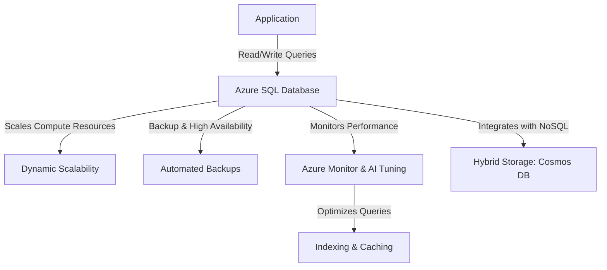

# **Azure SQL Database Overview**
### **Table of Contents**

- [**1. Introduction**](#1-introduction)
- [**2. Features of Azure SQL Database**](#2-features-of-azure-sql-database)
- [**3. Common Use Cases**](#3-common-use-cases)
- [**4. Comparing Azure SQL Database with Alternatives**](#4-comparing-azure-sql-database-with-alternatives)
- [**5. Best Practices for Azure SQL Database**](#5-best-practices-for-azure-sql-database)
- [**6. Further Reading**](#6-further-reading)

---

## **1. Introduction**

Azure SQL Database is a **fully managed relational database-as-a-service (DBaaS)** designed for **scalable, secure, and high-performance applications**. It provides **built-in intelligence, auto-scaling, and security features**, eliminating manual database maintenance.

---

## **2. Features of Azure SQL Database**

|**Feature**|**Benefit**|
|---|---|
|**Serverless & Elastic Scaling**|Auto-scales compute resources based on demand.|
|**Geo-Redundant Backups**|Ensures data protection with automated failover.|
|**AI-Powered Performance Tuning**|Optimizes queries with intelligent indexing and recommendations.|
|**Advanced Security**|Includes **Always Encrypted**, **Transparent Data Encryption (TDE)**, and **Azure Defender**.|
|**Hybrid Compatibility**|Supports **Azure Arc**, **Cosmos DB integration**, and **on-premises SQL Server sync**.|
|**Multiple Pricing Models**|Choose **DTU-based (predefined compute)** or **vCore-based (customized scaling)**.|

> **Tip:** **Serverless mode** is perfect for infrequent workloads, as it **pauses when idle**, reducing costs.

---

## **3. Common Use Cases**

### **3.1 Chatbots & Web Applications**

- **User Profile Storage:** Store structured user data for personalization.
- **Session Management:** Maintain real-time interaction data efficiently.

### **3.2 Transactional Systems**

- **E-Commerce Platforms:** Supports **order processing, inventory tracking, and payments**.
- **Financial Services:** Handles **high-frequency transactions with ACID compliance**.

### **3.3 Analytics & Reporting**

- **Power BI Integration:** Analyze trends and generate reports seamlessly.
- **Operational Dashboards:** Monitor application health and business metrics in real-time.

> **Tip:** If your workload includes **semi-structured or unstructured data**, consider a **hybrid approach** with **Azure Cosmos DB**.

---

## **4. Comparing Azure SQL Database with Alternatives**

|**Feature**|**Azure SQL Database**|**Self-Hosted SQL Server**|**Azure Cosmos DB**|
|---|---|---|---|
|**Management**|Fully managed (PaaS)|Self-managed|Fully managed (NoSQL)|
|**Scalability**|Auto-scaling, serverless|Manual resource allocation|Elastic, multi-region scaling|
|**Data Model**|Relational (tables, rows, SQL queries)|Relational|NoSQL (document, graph, key-value)|
|**Security**|Built-in encryption, RBAC, threat detection|Requires manual security setup|End-to-end encryption, role-based security|
|**Ideal Use Case**|Transactional apps, analytics, reporting|On-prem or hybrid SQL workloads|IoT, real-time apps, distributed workloads|

> **Decision Guide:**
> 
> - Use **Azure SQL Database** for **relational, ACID-compliant workloads**.
> - Use **Self-Hosted SQL Server** if your application **requires on-prem or hybrid infrastructure**.
> - Use **Cosmos DB** for **unstructured, globally distributed data**.

---

## **5. Best Practices for Azure SQL Database**

### **5.1 Optimize Performance**

✅ **Use Indexing & Query Optimization**

- Leverage **columnstore indexes** for analytics workloads.
- Enable **Query Store** to analyze slow-running queries.

✅ **Cache Frequently Accessed Data**

- Implement **Azure Cache for Redis** to reduce database queries.
- Use **Materialized Views** for precomputed query results.

### **5.2 Secure Your Data**

✅ **Encrypt Sensitive Data**

- Use **Transparent Data Encryption (TDE)** for data at rest.
- Enable **Always Encrypted** to protect sensitive fields like user passwords.

✅ **Implement Network Security**

- Restrict access with **Azure Private Link** and **firewall rules**.
- Enable **Managed Identity** for secure authentication.

### **5.3 Scale Efficiently**

✅ **Choose the Right Pricing Model**

- **DTU-based**: Best for **predictable workloads**.
- **vCore-based**: Best for **scalable, compute-intensive applications**.

✅ **Use Auto-Scaling Features**

- Enable **elastic pools** for shared resource efficiency.
- Implement **hyperscale tier** for growing workloads.

### **5.4 Monitor & Automate**

✅ **Enable Azure Monitor & Alerts**

- Set up alerts for **query performance issues and resource usage**.
- Use **Azure Log Analytics** to **track slow queries & optimize indexes**.

✅ **Automate Backups & Disaster Recovery**

- Configure **Point-in-Time Restore (PITR)** for quick recovery.
- Use **Geo-Replication** to replicate across Azure regions.

> **Tip:** Use **Azure Synapse Analytics** for large-scale analytical queries over Azure SQL Database.

---

## **6. Further Reading**

- [Azure SQL Database Overview](https://learn.microsoft.com/en-us/azure/azure-sql/database/)
- [Optimizing Azure SQL Performance](https://learn.microsoft.com/en-us/azure/azure-sql/database/performance-best-practices/)
- [Azure SQL Database Security Guide](https://learn.microsoft.com/en-us/azure/azure-sql/database/security-overview/)
- [Azure Pricing Calculator](https://azure.microsoft.com/en-us/pricing/calculator/)

---

### **Next Steps**
- [database_migration_tools](database_migration_tools.md)
