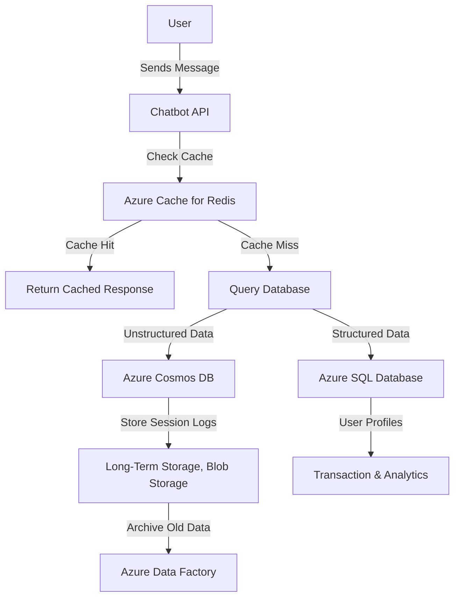

# **Data Storage Solutions for Chatbots**

### **Table of Contents**

- [**1. Introduction**](#1-introduction)
- [**2. Storage Options for Chatbots**](#2-storage-options-for-chatbots)
- [**3. Supporting Technologies for Data Storage**](#3-supporting-technologies-for-data-storage)
- [**4. Recommended Storage Architecture**](#4-recommended-storage-architecture)
- [**5. Optimization Strategies**](#5-optimization-strategies)
- [**6. Further Reading**](#6-further-reading)
- [**Next Steps**](#next-steps)

---
## **1. Introduction**

Chatbots generate large volumes of structured (user profiles, transactions) and unstructured (conversations, logs) data. Choosing the right storage solution enhances **performance, scalability, and cost-efficiency**.

> **Tip:** Combine **NoSQL** (Azure Cosmos DB) for real-time interactions and **SQL** (Azure SQL Database) for structured storage.



---

## **2. Storage Options for Chatbots**

### **2.1 Azure Cosmos DB (NoSQL)**

Azure Cosmos DB is a **multi-model, globally distributed NoSQL database** optimized for **real-time chatbot interactions**.

|**Feature**|**Benefit**|
|---|---|
|**Global Distribution**|Ensures low-latency access for worldwide users.|
|**Multi-Model Support**|Works with JSON, MongoDB, Cassandra, and Gremlin APIs.|
|**Auto-Scaling**|Adjusts Request Units (RUs) dynamically based on traffic.|
|**Low Latency Reads/Writes**|Delivers millisecond response times for chat applications.|

#### **Use Cases**

- **User Sessions & Conversations** – Store messages, context, and conversation history.
- **AI Model Logs** – Save model interactions and feedback for chatbot learning.

> **Tip:** Use **Cosmos DB’s "Time-to-Live (TTL)"** feature to auto-delete old conversations.

---

### **2.2 Azure SQL Database (Relational)**

Azure SQL Database is a **fully managed relational database service** that excels at **structured chatbot data**.

|**Feature**|**Benefit**|
|---|---|
|**ACID Compliance**|Guarantees data consistency and integrity.|
|**Elastic Pools**|Allocates resources dynamically to optimize performance.|
|**Advanced Security**|Includes encryption, auditing, and Azure Active Directory integration.|
|**Serverless & DTU Models**|Supports cost-efficient scaling for chatbot workloads.|

#### **Use Cases**

- **User Profiles & Preferences** – Store structured user data (name, settings, preferences).
- **Transaction Data** – Manage chatbot-enabled e-commerce payments or bookings.
- **Analytics & Reporting** – Power dashboards tracking chatbot performance.

> **Tip:** Use **"Hyperscale Mode"** for large chatbots requiring **high read/write throughput**.

---

## **3. Supporting Technologies for Data Storage**

### **3.1 Caching for Faster Responses**

🔹 **Azure Cache for Redis** → Reduces database queries by storing frequently accessed data.  
🔹 **Memcached** → Lightweight caching for simple chatbot lookups.

```python
import redis
cache = redis.StrictRedis(host='your-redis-host', port=6380, password='your-password', ssl=True)
cache.set('chat:user123', 'session_data', ex=3600)  # Store session data with expiry
```

---

### **3.2 Data Archiving & Retention**

🔹 **Azure Blob Storage** → Stores large logs, chatbot transcripts, and session backups.  
🔹 **Azure Data Factory** → Automates scheduled archiving of infrequent chatbot data.

```python
from azure.storage.blob import BlobServiceClient
blob_client = BlobServiceClient(account_url="https://youraccount.blob.core.windows.net", credential="your-key")
container_client = blob_client.get_container_client("chatbot-logs")
container_client.upload_blob("session_2024.log", data="User conversation logs")
```

> **Tip:** Offload older chatbot conversations to **Blob Storage** to reduce database costs.

---

## **4. Recommended Storage Architecture**

- **Short-Term (Fast Access)**
    
    - **Azure Cache for Redis** – Stores active user sessions & chat history.
    - **Azure Cosmos DB** – Handles live chat interactions with low latency.
- **Long-Term (Structured Data)**
    
    - **Azure SQL Database** – Stores user profiles, payment records, and chatbot analytics.
- **Archival (Cold Storage)**
    
    - **Azure Blob Storage** – Retains old chatbot logs for compliance and analysis.

---

## **5. Optimization Strategies**

✅ **Hybrid NoSQL & SQL Approach** → Store structured and unstructured data separately.  
✅ **Use Redis as a Cache** → Avoid frequent DB queries for chatbot sessions.  
✅ **Enable Auto-Scaling** → Ensure Cosmos DB & SQL scale dynamically with traffic.  
✅ **Partition Data Effectively** → Prevent "hot partitions" in Cosmos DB for balanced workloads.  
✅ **Implement Time-to-Live (TTL) Policies** → Automatically delete outdated chatbot logs.

> **Tip:** See "[Performance Optimization and Caching](#performance_optimization_and_caching)" for additional efficiency improvements.

---

## **6. Further Reading**

- [Azure Cosmos DB Documentation](https://learn.microsoft.com/en-us/azure/cosmos-db/introduction)
- [Azure SQL Database Overview](https://learn.microsoft.com/en-us/azure/azure-sql/)
- [Azure Cache for Redis Documentation](https://learn.microsoft.com/en-us/azure/azure-cache-for-redis/)
- [Azure Blob Storage Best Practices](https://learn.microsoft.com/en-us/azure/storage/blobs/)

> **Cross-Reference:** See the **"[azure_nosql_solutions](azure_nosql_solutions.md)"** document for a deeper comparison of Cosmos DB with other NoSQL solutions.

---

## **Next Steps**

- **[azure_sql_database](azure_sql_database.md)**
- **[azure_nosql_solutions](azure_nosql_solutions.md)**
- **[mongodb_overview](mongodb_overview.md)**

---

