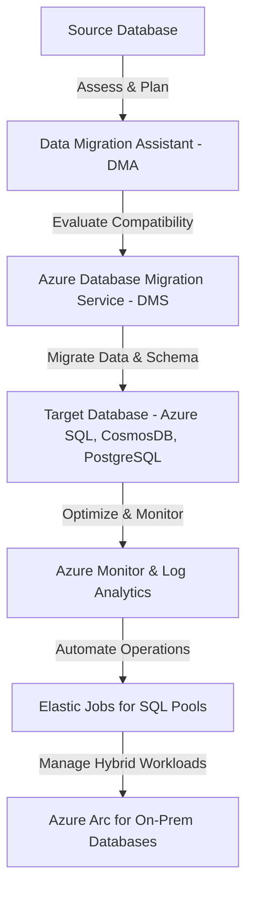

# **Database Migration and Management Tools**

### **Table of Contents**

- [**1. Introduction**](#1-introduction)
- [**2. Migration and Management Solutions**](#2-migration-and-management-solutions)
- [**3. Best Practices**](#3-best-practices)
- [**4. Further Reading**](#4-further-reading)
- [**Next Steps**](#next-steps)

---

## **1. Introduction**

Migrating and managing databases efficiently is essential for **reducing downtime, improving performance, and ensuring data consistency**. Azure provides multiple tools to **migrate, automate, and monitor** databases across cloud and hybrid environments.

> **Tip:** Combining **automation** with migration services reduces **manual effort** and ensures **seamless transitions** with minimal disruptions.

---

## **2. Migration and Management Solutions**

### **2.1 Azure Database Migration Service (DMS)**

Azure DMS provides **fully managed, automated migration** from various database sources to Azure.

|**Feature**|**Benefit**|
|---|---|
|**Schema Assessment**|Identifies compatibility issues before migration.|
|**Automated Data Migration**|Transfers data with minimal manual effort.|
|**Supports Online & Offline Migrations**|Flexible migration models for different workload requirements.|
|**Multi-Database Support**|Works with SQL Server, MySQL, PostgreSQL, MongoDB, and more.|

#### **Migration Approaches**

|**Mode**|**Best For**|**Trade-Offs**|
|---|---|---|
|**Online Migration**|Minimal downtime, real-time cutover|Higher resource consumption|
|**Offline Migration**|Faster for small databases|Requires scheduled downtime|

#### **Example Migration Workflow**

1. **Assess Database Compatibility** → Use **Data Migration Assistant (DMA)** to detect schema and indexing issues.
2. **Set Up DMS Instance** → Configure database connectivity settings.
3. **Start Data Migration** → Migrate schema, indexes, and stored procedures.
4. **Monitor & Optimize** → Validate performance post-migration using **Azure Monitor**.

> **Reminder:** Use **Azure Data Migration Assistant (DMA)** before migrating to avoid **schema conflicts**.

---

### **2.2 Elastic Jobs for Task Automation**

Elastic Jobs automate **routine database tasks** across **multiple Azure SQL databases**, reducing **manual workload**.

|**Feature**|**Benefit**|
|---|---|
|**Multi-Database Execution**|Run jobs across multiple databases simultaneously.|
|**Event-Driven Scheduling**|Set triggers for backups, schema changes, and optimizations.|
|**Parallel Execution**|Executes jobs concurrently for large database pools.|
|**Dynamic Targeting**|Automatically applies jobs to new databases.|

#### **Best Use Cases**

- **Multi-Tenant SaaS Databases** → Apply schema updates to hundreds of customer databases.
- **Index Optimization & Maintenance** → Automate re-indexing and performance tuning.
- **Scheduled Backups & Alerts** → Ensure database reliability with minimal effort.

> **Tip:** Elastic Jobs are particularly useful for **SaaS platforms** managing **hundreds of database instances**.

---

### **2.3 Azure Arc for Hybrid Data Management**

Azure Arc extends **Azure’s governance and security** to **on-prem and multi-cloud** databases.

|**Capability**|**Benefit**|
|---|---|
|**Manage Databases from Azure**|Centralized control for on-prem, multi-cloud, and edge databases.|
|**Flexible Deployment**|Works with **SQL Server, PostgreSQL, MySQL, and MongoDB**.|
|**Compliance & Security**|Enforce **RBAC, policies, and monitoring** for hybrid environments.|
|**Offline Mode Support**|Manage databases even in **restricted or air-gapped environments**.|

#### **Best Use Cases**

- **Hybrid Cloud Workloads** → Unified management for **on-prem & cloud** databases.
- **Regulated Industries** → Maintain **on-prem compliance** while leveraging Azure automation.
- **Multi-Cloud Database Management** → Consistently manage **AWS RDS, Google Cloud SQL, and on-prem databases**.

> **Reminder:** Azure Arc enables **self-service cloud capabilities** for **on-prem databases** without full migration.

---

## **3. Best Practices**

✅ **Assess Early & Plan Ahead**

- Run **Azure Data Migration Assistant (DMA)** before migration.
- Identify **schema incompatibilities & indexing issues**.

✅ **Automate Maintenance & Monitoring**

- Use **Elastic Jobs** for **multi-database automation**.
- Set up **Azure Monitor & Log Analytics** for **real-time insights**.

✅ **Choose the Right Migration Model**

- **Online Migrations** for **low downtime**.
- **Offline Migrations** for **high data volumes with planned cutovers**.

✅ **Secure Data & Governance**

- Enable **Azure Security Center** for compliance checks.
- Use **Azure Key Vault** for **securing connection strings & credentials**.

✅ **Optimize Post-Migration Performance**

- Implement **Indexing & Query Optimization** using **Azure Advisor**.
- Use **Elastic Pools** for **cost-efficient scaling**.

> **Tip:** Use **Azure Database Experimentation Assistant (DEA)** to simulate workload impacts before migration.

---

## **4. Further Reading**

📌 [Azure Database Migration Service (DMS) Docs](https://learn.microsoft.com/en-us/azure/dms/overview)  
📌 [Azure Elastic Jobs Documentation](https://learn.microsoft.com/en-us/azure/azure-sql/database/elastic-jobs-overview)  
📌 [Azure Arc for Data Services](https://learn.microsoft.com/en-us/azure/azure-arc/data/overview)  
📌 [Performance Tuning with Query Store](https://learn.microsoft.com/en-us/sql/relational-databases/performance/monitor-performance-using-query-store)

---

## **Next Steps**

🔹 **[azure_sql_database](azure_sql_database.md)** – Managed relational database for structured data.  
🔹 **[azure_nosql_solutions](azure_nosql_solutions.md)** – Exploring CosmosDB & MongoDB.  
🔹 **[performance_optimization_and_caching](../Containerization_and_Deployment/performance_optimization_and_caching.md)** – Enhancing DB efficiency.

---

