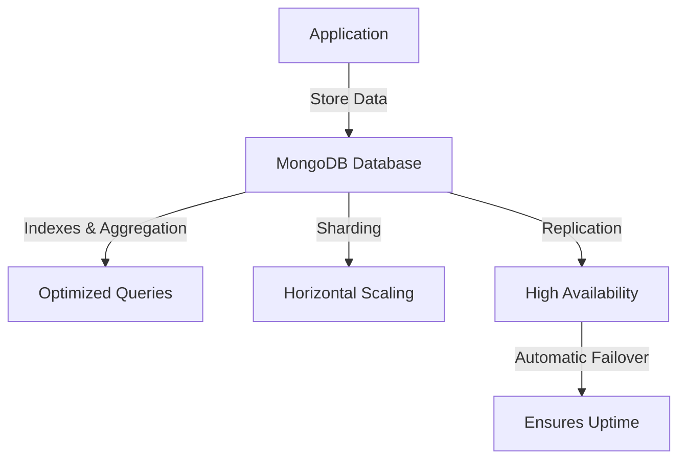

# **MongoDB Overview**
### **Table of Contents**

- [**1. Introduction**](#1-introduction)
- [**2. Core Features**](#2-core-features)
- [**3. Deployment Options**](#3-deployment-options)
- [**4. Popular Use Cases**](#4-popular-use-cases)
- [**5. Best Practices**](#5-best-practices)
- [**6. Further Reading**](#6-further-reading)
- [**Next Steps**](#next-steps)

---
## **1. Introduction**

MongoDB is a widely used **NoSQL document database**, designed for **scalability, flexibility, and performance**. It stores data in **BSON (Binary JSON)** format, allowing **schema-less storage** for rapid development.

> **Why Use MongoDB?**
> 
> - Ideal for **applications with dynamic schema** (e.g., real-time data, user-generated content).
> - Supports **horizontal scaling** via **sharding** for handling high traffic.
> - Provides **replication & failover mechanisms** to ensure uptime.


---

## **2. Core Features**

### **2.1 Flexible Schema Design**

- No predefined schema – allows **nested documents** and **dynamic fields**.
- Adapts quickly to **evolving application requirements**.

> **Example:**  
> A MongoDB collection can store different fields per document:
> 
> ```json
> { "name": "John Doe", "email": "john@example.com", "age": 30 }
> { "name": "Jane Smith", "phone": "123-456-7890" }
> ```

---

### **2.2 High Scalability**

- **Horizontal Scaling:** Uses **sharding** to distribute data across multiple nodes.
- **Vertical Scaling:** Supports upgrading instances for more processing power.

> **Tip:** Use **MongoDB Atlas auto-scaling** to handle spikes in workload efficiently.

---

### **2.3 Advanced Query & Aggregation**

- Rich query language for **filtering, sorting, and full-text search**.
- **Aggregation Pipeline** for efficient data transformations.

> **Example:** Aggregating user orders:
> 
> ```javascript
> db.orders.aggregate([
>   { $match: { status: "shipped" } },
>   { $group: { _id: "$customer_id", totalSpent: { $sum: "$amount" } } }
> ]);
> ```

---

### **2.4 Replication & High Availability**

- **Replica Sets:** Ensures **data redundancy** by maintaining **multiple copies**.
- **Automatic Failover:** Elects a new primary node when failures occur.

> **Tip:** Deploy **three or more replica nodes** for production to ensure high availability.

---

## **3. Deployment Options**

|**Deployment Model**|**Best For**|**Key Features**|
|---|---|---|
|**MongoDB Atlas** _(Cloud Managed)_|Fully managed cloud deployment|Auto-scaling, automated backups, security compliance|
|**MongoDB Enterprise Advanced** _(On-Premise & Hybrid)_|Enterprise-level self-hosted solution|Security, auditing, BI integrations|
|**MongoDB Community Edition** _(Self-Hosted)_|Free, open-source|Best for small workloads, manual scaling|

> **Reminder:** Use **MongoDB Atlas for production** to benefit from managed services like auto-scaling and built-in security.

---

## **4. Popular Use Cases**

|**Use Case**|**How MongoDB Helps**|
|---|---|
|**E-commerce**|Stores **product catalogs, inventory, user sessions**|
|**IoT Applications**|Handles **time-series & real-time sensor data**|
|**Content Management**|Manages **hierarchical & multimedia content**|
|**Real-Time Analytics**|Aggregates **user data & logs at scale**|

> **Tip:** MongoDB’s **Change Streams** allow real-time event tracking, useful for **notifications & live dashboards**.

---

## **5. Best Practices**

### ✅ **1. Optimize Indexing**

- **Create indexes** on frequently queried fields to improve performance.
- Use **compound indexes** for multi-field searches.

> **Example:** Indexing user emails for faster lookups:
> 
> ```javascript
> db.users.createIndex({ email: 1 })
> ```

---

### ✅ **2. Design for Sharding**

- Choose **appropriate shard keys** to evenly distribute data.
- Monitor **chunk migrations** to prevent performance bottlenecks.

> **Tip:** Avoid **monotonically increasing shard keys** (e.g., timestamps) to **prevent hot partitions**.

---

### ✅ **3. Secure Deployments**

- **Enable authentication & role-based access control (RBAC)**.
- **Use SSL/TLS** to encrypt connections.
- **Whitelist IPs** to prevent unauthorized access.

> **Example:** Restrict database access:
> 
> ```javascript
> db.createUser({
>   user: "admin",
>   pwd: "securepassword",
>   roles: [{ role: "readWrite", db: "chatbot" }]
> })
> ```

---

### ✅ **4. Monitor Performance**

- Use **MongoDB Atlas Monitoring** or **Prometheus & Grafana** for real-time tracking.
- Set up **alerts** for slow queries & replication lag.

> **Tip:** Regularly **run `explain()`** on queries to optimize execution plans.

---

### ✅ **5. Automate Backups**

- Use **MongoDB Ops Manager** or **Atlas Backup** for automated snapshots.
- Store backups in **Azure Blob Storage** or **AWS S3**.

> **Reminder:** Schedule **incremental backups** to minimize downtime.

---

## **6. Further Reading**

📌 [MongoDB Official Documentation](https://www.mongodb.com/docs/manual/)  
📌 [MongoDB Atlas Overview](https://www.mongodb.com/cloud/atlas)  
📌 [Sharding & Replication Best Practices](https://www.mongodb.com/docs/manual/sharding/)  
📌 [Indexing Strategies](https://www.mongodb.com/docs/manual/indexes/)

> **Cross-Reference:** Explore **"[azure_nosql_solutions](azure_nosql_solutions.md)"** for comparisons with **Cosmos DB & Cassandra**.

---

## **Next Steps**

🔹 **[database_migration_tools](database_migration_tools.md)** – Migrating MongoDB to **Azure CosmosDB**.  
🔹 **[performance_optimization_and_caching](../Containerization_and_Deployment/performance_optimization_and_caching.md)** – Improving MongoDB efficiency.  
🔹 **[scalability_in_applications](../Containerization_and_Deployment/scalability_in_applications.md)** – Scaling NoSQL databases across **multi-cloud environments**.

---
