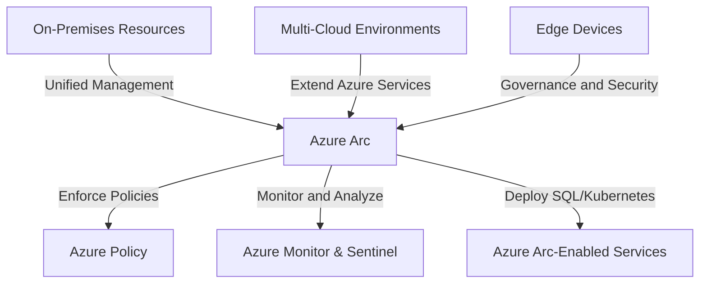

# Azure Arc
### **Table of Contents**

- [**1. Introduction to Azure Arc**](#1-introduction-to-azure-arc)
- [**2. Why Azure Arc? (Core Advantages)**](#2-why-azure-arc-core-advantages)
- [**3. Key Features of Azure Arc**](#3-key-features-of-azure-arc)
- [**4. Azure Arc-Enabled Services**](#4-azure-arc-enabled-services)
- [**5. Use Cases of Azure Arc**](#5-use-cases-of-azure-arc)
- [**6. Best Practices for Implementing Azure Arc**](#6-best-practices-for-implementing-azure-arc)
- [**7. Further Reading**](#7-further-reading)
- [**Summary of Improvements**](#summary-of-improvements)

----
## **1. Introduction to Azure Arc**

Azure Arc is a **hybrid and multi-cloud management platform** that enables organizations to extend Azure services **beyond the Azure cloud**. It allows **centralized control** over **on-premises, multi-cloud, and edge** environments, bringing Azure’s governance, security, and automation capabilities anywhere.

> **Analogy:** Think of Azure Arc as a **universal remote control** for managing infrastructure across different environments.

---

## **2. Why Azure Arc? (Core Advantages)**

|**Feature**|**Why It Matters**|
|---|---|
|**Unified Resource Management**|Manage workloads across **on-premises, multi-cloud, and edge** from a single control plane.|
|**Hybrid Kubernetes & Databases**|Run **Azure SQL and Kubernetes services** on any infrastructure.|
|**Compliance & Governance**|Enforce **Azure Policy & Security Center** across distributed environments.|
|**Seamless Azure Integration**|Extend **Azure Monitor, Security Center, and Sentinel** to non-Azure environments.|

---

## **3. Key Features of Azure Arc**

### **3.1 Unified Control Plane**

- Manage **Windows, Linux, Kubernetes clusters, and databases** centrally.
- **Azure Portal, CLI, and REST API** provide consistent interfaces.

### **3.2 Kubernetes Management**

- Enforce **RBAC, Azure Policy, and GitOps-based deployments**.
- Standardize configurations across on-prem and cloud Kubernetes clusters.

### **3.3 Hybrid Data Services**

- Deploy **Azure SQL Managed Instance** and **PostgreSQL Hyperscale** on **any infrastructure**.
- **Always On Availability Groups** ensure data resiliency.

### **3.4 Security & Compliance**

- **Azure Security Center** provides **threat detection & vulnerability assessments**.
- **Azure Sentinel** enables **SIEM (Security Information and Event Management)**.

---

## **4. Azure Arc-Enabled Services**

### **4.1 Azure Arc-Enabled Kubernetes**

|**Feature**|**Benefit**|
|---|---|
|**GitOps-Based Deployment**|Automates Kubernetes application updates.|
|**Azure Policy Integration**|Enforces security and compliance.|
|**Cluster Monitoring**|Tracks performance with **Azure Monitor**.|

### **4.2 Azure Arc-Enabled Data Services**

|**Feature**|**Benefit**|
|---|---|
|**SQL Managed Instance**|Brings **Azure SQL** to **on-prem** and **multi-cloud**.|
|**PostgreSQL Hyperscale**|Distributed database for high-scale workloads.|

> **Tip:** Azure Arc-enabled data services support **always-on availability**, **backup automation**, and **auto-scaling**.

---

## **5. Use Cases of Azure Arc**

|**Scenario**|**Azure Arc Solution**|
|---|---|
|**Hybrid Workloads**|Deploy **Azure services on-prem** without full migration.|
|**Data Sovereignty**|Meet **compliance requirements** by keeping sensitive data on-prem.|
|**Edge Computing**|Manage **IoT and remote devices** using **Azure Arc policies**.|
|**Multi-Cloud Management**|Apply **unified governance** across **AWS, Google Cloud, and private clouds**.|

---

## **6. Best Practices for Implementing Azure Arc**

1. **Choose the Right Connectivity Mode**
    
    - Use **Direct Mode** for **real-time connectivity** to Azure.
    - Use **Indirect Mode** for **disconnected or air-gapped environments**.
2. **Leverage GitOps for Kubernetes**
    
    - Automate deployments using **Azure Arc with GitOps**.
3. **Monitor with Azure Sentinel**
    
    - Detect threats across hybrid environments.
4. **Use Azure Policy for Governance**
    
    - Apply compliance rules **uniformly across all managed resources**.
5. **Optimize Cost with Hybrid Licensing**
    
    - **Bring your own license (BYOL)** for cost-effective deployments.

---

## **7. Further Reading**

- [Azure Arc Official Documentation](https://learn.microsoft.com/en-us/azure/azure-arc/)
- [Azure Arc for Kubernetes](https://learn.microsoft.com/en-us/azure/azure-arc/kubernetes/)
- [Azure Arc Data Services](https://learn.microsoft.com/en-us/azure/azure-arc/data/)

> **Next Step:** Learn more about hybrid cloud architecture in [azure_arc_hybrid](azure_arc_hybrid.md).
