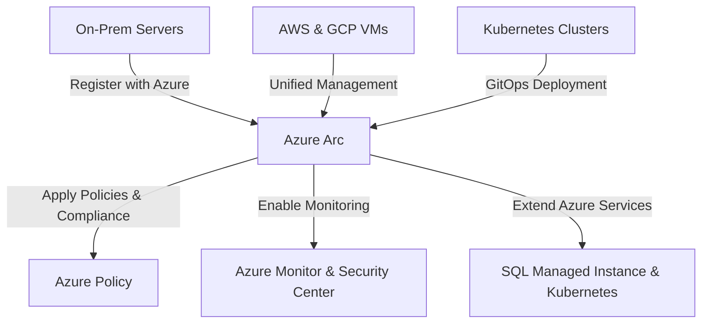

# **Azure Arc for Hybrid and Multi-Cloud Environments**
### **Table of Contents**

- [**1. Introduction to Azure Arc**](#1-introduction-to-azure-arc)
- [**2. Key Benefits**](#2-key-benefits)
- [**3. Azure Arc-Enabled Services**](#3-azure-arc-enabled-services)
- [**4. Use Cases**](#4-use-cases)
- [**5. Deployment Workflow**](#5-deployment-workflow)
- [**6. Best Practices**](#6-best-practices)
- [**7. Further Reading**](#7-further-reading)
- [**Next Steps**](#next-steps)

---

## **1. Introduction to Azure Arc**

Azure Arc extends **Azure management, security, and governance** to resources running in **on-premises, multi-cloud, and edge environments**. It provides a unified control plane, allowing businesses to **centralize operations across heterogeneous infrastructures**.

> **Why Azure Arc?**
> 
> - Manages **on-prem, AWS, and Google Cloud VMs** as if they were native Azure resources.
> - Provides **policy enforcement, monitoring, and DevOps automation** for hybrid environments.
> - Brings **Azure data and Kubernetes services** to **any infrastructure**.


---

## **2. Key Benefits**

|**Benefit**|**Description**|
|---|---|
|**Unified Management**|Control and configure **servers, VMs, and Kubernetes clusters** from Azure.|
|**Hybrid Cloud Governance**|Enforce **Azure Policies, Role-Based Access Control (RBAC), and Security Compliance** across clouds.|
|**Azure Kubernetes Anywhere**|Manage Kubernetes clusters outside Azure, with GitOps-based deployments.|
|**Hybrid Data Services**|Run **Azure SQL Managed Instance and PostgreSQL Hyperscale** on-premises or in other clouds.|
|**DevOps Integration**|Enables **GitOps, CI/CD workflows, and automation** for hybrid deployments.|

> **Tip:** **Azure Arc is cloud-agnostic** – it works across **AWS, GCP, and on-premises environments**.

---

## **3. Azure Arc-Enabled Services**

### **3.1 Azure Arc for Kubernetes**

Enables **centralized management, policy enforcement, and GitOps automation** for Kubernetes clusters running anywhere.

|**Feature**|**Benefit**|
|---|---|
|**GitOps-Based Deployment**|Automates configuration and app delivery via **ArgoCD or Flux**.|
|**Multi-Cluster Management**|Provides a **single pane of glass** for monitoring hybrid clusters.|
|**Security & Compliance**|Enforce Azure **RBAC and Policy controls** on non-Azure clusters.|

> **Example:** Deploying an **Arc-enabled Kubernetes cluster**:

```bash
az connectedk8s connect --name myCluster --resource-group myResourceGroup
```

---

### **3.2 Azure Arc Data Services**

Runs **Azure SQL Managed Instance and PostgreSQL Hyperscale** in **on-premises or multi-cloud** environments.

|**Feature**|**Benefit**|
|---|---|
|**Hybrid SQL & PostgreSQL**|Run **managed databases** outside Azure.|
|**Elastic Scaling**|Scale resources dynamically based on workload needs.|
|**Always-On Availability**|Achieve **high availability** even in disconnected environments.|

> **Use Case:** **Financial institutions** that need **data sovereignty** while using **Azure SQL MI** in private data centers.

---

## **4. Use Cases**

|**Scenario**|**How Azure Arc Helps**|
|---|---|
|**Hybrid Cloud Governance**|**Enforce policies & security** across multi-cloud and on-prem.|
|**Edge Computing**|Deploy and manage **IoT and Kubernetes workloads** at edge locations.|
|**Data Sovereignty Compliance**|Keep **sensitive data on-prem** while using **Azure management tools**.|
|**Multi-Cloud DevOps**|Enable **GitOps, CI/CD pipelines**, and infrastructure automation across clouds.|

> **Example:** **Azure Arc allows GitOps-based deployment** of Kubernetes applications running in **AWS, Google Cloud, and on-prem**.

---

## **5. Deployment Workflow**

### **Step 1: Register Resources with Azure Arc**

- Connect **on-prem, AWS, and GCP servers** to **Azure Arc**.
- Connect **Kubernetes clusters** for centralized governance.

> **Command Example: Registering a Kubernetes Cluster**

```bash
az connectedk8s connect --name hybrid-cluster --resource-group arc-resources
```

---

### **Step 2: Apply Policies and Governance**

- Use **Azure Policy** to enforce security and compliance rules.
- Restrict unauthorized **public IP assignments** on VMs.

> **Command Example: Enforcing Kubernetes Policies**

```bash
az policy assignment create --name restrict-public-ip --scope /subscriptions/{sub-id}/resourceGroups/{rg-name}
```

---

### **Step 3: Enable Monitoring & Security**

- **Azure Monitor** tracks **performance metrics & logs**.
- **Azure Security Center** detects **threats across hybrid workloads**.

> **Tip:** **Enable monitoring dashboards** for **real-time insights** on Kubernetes clusters.

---

### **Step 4: Deploy Applications with GitOps**

- Store **Kubernetes manifests in Git**.
- Automate deployments using **Flux or ArgoCD**.

> **Example:** Deploying a **chatbot microservice** using GitOps.

```yaml
apiVersion: apps/v1
kind: Deployment
metadata:
  name: chatbot
spec:
  replicas: 3
  selector:
    matchLabels:
      app: chatbot
  template:
    metadata:
      labels:
        app: chatbot
    spec:
      containers:
      - name: chatbot
        image: my-chatbot:latest
```

> **Reminder:** See **"[Containerizing_a_Chatbot_Using_Docker](../../docs/02_Setup_and_Configuration/Containerizing_a_Chatbot_Using_Docker)"** for best practices.

---

## **6. Best Practices**

✅ **Use GitOps for Kubernetes Management**

- Store all **Kubernetes configurations in Git repositories**.
- Use **ArgoCD or Flux** to **sync configurations automatically**.

✅ **Enable Role-Based Access Control (RBAC)**

- Restrict **access to critical resources** using **Azure Active Directory**.

✅ **Optimize Connectivity Modes**

- Use **Direct Mode** for continuous Azure connection.
- Use **Indirect Mode** for air-gapped environments.

✅ **Automate Security Compliance**

- Use **Azure Defender** to detect **threats across hybrid workloads**.

✅ **Monitor Performance in Real-Time**

- Set up **Azure Monitor dashboards** for **multi-cloud observability**.

---

## **7. Further Reading**

📌 [Azure Arc Documentation](https://learn.microsoft.com/en-us/azure/azure-arc/)  
📌 [Azure Arc Data Services](https://learn.microsoft.com/en-us/azure/azure-arc/data/overview)  
📌 [Hybrid Kubernetes with Azure Arc](https://learn.microsoft.com/en-us/azure/azure-arc/kubernetes/overview)

> **Cross-Reference:** If managing Kubernetes across hybrid clouds, see **"[docker_and_kubernetes](Containerization_and_Deployment/docker_and_kubernetes.md)"**.

---

## **Next Steps**

🔹 **[azure_workflow_and_orchestration](azure_workflow_and_orchestration.md)** – Automate **Arc-enabled deployments**.  
🔹 **[azure_monitoring_overview](../03_Testing_and_Monitoring/azure_monitoring_overview.md)** – Track performance in **hybrid environments**.  
🔹 **[scalability_in_applications](Containerization_and_Deployment/scalability_in_applications.md)** – Scaling **Arc-enabled workloads**.
