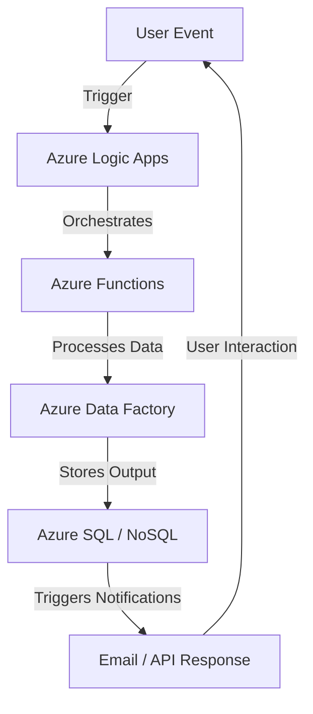

# **Azure Workflow and Orchestration**
### **Table of Contents**

- [**1. Introduction to Workflow and Orchestration**](#1-introduction-to-workflow-and-orchestration)
- [**2. Why Use Workflow and Orchestration?**](#2-why-use-workflow-and-orchestration)
- [**3. Azure Tools for Workflow and Orchestration**](#3-azure-tools-for-workflow-and-orchestration)
- [**4. Common Workflow Patterns**](#4-common-workflow-patterns)
- [**5. Setting Up a Workflow with Azure Logic Apps**](#5-setting-up-a-workflow-with-azure-logic-apps)
- [**6. Best Practices for Workflow Design**](#6-best-practices-for-workflow-design)
- [**7. Real-World Examples**](#7-real-world-examples)
- [**8. Further Reading**](#8-further-reading)
- [**Next Steps**](#next-steps)


---
## **1. Introduction to Workflow and Orchestration**

**Workflow and orchestration** are essential for automating business processes, data flows, and integrations between services. **Azure provides multiple tools** to manage, schedule, and automate these tasks efficiently.

> **Workflow vs. Orchestration:**
> 
> - **Workflow:** A sequence of steps performed in a defined order (e.g., data processing pipeline).
> - **Orchestration:** The automated coordination of multiple workflows across different services (e.g., managing microservices in Kubernetes).



---

## **2. Why Use Workflow and Orchestration?**

|**Benefit**|**Description**|
|---|---|
|**Automation**|Reduces manual effort and streamlines repetitive tasks.|
|**Scalability**|Dynamically scales to handle large workloads efficiently.|
|**Integration**|Connects multiple services across cloud and on-premises.|
|**Reliability**|Ensures fault tolerance with automated retries and logging.|
|**Cost Efficiency**|Reduces infrastructure costs by optimizing resource usage.|

> **Example:** Automating an e-commerce **order processing system**, integrating payments, inventory, and shipping notifications.

---

## **3. Azure Tools for Workflow and Orchestration**

### **3.1 Azure Logic Apps** – **Low-Code Workflow Automation**

**Best for:** **Business workflows, system integrations, approvals.**  
💡 **Prebuilt Connectors** (e.g., Office 365, Salesforce, GitHub).

```yaml
- Trigger: "When a new order is received in Shopify"
- Action: "Send an approval email to Sales team"
- Action: "If approved, create an invoice in Dynamics 365"
- Action: "Send order confirmation email"
```

📌 [Azure Logic Apps Documentation](https://learn.microsoft.com/en-us/azure/logic-apps/)

---

### **3.2 Azure Functions** – **Serverless Event-Driven Automation**

**Best for:** **On-demand execution of lightweight scripts.**  
💡 **Triggers:** HTTP requests, database changes, storage events.

```python
import azure.functions as func
def main(req: func.HttpRequest) -> func.HttpResponse:
    return func.HttpResponse("Function executed successfully!")
```

📌 [Azure Functions Overview](https://learn.microsoft.com/en-us/azure/azure-functions/)

---

### **3.3 Azure Data Factory** – **ETL & Data Integration Pipelines**

**Best for:** **Large-scale data ingestion, transformation, movement.**  
💡 **Integrates with Azure Data Lake, Synapse, SQL, and NoSQL.**

```yaml
- Extract: "Retrieve sales data from on-prem SQL Server"
- Transform: "Convert currency to USD"
- Load: "Store cleaned data in Azure Data Lake"
```

📌 [Azure Data Factory Tutorials](https://learn.microsoft.com/en-us/azure/data-factory/)

---

### **3.4 Azure Kubernetes Service (AKS)** – **Containerized Workflow Orchestration**

**Best for:** **Microservices, containerized applications, CI/CD.**  
💡 **Runs multi-container workflows using Kubernetes.**

```yaml
apiVersion: batch/v1
kind: Job
metadata:
  name: chatbot-data-processing
spec:
  template:
    spec:
      containers:
      - name: chatbot
        image: chatbot-processor:latest
      restartPolicy: Never
```

📌 [Kubernetes on Azure Guide](https://learn.microsoft.com/en-us/azure/aks/)

---

## **4. Common Workflow Patterns**

### **4.1 Sequential Workflows**

🔹 **Tasks execute in a fixed order.**  
✅ **Example:** Processing an insurance claim (Submit → Validate → Approve → Notify).

### **4.2 Parallel Workflows**

🔹 **Multiple tasks execute simultaneously.**  
✅ **Example:** Aggregating data from different APIs at the same time.

### **4.3 Event-Driven Workflows**

🔹 **Triggered by user actions or system events.**  
✅ **Example:** Sending an SMS alert when a server exceeds CPU limits.

---

## **5. Setting Up a Workflow with Azure Logic Apps**

### **Step 1: Create a Logic App**

1. Open **Azure Portal** → **Create a Resource** → **Logic App**.
2. Configure name, region, and resource group.

### **Step 2: Add a Trigger**

1. Choose a **Trigger** (e.g., "When a new email arrives").
2. Configure authentication and filtering conditions.

### **Step 3: Define Actions**

1. Add **steps** (e.g., save attachments to Blob Storage, notify via Teams).
2. Define **error handling** for failed actions.

### **Step 4: Test and Deploy**

1. Save the workflow.
2. Run a test to verify logic.
3. Monitor logs in **Azure Monitor**.

---

## **6. Best Practices for Workflow Design**

✅ **Start with Simple Workflows** – Build in stages for easier debugging.  
✅ **Implement Retry Logic** – Set up automatic retries for transient failures.  
✅ **Optimize for Performance** – Use caching and parallel execution.  
✅ **Secure with RBAC & Managed Identities** – Restrict access to critical workflows.  
✅ **Use Monitoring & Alerts** – Configure Azure Monitor to track failures.

---

## **7. Real-World Examples**

|**Use Case**|**Azure Tool**|
|---|---|
|**Real-Time Notifications**|Azure Functions + Logic Apps|
|**Data Processing Pipelines**|Azure Data Factory|
|**CI/CD for Microservices**|Azure Kubernetes Service|
|**Automated Document Approval**|Logic Apps + Power Automate|

---

## **8. Further Reading**

📌 [Azure Logic Apps Documentation](https://learn.microsoft.com/en-us/azure/logic-apps/)  
📌 [Azure Functions Overview](https://learn.microsoft.com/en-us/azure/azure-functions/)  
📌 [Azure Data Factory Tutorials](https://learn.microsoft.com/en-us/azure/data-factory/)  
📌 [Kubernetes on Azure Guide](https://learn.microsoft.com/en-us/azure/aks/)

---

## **Next Steps**

🔹 **[03_Testing_and_Monitoring](../03_Testing_and_Monitoring/03_Testing_and_Monitoring.md)** – Learn how to monitor workflows.  
🔹 **[azure_devops_tools](../01_Introduction_and_Overview/azure_devops_tools.md)** – Automate workflow deployments.  
