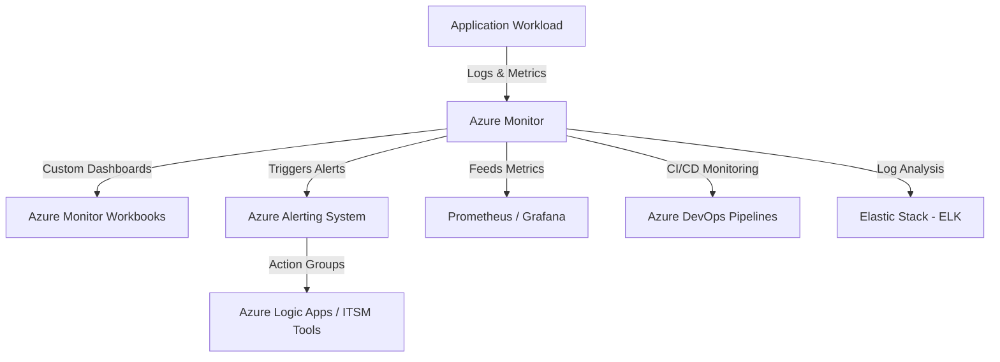

# **Advanced Features and Integrations in Azure Monitoring**
### **Table of Contents**

- [**1. Introduction**](#1-introduction)
- [**2. Advanced Monitoring Features**](#2-advanced-monitoring-features)
- [**3. Integration with Azure DevOps**](#3-integration-with-azure-devops)
- [**4. Third-Party Integration Possibilities**](#4-third-party-integration-possibilities)
- [**5. Comparative Insights**](#5-comparative-insights)
- [**6. Best Practices for Advanced Monitoring**](#6-best-practices-for-advanced-monitoring)
- [**7. Further Reading**](#7-further-reading)

---

## **1. Introduction**

Azure’s advanced monitoring capabilities enable **real-time observability, automated alerting, and deep analytics**. By integrating **Azure Monitor, Azure DevOps, and third-party tools** like Prometheus and ELK, teams can proactively address performance issues, ensure high availability, and improve application reliability.

> **Tip:** Embedding monitoring within CI/CD pipelines allows for faster **incident resolution** and continuous performance evaluation.

---

## **2. Advanced Monitoring Features**

### **2.1 Azure Monitor: Unified Observability**

|**Feature**|**Benefit**|
|---|---|
|**Metrics & Logs**|Collects performance data from applications, infrastructure, and network resources.|
|**Workbooks**|Provides interactive dashboards for real-time insights.|
|**Application Insights**|Monitors application performance and user behavior.|
|**Log Analytics**|Queries logs for troubleshooting and reporting.|

🔹 **Example:** A DevOps engineer **visualizes database query performance trends** using **Azure Monitor Workbooks**.

> **Tip:** Use **Log Analytics Query Packs** to automate data filtering and analysis across multiple services.

---

### **2.2 Custom Alerts and Automated Responses**

- **Dynamic Thresholds:** Uses AI-based anomaly detection.
- **Action Groups:** Automates workflows via **Azure Logic Apps, ITSM integrations (ServiceNow), or Slack notifications**.
- **CI/CD Alerts:** Triggers Azure DevOps rollbacks when critical failures occur.

🔹 **Example:** If an Azure Function **exceeds memory usage**, an automated alert triggers **a Kubernetes pod scale-out event**.

> **Reminder:** Configure **escalation policies** to notify different teams based on severity.

---

### **2.3 Application Dependency Mapping**

Azure **Application Insights** automatically maps dependencies between services, databases, and external APIs.

|**Scenario**|**Outcome**|
|---|---|
|**Latency Diagnosis**|Identifies slow API calls impacting chatbot response times.|
|**Microservices Monitoring**|Visualizes interactions between cloud services and Kubernetes workloads.|

🔹 **Example:** A chatbot's **slow response time is traced back to a third-party API latency** via dependency mapping.

> **Tip:** Combine **Application Insights** with **Azure Monitor Logs** for **root cause analysis**.

---

## **3. Integration with Azure DevOps**

Azure Monitor integrates **natively** with Azure DevOps, providing **real-time pipeline visibility, deployment monitoring, and automated rollbacks**.

|**Feature**|**Benefit**|
|---|---|
|**Pipeline Metrics**|Tracks build success rates, failures, and execution times.|
|**Alerts for Deployments**|Detects performance drops after deployments.|
|**Dashboards for DevOps Teams**|Centralized monitoring of infrastructure, application health, and CI/CD metrics.|

🔹 **Example:** A failed Kubernetes deployment triggers **an automatic rollback** in **Azure DevOps Pipelines**.

> **Tip:** Use **Azure Monitor Logs** to correlate **code commits with performance trends**.

---

## **4. Third-Party Integration Possibilities**

### **4.1 Prometheus & Grafana**

✅ **Use Azure Monitor as a Prometheus data source** for **Grafana dashboards**.  
✅ **Monitor Kubernetes clusters** running on **Azure Kubernetes Service (AKS)**.

```yaml
scrape_configs:
  - job_name: 'azure-monitor'
    metrics_path: '/metrics'
    static_configs:
      - targets: ['azure.monitor.local']
```

> **Tip:** Use **Prometheus exporters** to collect **container and network-level metrics**.

---

### **4.2 Elastic Stack (ELK)**

✅ **Export Azure logs to Elasticsearch** for **advanced text search and log analytics**.  
✅ **Visualize error trends** and **application health** in **Kibana**.

```yaml
output.elasticsearch:
  hosts: ["https://elasticsearch.azure.com"]
  username: "elastic-user"
  password: "your-secure-password"
```

> **Tip:** Use **ELK's anomaly detection** to proactively detect unusual **log patterns**.

---

### **4.3 ITSM Tools (ServiceNow, PagerDuty, Opsgenie)**

✅ **Automate ticket creation** for **high-priority incidents**.  
✅ **Enable bi-directional updates** between **Azure Monitor and ServiceNow**.

🔹 **Example:** A **critical database failure automatically generates a PagerDuty incident**, alerting **on-call engineers**.

---

## **5. Comparative Insights**

|**Feature**|**Azure Monitor**|**Prometheus + Grafana**|**Elastic Stack (ELK)**|
|---|---|---|---|
|**Data Type**|Metrics, logs, traces|Metrics only|Logs and traces|
|**Visualization**|Native Dashboards|Custom Dashboards|Kibana|
|**Best For**|Cloud & Hybrid Environments|Kubernetes Monitoring|Log Analytics|

> **Takeaway:** Use **Azure Monitor** for a **fully managed** solution, **Prometheus** for **Kubernetes**, and **ELK** for **log-heavy applications**.

---

## **6. Best Practices for Advanced Monitoring**

✅ **Define Key Metrics:** Identify **response times, error rates, and uptime SLAs**.  
✅ **Automate Alerts & Responses:** Use **Azure Logic Apps** for **automated remediation workflows**.  
✅ **Optimize Dashboards:** **Customize dashboards** for **developers, operations, and executives**.  
✅ **Integrate with DevOps:** Embed **Azure Monitor into CI/CD pipelines** for **pre-deployment checks**.  
✅ **Combine Tools Strategically:** Use **Prometheus for AKS metrics**, **ELK for logs**, and **Azure Monitor for centralized observability**.

> **Tip:** Regularly **review alerting rules** to avoid **alert fatigue**.

---

## **7. Further Reading**

📌 [Azure Monitor Overview](https://learn.microsoft.com/en-us/azure/azure-monitor/overview)  
📌 [Prometheus and Grafana Integration Guide](https://prometheus.io/docs/visualization/grafana/)  
📌 [Azure DevOps Monitoring Best Practices](https://learn.microsoft.com/en-us/azure/devops/)  
📌 [Elastic Stack Overview](https://www.elastic.co/what-is/elk-stack)

> **Explore Next:** Learn about **automating testing and monitoring** in **"[automated_testing_guide](automated_testing_guide.md)"**.
