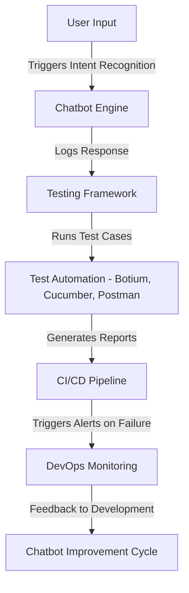

# **Implementation Guide: Automated Testing Frameworks for Chatbots**

### **Table of Contents**

- [**1. Introduction**](#1-introduction)
- [**2. Why Use Automated Testing for Chatbots?**](#2-why-use-automated-testing-for-chatbots)
- [**3. Overview of Popular Testing Frameworks**](#3-overview-of-popular-testing-frameworks)
- [**4. Designing Test Cases**](#4-designing-test-cases)
- [**5. Integrating Testing Frameworks with CI/CD**](#5-integrating-testing-frameworks-with-cicd)
- [**6. Best Practices for Automated Testing**](#6-best-practices-for-automated-testing)
- [**7. Further Reading**](#7-further-reading)


---

## **1. Introduction**

Automated testing ensures **chatbot quality, intent recognition accuracy, and API response validation**. This guide provides a structured approach to selecting and implementing testing tools for chatbot projects.

> **Tip:** Implementing **continuous testing** prevents issues in production, reducing **response time failures** and **logic inconsistencies**.



---

## **2. Why Use Automated Testing for Chatbots?**

|**Benefit**|**Impact**|
|---|---|
|**Improved Accuracy**|Validates intent recognition and NLP training effectiveness.|
|**Reduced Manual Effort**|Automates repetitive test cases, saving QA time.|
|**Faster Deployment**|Enables rapid feedback loops in CI/CD pipelines.|
|**Enhanced User Experience**|Ensures seamless interactions with minimal bot failures.|

🔹 **Example:** Running automated tests for **intent misclassification** helps ensure the chatbot provides **contextually accurate responses**.

---

## **3. Overview of Popular Testing Frameworks**

### **3.1 Botium - End-to-End Chatbot Testing**

Botium is a **specialized testing framework** for **conversational AI and chatbot testing**.

|**Feature**|**Benefit**|
|---|---|
|**Intent Validation**|Ensures correct intent classification for diverse inputs.|
|**Conversation Flow Testing**|Validates multi-turn interactions and context retention.|
|**Cross-Platform Testing**|Simulates chatbot behavior on WhatsApp, Messenger, Slack, and more.|

#### **Example: BotiumScript Test Case**

```yaml
# Define a test case to validate greeting intent
# User input triggers chatbot greeting
TestCase: Greeting Test
  - Utterance: "Hello"
  - Bot Response: "Hi! How can I assist you?"
```

🔹 **Use Case:** Testing chatbot integrations across **multiple platforms**.

---

### **3.2 Cucumber - BDD Testing with Gherkin Syntax**

Cucumber follows **Behavior-Driven Development (BDD)**, allowing **non-technical stakeholders** to define test cases in **plain English**.

|**Feature**|**Benefit**|
|---|---|
|**Gherkin Syntax**|Enables easy collaboration between developers and business teams.|
|**Cross-Platform Support**|Integrates with multiple programming languages (Java, Python, JavaScript).|
|**BDD Approach**|Aligns chatbot testing with user requirements.|

#### **Example: Cucumber Gherkin Script**

```gherkin
Feature: Chatbot Greeting
  Scenario: User says hello
    Given the chatbot is active
    When the user types "Hello"
    Then the chatbot should respond with "Hi! How can I help you today?"
```

🔹 **Use Case:** Ensuring chatbot behavior aligns with **business logic**.

---

### **3.3 Postman - API Testing for Chatbots**

Postman is a **powerful API testing tool** used to verify chatbot back-end integrations.

|**Feature**|**Benefit**|
|---|---|
|**Automated API Testing**|Validates chatbot responses via API requests.|
|**Environment Variables**|Tests chatbot behavior in different environments (dev, staging, production).|
|**Scheduled Runs**|Continuously monitors chatbot APIs for performance and accuracy.|

#### **Example: Postman API Test**

```json
{
  "method": "POST",
  "url": "https://chatbot-api.example.com/message",
  "body": {
    "text": "Hello"
  },
  "assertions": [
    { "response.status": 200 },
    { "response.body.message": "Hi! How can I help you?" }
  ]
}
```

🔹 **Use Case:** Ensuring chatbot API responses **remain consistent across deployments**.

---

### **3.4 Microsoft Bot Framework - Built-In Chatbot Testing**

This framework provides **native testing tools** for **Azure-based bots**.

|**Feature**|**Benefit**|
|---|---|
|**Test Emulator**|Simulates user interactions in a local environment.|
|**Unit Testing Support**|Verifies dialogue logic and bot response accuracy.|
|**Azure Bot Service Integration**|Ensures seamless deployment and monitoring.|

🔹 **Example:** Running **end-to-end conversation tests** using the **Bot Framework Emulator**.

---

## **4. Designing Test Cases**

|**Test Type**|**Objective**|
|---|---|
|**Intent Recognition**|Ensure user queries trigger the correct intent.|
|**Fallback Handling**|Validate chatbot responses to unrecognized inputs.|
|**Multi-Turn Dialogues**|Test chatbot’s ability to **retain context** in long conversations.|
|**API Responses**|Verify chatbot’s integration with **external APIs**.|
|**Load Testing**|Simulate high user loads to assess chatbot performance.|

🔹 **Example:** Testing if the chatbot **gracefully handles out-of-scope user questions**.

---

## **5. Integrating Testing Frameworks with CI/CD**

### **Automated Chatbot Testing Workflow**

```mermaid
graph TD;
    A[Code Commit] -->|Triggers Build| B[CI/CD Pipeline];
    B -->|Run Test Cases| C[Automated Test Suite (Botium, Cucumber)];
    C -->|Generate Reports| D[QA Dashboard];
    D -->|Pass| E[Deploy to Production];
    D -->|Fail| F[Send Alert to Dev Team];
```

### **Steps to Integrate Testing into CI/CD Pipelines**

1. **Set Up Testing Frameworks:**
    - Install **Botium**, **Cucumber**, or **Postman** within your pipeline.
2. **Automate Tests:**
    - Use **GitHub Actions**, **Azure DevOps**, or **Jenkins** to **trigger tests** automatically.
3. **Generate Reports:**
    - Store **test logs** and **metrics** in **dashboarding tools** (e.g., **Azure Monitor, Grafana**).
4. **Monitor Failures:**
    - Configure **alerts** for failed test cases to **detect regressions early**.

🔹 **Example:** Automating chatbot testing using **GitHub Actions**:

```yaml
name: Chatbot CI/CD Pipeline
on: [push]
jobs:
  test:
    runs-on: ubuntu-latest
    steps:
      - uses: actions/checkout@v2
      - name: Install Dependencies
        run: npm install
      - name: Run Chatbot Tests
        run: npm test
```

🔹 **Outcome:** The chatbot **fails fast**, preventing **defective releases**.

---

## **6. Best Practices for Automated Testing**

✅ **Test High-Priority Scenarios First:** Cover **greeting, FAQ, and fallback intents** first.  
✅ **Use Mock Data for APIs:** Prevent external dependencies **from affecting test results**.  
✅ **Run Tests on Every Commit:** Embed **automated testing into DevOps workflows**.  
✅ **Monitor User Behavior:** Analyze **chat logs** to identify real-world test cases.  
✅ **Optimize Load Testing:** Simulate **high concurrent traffic** to evaluate scalability.

---

## **7. Further Reading**

📌 [Botium Documentation](https://botium.ai/documentation/)  
📌 [Cucumber Gherkin Guide](https://cucumber.io/docs/gherkin/reference/)  
📌 [Postman API Testing](https://learning.postman.com/docs/)  
📌 [Microsoft Bot Framework Testing](https://learn.microsoft.com/en-us/azure/bot-service/)

> **Next Step:** Explore **[continuous_testing_devops](continuous_testing_devops.md)** to streamline chatbot quality assurance.
