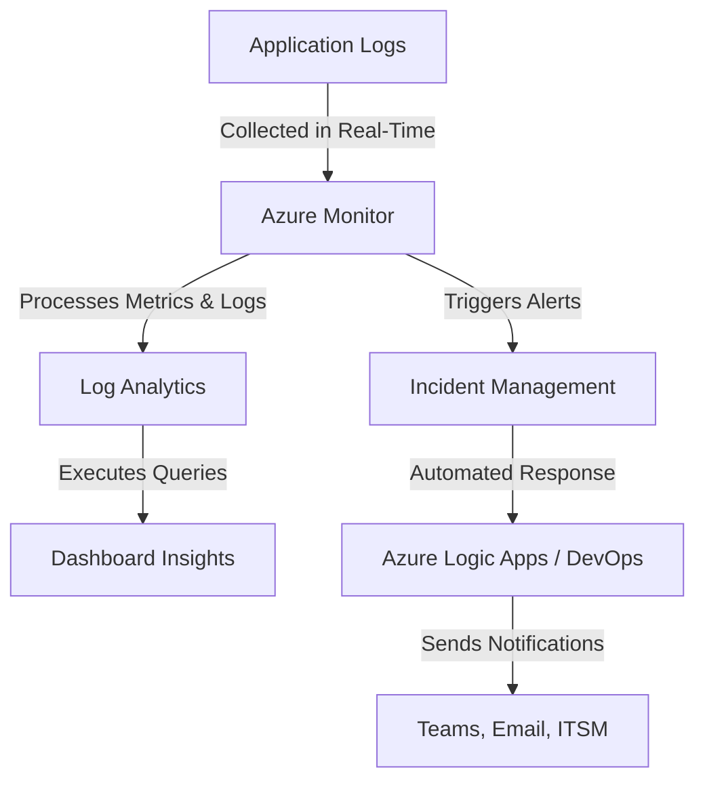
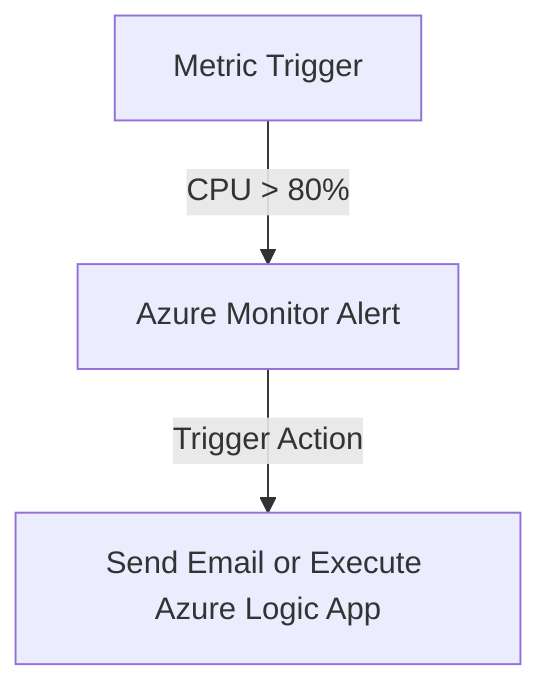

This **Azure Monitoring and Diagnostics Overview** is now **fully optimized for implementation, insights, and automation**! 🚀

---

# **Azure Monitoring and Diagnostics Overview**


### **Table of Contents**

- [**1. Introduction**](#1-introduction)
- [**2. What is Azure Monitoring?**](#2-what-is-azure-monitoring)
- [**3. Core Features of Azure Monitor**](#3-core-features-of-azure-monitor)
- [**4. Diagnostic Tools in Azure**](#4-diagnostic-tools-in-azure)
- [**5. Step-by-Step Guide to Setting Up Azure Monitoring**](#5-step-by-step-guide-to-setting-up-azure-monitoring)
- [**6. Best Practices for Monitoring and Diagnostics**](#6-best-practices-for-monitoring-and-diagnostics)
- [**7. Common Use Cases**](#7-common-use-cases)
- [**8. Further Reading**](#8-further-reading)


---

## **1. Introduction**

Azure Monitor is **Microsoft’s unified monitoring platform**, enabling you to **track**, **analyze**, and **act on** telemetry data from applications, infrastructure, and networks.

|**Capability**|**Benefit**|
|---|---|
|**Real-Time Monitoring**|Detect performance anomalies instantly.|
|**Log Aggregation**|Collect logs from multiple Azure services.|
|**Automated Alerts**|Get notified when issues arise.|
|**Integration**|Works with DevOps, Grafana, and third-party tools.|

🔹 **Example:** Monitor a chatbot’s API latency, request failures, and CPU utilization in real time.

---

## **2. What is Azure Monitoring?**

Azure Monitor captures **metrics**, **logs**, and **traces** from **applications, infrastructure, and cloud services**.

|**Component**|**Function**|
|---|---|
|**Metrics**|Numerical performance data (e.g., CPU usage).|
|**Logs**|Detailed event data (e.g., error logs, API calls).|
|**Traces**|Request lifecycle tracking for distributed apps.|

🔹 **Example:** Use **Azure Monitor Metrics** to track **response time spikes** in an AI-driven chatbot.

---

## **3. Core Features of Azure Monitor**

### **3.1 Metrics**

Azure Monitor Metrics provides **real-time performance tracking**.

|**Metric**|**Use Case**|
|---|---|
|**CPU Utilization**|Monitor virtual machines and containers.|
|**Memory Usage**|Detect potential performance bottlenecks.|
|**Network Traffic**|Analyze inbound/outbound network load.|

🔹 **Tool:** **Metrics Explorer** helps **visualize trends and set alert rules**.

---

### **3.2 Logs**

Azure Monitor Logs capture **structured** and **unstructured** data.

|**Log Type**|**Use Case**|
|---|---|
|**Activity Logs**|Track changes to Azure resources.|
|**Application Logs**|Monitor custom application events and errors.|
|**Diagnostics Logs**|Collect telemetry for detailed debugging.|

🔹 **Tool:** **Log Analytics** enables **advanced queries using Kusto Query Language (KQL)**.

**Example Query (Find all failed requests):**

```kql
AzureDiagnostics
| where ResultType == "Failure"
| summarize count() by ResourceGroup
```

---

### **3.3 Insights**

Azure Monitor **Insights** provide **pre-configured monitoring** for specific services.

|**Insight Type**|**Benefit**|
|---|---|
|**Application Insights**|Tracks application performance and user behavior.|
|**VM Insights**|Monitors virtual machine resource usage.|
|**Container Insights**|Observes Kubernetes workloads in Azure Kubernetes Service (AKS).|

🔹 **Example:** Use **Container Insights** to track **resource consumption per Kubernetes pod**.

---

## **4. Diagnostic Tools in Azure**

### **4.1 Application Insights**

🔹 **Deep telemetry for web apps and microservices.**

- Tracks **requests**, **dependencies**, and **custom logs**.
- Supports **live debugging** with end-to-end distributed tracing.

**Example Query (Find slow API responses):**

```kql
requests
| where duration > 3000ms
| order by timestamp desc
```

---

### **4.2 Log Analytics**

🔹 **Query and analyze large-scale telemetry data** from multiple sources.

- Combine **Azure Monitor Logs** and **third-party logs** (e.g., AWS, on-prem logs).

**Example Query (Find errors in last 24 hours):**

```kql
AzureActivity
| where ActivityStatus == "Failed"
| where TimeGenerated > ago(24h)
| summarize count() by ResourceGroup
```

---

### **4.3 Azure Monitor Alerts**

🔹 **Proactively detect issues before users do.**

- **Metric Alerts:** Triggered when CPU, memory, or disk usage **exceeds thresholds**.
- **Log Alerts:** Fire when **specific log patterns** are detected.
- **Smart Alerts:** Use **AI-based anomaly detection**.

**Example Alert Workflow:**



---

## **5. Step-by-Step Guide to Setting Up Azure Monitoring**

1️⃣ **Enable Monitoring for Resources**

- Open **Azure Portal** → Select a resource (e.g., VM, App Service).
- Enable **Diagnostic Settings**.

2️⃣ **Set Up Metrics and Logs**

- Go to **Azure Monitor** → Select **Metrics**.
- Choose **performance metrics** (e.g., CPU, Memory, Network).
- Use **Metrics Explorer** to visualize trends.

3️⃣ **Configure Alerts**

- Go to **Azure Monitor** → **Alerts**.
- Create **New Alert Rule** → Define **Condition** and **Action**.
- Example: **Notify DevOps team** when **CPU usage exceeds 90%**.

4️⃣ **Deploy Application Insights**

- Install **Application Insights SDK** in the application.
- Enable **Distributed Tracing** to track API calls.

---

## **6. Best Practices for Monitoring and Diagnostics**

✅ **Define Key Metrics Early:**

- Identify **critical performance indicators** relevant to your workload.

✅ **Use Alerts for Proactive Monitoring:**

- Set **CPU, memory, and latency thresholds** for early warnings.

✅ **Leverage Dashboards for Visibility:**

- Use **Azure Dashboards** for a **centralized monitoring view**.

✅ **Integrate with DevOps Pipelines:**

- Automate monitoring setup **within CI/CD workflows**.

✅ **Optimize Log Retention:**

- Set **log retention policies** to balance **cost and accessibility**.

---

## **7. Common Use Cases**

|**Use Case**|**Azure Monitoring Feature**|
|---|---|
|**Detecting Anomalies**|AI-powered anomaly detection in Metrics.|
|**Monitoring API Latency**|Application Insights request tracking.|
|**Scaling Infrastructure**|Auto-scale based on CPU or memory spikes.|
|**Proactive Alerting**|Metric & Log Alerts with ITSM integration.|

---

## **8. Further Reading**

📌 [Azure Monitor Documentation](https://learn.microsoft.com/en-us/azure/azure-monitor/)  
📌 [Application Insights Overview](https://learn.microsoft.com/en-us/azure/azure-monitor/app/app-insights-overview)  
📌 [Log Analytics Query Reference](https://learn.microsoft.com/en-us/azure/azure-monitor/logs/query-language)  
📌 [Azure Monitor Alerts Guide](https://learn.microsoft.com/en-us/azure/azure-monitor/alerts/alerts-overview)

> **Next Step:** Explore **[monitoring_logging_chatbots](monitoring_logging_chatbots.md)** for **real-world chatbot monitoring**.
