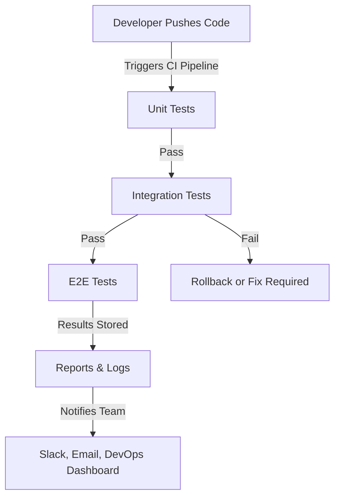

# **Continuous Testing in DevOps: A Comprehensive Guide**
### **Table of Contents**

- [**1. What is Continuous Testing?**](#1-what-is-continuous-testing)
- [**2. Why Continuous Testing Matters**](#2-why-continuous-testing-matters)
- [**3. Core Components of Continuous Testing**](#3-core-components-of-continuous-testing)
- [**4. Testing Types in Continuous Testing**](#4-testing-types-in-continuous-testing)
- [**5. Tools for Continuous Testing**](#5-tools-for-continuous-testing)
- [**6. Integrating Continuous Testing with CI/CD Pipelines**](#6-integrating-continuous-testing-with-cicd-pipelines)
- [**7. Best Practices for Continuous Testing**](#7-best-practices-for-continuous-testing)
- [**8. Challenges and Solutions**](#8-challenges-and-solutions)
- [**9. Further Reading**](#9-further-reading)

---

## **1. What is Continuous Testing?**

Continuous Testing is the **automated process of validating software** at every stage of the CI/CD pipeline. It ensures that every code change is **tested early**, **frequently**, and **efficiently** before production.

|**Component**|**Purpose**|
|---|---|
|**Unit Tests**|Validate individual functions or classes.|
|**Integration Tests**|Ensure modules interact correctly.|
|**End-to-End (E2E) Tests**|Simulate real-world user behavior.|
|**Performance & Security Tests**|Detect bottlenecks and vulnerabilities.|

> **Example:** A banking application automatically **tests login security** whenever new authentication features are deployed.


---

## **2. Why Continuous Testing Matters**

|**Benefit**|**Impact**|
|---|---|
|**Bug Detection Early**|Reduces debugging costs by catching errors in development.|
|**Faster Releases**|Automates testing, speeding up time-to-market.|
|**Improved Code Quality**|Prevents regressions and ensures stable releases.|
|**DevOps Compliance**|Enforces security, performance, and quality checks automatically.|

> **Tip:** **Fixing a bug in production** is **10x more expensive** than in development.

---

## **3. Core Components of Continuous Testing**

1️⃣ **Automated Test Execution**

- Run tests **on every code push** via CI/CD pipelines.

2️⃣ **Test Environment Management**

- Use **containers (Docker, Kubernetes)** to ensure **consistent testing environments**.

3️⃣ **Feedback & Monitoring**

- **Instant test results** for rapid fixes and rollbacks.

4️⃣ **Integration with CI/CD Pipelines**

- Automate **test execution** within **Jenkins, GitHub Actions, Azure DevOps**.

---

## **4. Testing Types in Continuous Testing**

### **4.1 Unit Testing**

🔹 **Verifies small code units independently**

- **Frameworks:** `Jest`, `JUnit`, `PyTest`
- **Example:**

```python
def add(a, b):
    return a + b

def test_add():
    assert add(2, 3) == 5
```

---

### **4.2 Integration Testing**

🔹 **Ensures different modules work together**

- **Tools:** `Postman`, `JUnit`, `REST Assured`
- **Example:** Test an API endpoint:

```bash
curl -X GET "http://api.example.com/users"
```

---

### **4.3 End-to-End (E2E) Testing**

🔹 **Simulates real user behavior**

- **Tools:** `Cypress`, `Selenium`
- **Example:**

```javascript
cy.visit('/login')
cy.get('input[name=username]').type('testuser')
cy.get('input[name=password]').type('securepass')
cy.get('button[type=submit]').click()
```

---

### **4.4 Performance Testing**

🔹 **Measures application speed and scalability**

- **Tools:** `JMeter`, `k6`
- **Example (k6 Load Test):**

```javascript
import http from 'k6/http';

export default function () {
    http.get('http://api.example.com');
}
```

---

### **4.5 Security Testing**

🔹 **Detects security vulnerabilities**

- **Tools:** `OWASP ZAP`, `Burp Suite`
- **Example:** Scan for vulnerabilities in a website:

```bash
zap-cli quick-scan http://example.com
```

---

## **5. Tools for Continuous Testing**

|**Tool**|**Purpose**|
|---|---|
|**Jenkins**|Automates test execution in CI/CD.|
|**GitHub Actions**|Runs tests on every commit.|
|**Selenium**|Web UI testing.|
|**JUnit, PyTest**|Unit testing.|
|**SonarQube**|Code quality and security scanning.|

> **Tip:** Use **SonarQube** to enforce **code quality gates** before deploying.

---

## **6. Integrating Continuous Testing with CI/CD Pipelines**

### **6.1 Steps to Integrate**

1️⃣ **Set Up Test Suites** → Define **unit, integration, and E2E tests**.  
2️⃣ **Automate Triggers** → Run tests on every **code push** or **pull request**.  
3️⃣ **Generate Reports** → Store test results in **CI/CD dashboards**.

### **6.2 Example: GitHub Actions for CI/CD Testing**

```yaml
name: CI/CD Testing

on: push

jobs:
  test:
    runs-on: ubuntu-latest
    steps:
      - uses: actions/checkout@v2
      - name: Install Dependencies
        run: npm install
      - name: Run Tests
        run: npm test
```

> **🔹 Best Practice:** Configure **Slack or email alerts** for **failed tests**.

---

## **7. Best Practices for Continuous Testing**

✅ **Shift Left Testing:**

- Test early in development to catch issues **before deployment**.

✅ **Use Mocking & Stubbing:**

- Isolate dependencies to **test components separately**.

✅ **Run Tests in Parallel:**

- **Reduce execution time** by running **multiple tests simultaneously**.

✅ **Automate Regression Testing:**

- Catch **unexpected changes** by re-running old test cases.

✅ **Monitor Test Flakiness:**

- Detect and fix **unstable tests** that give inconsistent results.

---

## **8. Challenges and Solutions**

|**Challenge**|**Solution**|
|---|---|
|**Flaky Tests**|Use retry logic and increase test stability.|
|**Slow Test Execution**|Run tests in parallel with cloud-based testing.|
|**High Maintenance Overhead**|Use **AI-driven test automation** to self-heal failing tests.|
|**Environment Inconsistencies**|Use Docker containers for **consistent test environments**.|

---

## **9. Further Reading**

📌 [Jenkins CI/CD Guide](https://www.jenkins.io/doc/)  
📌 [GitHub Actions Docs](https://docs.github.com/en/actions)  
📌 [Unit Testing Best Practices](https://martinfowler.com/bliki/UnitTest.html)  
📌 [OWASP Security Testing Guide](https://owasp.org/www-project-web-security-testing-guide/)

> **Next Steps:** **Explore "[testing_strategies_chatbots](testing_strategies_chatbots.md)" .