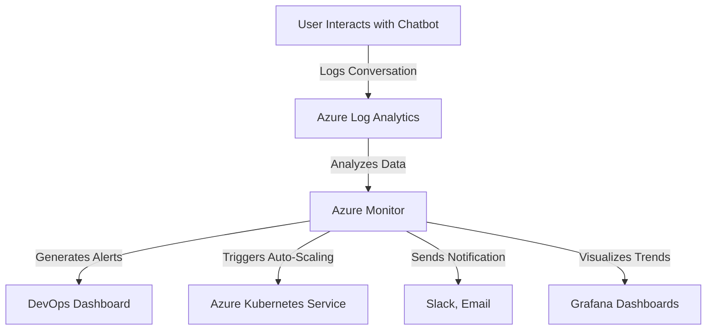

# **Monitoring and Logging for Chatbots: A Proactive Approach**

### **Table of Contents**

- [**1. Why Monitoring and Logging Matter**](#1-why-monitoring-and-logging-matter)
- [**2. Monitoring with Azure Monitor**](#2-monitoring-with-azure-monitor)
- [**3. Logging Strategies and Best Practices**](#3-logging-strategies-and-best-practices)
- [**4. Integrating Prometheus and Grafana**](#4-integrating-prometheus-and-grafana)
- [**5. Alerts and Automated Responses**](#5-alerts-and-automated-responses)
- [**6. Best Practices for Monitoring and Logging**](#6-best-practices-for-monitoring-and-logging)
- [**7. Further Reading**](#7-further-reading)

---

## **1. Why Monitoring and Logging Matter**

|**Benefit**|**Why It’s Important**|
|---|---|
|**Proactive Issue Detection**|Identify failures before they impact users.|
|**Performance Optimization**|Monitor response times and scale resources accordingly.|
|**Security Monitoring**|Detect and log unauthorized access attempts.|
|**User Experience Insights**|Analyze user queries and chatbot interactions.|

> **Example:** Monitoring chatbot response times can reveal API bottlenecks affecting user engagement.


---

## **2. Monitoring with Azure Monitor**

### **2.1 Setting Up Azure Monitor for Chatbots**

1️⃣ **Enable Application Insights**

- Navigate to Azure Portal → **Application Insights**
- Link it to your chatbot service.
- Track latency, user engagement, and API failures.

2️⃣ **Configure Logs and Metrics**

- **Metrics to track:**
    - Request per second
    - Error rates
    - Latency trends

3️⃣ **Set Up Custom Alerts**

- Example: **Trigger an alert** when chatbot response time **exceeds 3 seconds.**

```yaml
metrics:
  - name: response_time
    threshold: 3000  # in milliseconds
    action: notify_devops_team
```

### **2.2 Example: Logging with Application Insights**

```python
from applicationinsights import TelemetryClient

telemetry_client = TelemetryClient('<instrumentation_key>')
telemetry_client.track_event('Chatbot Initialized')
telemetry_client.flush()
```

---

## **3. Logging Strategies and Best Practices**

### **3.1 Structured Logging**

- Store chatbot interactions as **JSON objects** in **Azure Log Analytics**.

```json
{
  "timestamp": "2024-01-31T12:00:00Z",
  "user_id": "12345",
  "user_input": "How do I reset my password?",
  "bot_response": "Click the 'Forgot Password' link.",
  "response_time_ms": 450
}
```

### **3.2 Real-Time Querying Using Kusto Query Language (KQL)**

```kql
requests
| where success == false
| summarize count() by resultCode
```

### **3.3 Anonymizing User Data**

- **Remove sensitive information** before storing logs.

```python
import logging

logging.basicConfig(level=logging.INFO)
logger = logging.getLogger('chatbot')

logger.info('UserMessage: [REDACTED]')
logger.info('BotResponse: Hello! How can I assist you?')
```

### **3.4 Implement Log Retention Policies**

- **Set up a 30-day retention policy** for non-critical logs.
- **Store critical logs** in **cold storage (Azure Blob Storage)**.

---

## **4. Integrating Prometheus and Grafana**

### **4.1 Prometheus for Metrics Collection**

📌 **Steps to integrate:**

1. Install Prometheus on your chatbot server.
2. Configure **Prometheus YAML** to scrape chatbot metrics.

```yaml
scrape_configs:
  - job_name: 'chatbot'
    static_configs:
      - targets: ['localhost:8000']
```

3. **Expose Metrics in Chatbot Code**

```python
from prometheus_client import start_http_server, Counter

request_counter = Counter('chatbot_requests', 'Total Chatbot Requests')
start_http_server(8000)

def process_request():
    request_counter.inc()
```

---

### **4.2 Grafana for Dashboard Visualization**

📌 **Steps to integrate:**

1. Add **Prometheus** as a data source in Grafana.
2. Create **custom dashboards** for:
    - **User engagement trends**
    - **Response latency**
    - **Error distribution**
3. Set **Grafana Alerts** for spikes in error rates.

---

## **5. Alerts and Automated Responses**

### **5.1 Setting Up Alerts in Azure Monitor**

- Define **triggers** for:
    - 🟠 **High latency (>3s)**
    - 🔴 **500 Internal Server Errors**
    - 🔍 **User requests exceeding thresholds**

### **5.2 Automated Scaling and Self-Healing**

- **Example:** Trigger **auto-scaling** when CPU utilization **exceeds 80%**.

```yaml
autoScaling:
  - metric: cpu
    threshold: 80
    action: scale_out
```

- **Example:** Restart failing chatbot instances automatically.

```bash
kubectl rollout restart deployment/chatbot
```

---

## **6. Best Practices for Monitoring and Logging**

✅ **Define Key Metrics Early**

- Track **response time, API errors, and chatbot interactions**.

✅ **Use Structured Logging Formats**

- Store logs in **JSON format** for easier analysis.

✅ **Set Up Actionable Alerts**

- Avoid alert fatigue with **clear thresholds**.

✅ **Automate Incident Responses**

- Restart failing chatbot pods **automatically**.

✅ **Secure Logging Access**

- Restrict log access using **Azure RBAC**.

✅ **Optimize Log Storage**

- Archive old logs in **Azure Blob Storage**.

---

## **7. Further Reading**

📌 [Azure Monitor Docs](https://learn.microsoft.com/en-us/azure/azure-monitor/)  
📌 [Prometheus Quickstart](https://prometheus.io/docs/introduction/overview/)  
📌 [Grafana Dashboard Setup](https://grafana.com/docs/grafana/latest/dashboards/)

> **Next Steps:** [**monitoring_scenarios_guidance**](monitoring_scenarios_guidance.md)