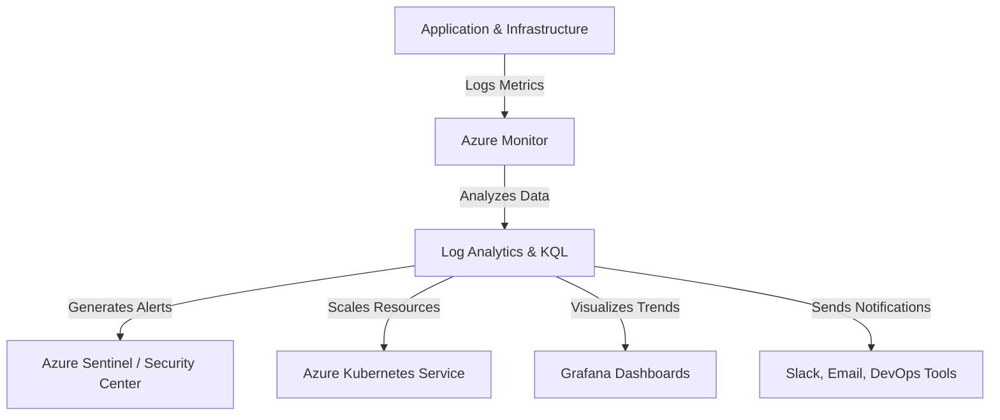

# **Monitoring Scenarios and Deployment Guidance**
### **Table of Contents**

- [**1. Monitoring Scenarios**](#1-monitoring-scenarios)
- [**2. Deployment Guidance**](#2-deployment-guidance)
- [**3. Automating Monitoring & Alerts**](#3-automating-monitoring--alerts)
- [**4. Best Practices for Monitoring & Logging**](#4-best-practices-for-monitoring--logging)
- [**5. Further Reading**](#5-further-reading)


---

## **1. Monitoring Scenarios**



### **1.1 Application Monitoring**

Monitor chatbot responsiveness, API performance, and service dependencies.

#### ✅ **Main Metrics**

- **Latency:** Monitor request-response times.
- **Error Rates:** Track API failures & chatbot misunderstandings.
- **User Behavior:** Capture conversation flow & interactions.

#### 🔧 **Setup**

1. **Enable Application Insights**
    - Add the SDK or enable auto-instrumentation.

```python
from applicationinsights import TelemetryClient
telemetry_client = TelemetryClient('<instrumentation_key>')
telemetry_client.track_event('Chatbot Initialized')
telemetry_client.flush()
```

2. **Create Custom Metrics**

```yaml
metrics:
  - name: response_time
    threshold: 3000  # milliseconds
    action: notify_devops
```

3. **Use End-to-End Transaction Tracing**
    
    - **Azure Monitor + Log Analytics:** Identify slow requests.
    - **Example KQL Query:**
    
    ```kql
    requests
    | where success == false
    | summarize count() by resultCode
    ```
    

---

### **1.2 Infrastructure Monitoring**

Track CPU, memory, disk usage, and networking health.

#### ✅ **Main Metrics**

- **Container Health:** Monitor Kubernetes pod statuses.
- **Resource Utilization:** CPU, memory & disk space.
- **Network Connectivity:** Detect high latency or failures.

#### 🔧 **Setup**

1. **Enable Azure Monitor for Kubernetes**

```bash
az aks enable-addons --addons monitoring --name MyAKSCluster --resource-group MyResourceGroup
```

2. **Integrate with Prometheus**

```yaml
scrape_configs:
  - job_name: 'chatbot'
    static_configs:
      - targets: ['localhost:8000']
```

3. **Set Auto-Scaling Policies**

```yaml
autoScaling:
  - metric: cpu
    threshold: 80
    action: scale_out
```

---

### **1.3 Security Monitoring**

Ensure compliance, prevent unauthorized access, and detect anomalies.

#### ✅ **Main Metrics**

- **Suspicious Logins:** Detect unauthorized access.
- **DDoS Attempts:** Monitor unusual traffic spikes.
- **Compliance Violations:** GDPR, HIPAA tracking.

#### 🔧 **Setup**

1. **Enable Azure Security Center**
2. **Integrate Azure Sentinel for SIEM**

```kql
SecurityEvent
| where EventID == "4625"
| summarize count() by Account, bin(TimeGenerated, 1h)
```

3. **Automate Incident Responses**

```yaml
incidentResponse:
  - event: failed_login_attempts
    threshold: 5
    action: lock_account
```

---

## **2. Deployment Guidance**

### **2.1 Planning Your Monitoring Stack**

|**Layer**|**Tool**|
|---|---|
|Application Monitoring|Azure Monitor, Application Insights|
|Infrastructure|Azure Monitor for VMs & AKS|
|Logs & Analytics|Azure Log Analytics, KQL|
|Visualization|Grafana, Power BI|
|Security|Azure Sentinel, Microsoft Defender|

---

### **2.2 Setting Up Monitoring Tools**

1️⃣ **Application Monitoring**

```yaml
resource "azurerm_application_insights" "chatbot_monitor" {
  name                = "chatbot-monitor"
  resource_group_name = var.resource_group_name
  application_type    = "web"
}
```

2️⃣ **Infrastructure Monitoring**

```yaml
resource "azurerm_monitor_metric_alert" "cpu_alert" {
  name                = "HighCPUAlert"
  resource_group_name = var.resource_group_name
  scopes              = [azurerm_virtual_machine.vm.id]

  criteria {
    metric_name      = "Percentage CPU"
    operator         = "GreaterThan"
    threshold        = 80
    aggregation      = "Average"
  }
}
```

3️⃣ **Security Alerting**

- **Example:** Alert when 5 failed logins occur in 10 minutes.

```yaml
securityAlert:
  - event: failed_login
    threshold: 5
    action: notify_security_team
```

---

## **3. Automating Monitoring & Alerts**

### **3.1 Using Azure DevOps**

- Automate testing & deployments.
- Trigger alerts for failed builds.

```yaml
jobs:
  test:
    runs-on: ubuntu-latest
    steps:
      - name: Run Unit Tests
        run: npm test
```

### **3.2 Using Terraform for Infrastructure as Code**

```hcl
resource "azurerm_log_analytics_workspace" "log_workspace" {
  name                = "chatbot-log-workspace"
  resource_group_name = var.resource_group_name
}
```

### **3.3 Integrating Prometheus & Grafana**

- **Steps:**
    1. **Expose chatbot metrics** in Prometheus.
    2. **Add Prometheus as a data source in Grafana**.
    3. **Create custom dashboards** for chatbot performance.

> **Example:** Track chatbot response times in Grafana.

```yaml
dataSources:
  - name: "Prometheus"
    type: "prometheus"
    url: "http://localhost:9090"
```

---

## **4. Best Practices for Monitoring & Logging**

### ✅ **Define Clear Metrics Early**

- **Track request latency, error rates, and infrastructure health**.

### ✅ **Use Actionable Alerts**

- **Avoid alert fatigue** by setting **meaningful** thresholds.

### ✅ **Automate Remediation**

- **Example:** Restart failing chatbot instances **automatically**.

```bash
kubectl rollout restart deployment/chatbot
```

### ✅ **Secure Monitoring Data**

- **Restrict log access** using **Azure RBAC**.
- **Encrypt logs at rest** in **Azure Blob Storage**.

### ✅ **Optimize Log Storage**

- **Archive old logs** to **cold storage**.

```yaml
storage:
  - type: cold
    retention: 365d
```

---

## **5. Further Reading**

📌 [Azure Monitor Docs](https://learn.microsoft.com/en-us/azure/azure-monitor/)  
📌 [Prometheus Setup](https://prometheus.io/docs/introduction/overview/)  
📌 [Grafana Dashboard Setup](https://grafana.com/docs/grafana/latest/dashboards/)  
📌 [Terraform for Azure Monitoring](https://registry.terraform.io/providers/hashicorp/azurerm/latest/docs)

>**Next Steps:** Check out **"[observability_logging_devops](observability_logging_devops.md)"** for **advanced CI/CD monitoring.** 
