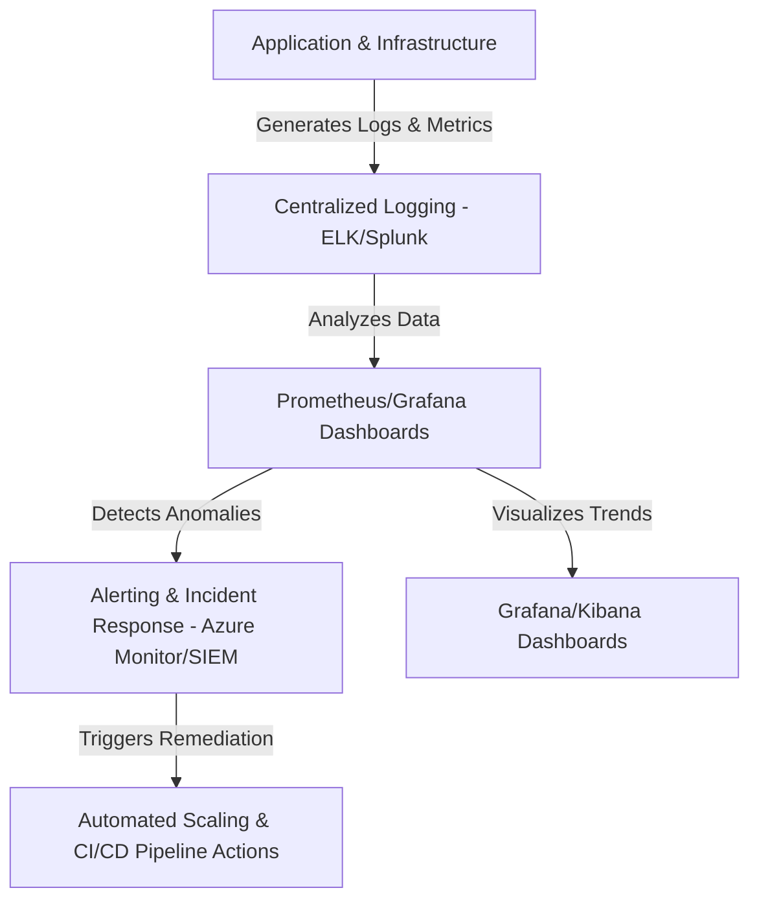

# **Observability and Logging in DevOps**
### **Table of Contents**

- [**1. Introduction to Observability**](#1-introduction-to-observability)
- [**2. Why Observability Matters?**](#2-why-observability-matters)
- [**3. Core Components of Observability**](#3-core-components-of-observability)
- [**4. Observability & Logging Tools**](#4-observability--logging-tools)
- [**5. DevOps Integration for Observability**](#5-devops-integration-for-observability)
- [**6. Best Practices for Observability**](#6-best-practices-for-observability)
- [**7. Challenges & Solutions**](#7-challenges--solutions)
- [**8. Further Reading**](#8-further-reading)

---

## **1. Introduction to Observability**

Observability in DevOps provides deep insights into system performance, security, and user experience by leveraging **logs, metrics, and traces**. It enables proactive debugging, root cause analysis, and automated incident response.

> **Definition:** Observability helps answer **"What is happening?"**, **"Why is it happening?"**, and **"How can we fix it?"**



---

## **2. Why Observability Matters?**

|**Benefit**|**Why It Matters**|
|---|---|
|**Proactive Monitoring**|Identifies anomalies before they become system failures.|
|**Rapid Debugging**|Reduces MTTR (Mean Time to Resolution) with detailed tracing.|
|**Improved Performance**|Tracks API latencies, error rates, and bottlenecks.|
|**Enhanced Security**|Detects suspicious activities & compliance violations.|

> **Example:** A chatbot platform detects a spike in API failures using **Grafana**, automatically scaling Kubernetes pods to maintain response times.

---

## **3. Core Components of Observability**

### **3.1 Logs - The Forensics**

Structured or unstructured event records from applications, databases, and infrastructure.

#### **Example - JSON Log (Chatbot API Error)**

```json
{
  "timestamp": "2025-02-01T14:30:00Z",
  "level": "ERROR",
  "message": "Chatbot API request timeout",
  "service": "chatbot-api",
  "request_id": "abc123",
  "user_id": "user567"
}
```

> **Tip:** Use structured logging (JSON, key-value pairs) for easy parsing & indexing.

---

### **3.2 Metrics - The Health Indicators**

Numerical values reflecting **system performance** over time.

|**Metric**|**Description**|
|---|---|
|**CPU Utilization**|Tracks how much CPU the system is using.|
|**Request Latency**|Measures API response times.|
|**Error Rate**|Percentage of failed requests.|
|**Throughput**|Number of transactions processed per second.|

#### **Example: Prometheus Query for Error Rate**

```promql
rate(http_requests_total{status="500"}[5m])
```

> **Tool:** **Prometheus + Grafana** for real-time metric visualization.

---

### **3.3 Traces - The X-ray for Requests**

Tracks **end-to-end execution** of a user request across distributed systems.

#### **Example: OpenTelemetry Trace (API Request Flow)**

```yaml
trace:
  id: "trace-001"
  spans:
    - name: "API Gateway"
      duration: 15ms
    - name: "Auth Service"
      duration: 30ms
    - name: "Database Query"
      duration: 200ms
```

> **Tool:** **Jaeger or OpenTelemetry** for distributed tracing.

---

## **4. Observability & Logging Tools**

|**Tool**|**Purpose**|
|---|---|
|**Prometheus**|Time-series monitoring for application & infrastructure metrics.|
|**Grafana**|Dashboard visualization for logs & metrics.|
|**Elasticsearch (ELK Stack)**|Centralized logging and full-text search.|
|**Azure Monitor**|Cloud-native observability for Azure workloads.|
|**Splunk**|Log analysis and security monitoring (SIEM).|
|**Jaeger/OpenTelemetry**|Distributed tracing for microservices.|

---

## **5. DevOps Integration for Observability**

### **Step 1: Configure Logging**

Use **Fluentd or Logstash** to aggregate logs across services.

```yaml
log_config:
  format: json
  destinations:
    - type: "elasticsearch"
      url: "http://elk-stack:9200"
    - type: "s3"
      retention: "30d"
```

### **Step 2: Setup Metrics Collection**

Expose Prometheus metrics from your **Kubernetes Pods**.

```yaml
scrape_configs:
  - job_name: 'chatbot-api'
    static_configs:
      - targets: ['localhost:9090']
```

### **Step 3: Implement Distributed Tracing**

Use **OpenTelemetry SDK** for API tracing.

```python
from opentelemetry import trace

tracer = trace.get_tracer("chatbot-service")
with tracer.start_as_current_span("handle_request"):
    process_request()
```

---

## **6. Best Practices for Observability**

✅ **Define Clear KPIs**

- Latency < 200ms
- API Error Rate < 1%
- 99.99% Uptime SLA

✅ **Use Actionable Alerts**

- Avoid "alert fatigue" with **intelligent thresholds**.

✅ **Automate Incident Response**

- Example: Restart failed **Kubernetes Pods** automatically.

```bash
kubectl rollout restart deployment/chatbot-api
```

✅ **Secure Monitoring Data**

- Implement **RBAC for logs & dashboards**.

✅ **Optimize Log Retention**

- Archive old logs to **AWS S3 or Azure Blob Storage**.

---

## **7. Challenges & Solutions**

|**Challenge**|**Solution**|
|---|---|
|**Too Many Logs**|Implement structured logging & log sampling.|
|**Noisy Alerts**|Use **dynamic alerting** based on trend deviations.|
|**High Storage Costs**|Configure **log retention policies** to archive historical data.|
|**Scaling Observability**|Use **Prometheus Federation** for multi-cluster monitoring.|

---

## **8. Further Reading**

📌 [OpenTelemetry Docs](https://opentelemetry.io/)  
📌 [Prometheus Monitoring Guide](https://prometheus.io/docs/introduction/overview/)  
📌 [ELK Stack Documentation](https://www.elastic.co/what-is/elk-stack)  
📌 [Azure Monitor Overview](https://learn.microsoft.com/en-us/azure/azure-monitor/)

> **Next Steps:** Check out **"[prometheus_grafana](prometheus_grafana.md)"** for real-time metric visualization. 
