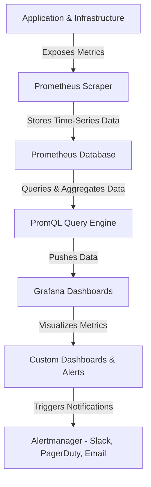

# **Prometheus and Grafana: Advanced Monitoring and Visualization**

### **Table of Contents**

- [**1. Introduction**](#1-introduction)
- [**2. Prometheus: Features & Architecture**](#2-prometheus-features--architecture)
- [**3. Grafana: Features & Setup**](#3-grafana-features--setup)
- [**4. Prometheus & Grafana Integration**](#4-prometheus--grafana-integration)
- [**5. Monitoring Scenarios**](#5-monitoring-scenarios)
- [**6. Best Practices for Monitoring**](#6-best-practices-for-monitoring)
- [**7. Troubleshooting & Optimization**](#7-troubleshooting--optimization)
- [**8. Further Reading**](#8-further-reading)

---

## **1. Introduction**

**Prometheus** (metrics collection) and **Grafana** (visualization) are powerful tools used for monitoring applications, infrastructure, and distributed systems. Together, they provide **real-time insights** and **actionable alerting** for **DevOps, SREs, and Platform Engineering teams**.



---

## **2. Prometheus: Features & Architecture**

### **2.1 Core Features**

|**Feature**|**Why It Matters**|
|---|---|
|**Pull-based Model**|Prometheus scrapes metrics, reducing overhead on applications.|
|**PromQL Query Language**|Advanced data aggregation & filtering for meaningful insights.|
|**Multi-Target Scraping**|Supports Kubernetes, Docker, VMs, APIs, and custom applications.|
|**Built-in Alerting**|AlertManager triggers notifications based on thresholds.|
|**Long-Term Storage Options**|Integrates with Grafana Loki, InfluxDB, and cloud storage.|

### **2.2 Prometheus Architecture**

|**Component**|**Function**|
|---|---|
|**Prometheus Server**|Core service that scrapes and stores metrics.|
|**Exporters**|Convert system metrics into Prometheus-compatible format.|
|**Push Gateway**|Stores short-lived job metrics (e.g., CI/CD jobs).|
|**Alertmanager**|Routes alerts via Slack, PagerDuty, or email.|

#### **Example: Prometheus Configuration (`prometheus.yml`)**

```yaml
scrape_configs:
  - job_name: 'kubernetes-nodes'
    static_configs:
      - targets: ['192.168.1.100:9100', '192.168.1.101:9100']
  - job_name: 'chatbot-api'
    static_configs:
      - targets: ['localhost:9090']
```

> **Tip:** Use **Node Exporter** to collect system metrics like CPU, Memory, and Disk usage.

---

## **3. Grafana: Features & Setup**

### **3.1 Core Features**

|**Feature**|**Why It Matters**|
|---|---|
|**Custom Dashboards**|Design interactive charts for real-time monitoring.|
|**Multi-Source Support**|Works with Prometheus, Elasticsearch, MySQL, and more.|
|**Alerting System**|Create rules for critical events (e.g., High CPU Usage).|
|**Annotations**|Attach logs & metadata to events in dashboards.|
|**Plugins & APIs**|Extend Grafana with third-party integrations.|

### **3.2 Installing Grafana & Adding Prometheus as a Data Source**

#### **Install Grafana via Docker**

```bash
docker run -d --name=grafana -p 3000:3000 grafana/grafana
```

#### **Steps to Add Prometheus as a Data Source**

1. Navigate to **Configuration > Data Sources**
2. Click **Add Data Source** > Select **Prometheus**
3. Set the **URL:** `http://localhost:9090`
4. Click **Save & Test**

#### **Example: Custom Dashboard Query**

```promql
sum(rate(http_requests_total{status="500"}[5m]))
```

> **Tip:** Use **Grafana Variables** to make dashboards dynamic for multiple environments.

---

## **4. Prometheus & Grafana Integration**

### **4.1 Workflow of Prometheus + Grafana**

1. **Prometheus scrapes metrics** from applications and services.
2. **Data is stored in Prometheus’s time-series database.**
3. **Grafana pulls & visualizes data** via PromQL queries.
4. **Alerts are configured** in Grafana & routed via Alertmanager.

---

## **5. Monitoring Scenarios**

|**Use Case**|**Metrics to Track**|**Alerting Example**|
|---|---|---|
|**Kubernetes Cluster**|Pod CPU/Memory, Node Availability|Node Disk > 80%|
|**API Performance**|Response Time, Request Count, Error Rate|HTTP 5xx > 10%|
|**Infrastructure Monitoring**|CPU Load, Disk IO, Network Traffic|CPU Usage > 85%|
|**Database Monitoring**|Query Execution Time, Connection Count|Query Time > 500ms|

> **Example: Kubernetes Pod Memory Usage Query**

```promql
sum(container_memory_usage_bytes{container!="POD"}) by (pod)
```

---

## **6. Best Practices for Monitoring**

✅ **Organize Dashboards Properly:** Separate panels for **Performance**, **Errors**, and **Alerts**.  
✅ **Set Smart Alert Thresholds:** Avoid "alert fatigue" by configuring **dynamic thresholds**.  
✅ **Use Aggregation Functions:** Summarize data efficiently to optimize queries.  
✅ **Leverage Labels & Tags:** Improves filtering and categorization of logs & metrics.  
✅ **Automate Dashboard Deployments:** Use **Terraform or Helm Charts** for scalability.

---

## **7. Troubleshooting & Optimization**

### **Common Issues & Fixes**

|**Problem**|**Solution**|
|---|---|
|**Grafana Dashboards Not Updating**|Increase data refresh rate (Settings → Refresh Rate).|
|**Prometheus High CPU Usage**|Limit the scrape interval (`scrape_interval: 30s`).|
|**Metrics Not Showing in Grafana**|Verify `targets` in `prometheus.yml` and check logs.|
|**Alertmanager Not Sending Alerts**|Test with `amtool check-config` and validate routing.|

> **Tip:** Use `promtool check rules rules.yml` to validate alerting rules.

---

## **8. Further Reading**

📌 [Prometheus Documentation](https://prometheus.io/docs/)  
📌 [Grafana Setup Guide](https://grafana.com/docs/)  
📌 [Kubernetes Monitoring with Prometheus](https://kubernetes.io/docs/tasks/debug-application-cluster/resource-metrics-pipeline/)  
📌 [PromQL Query Examples](https://prometheus.io/docs/prometheus/latest/querying/examples/)

> **Next Steps: "[04_Security_and_Optimization](../04_Security_and_Optimization/04_Security_and_Optimization.md)"
