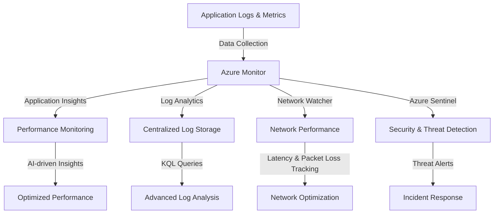

# **Azure Monitoring and Logging Overview**

### **Table of Contents**

- [**1. Introduction**](#1-introduction)
- [**2. Core Features**](#2-core-features)
- [**3. Best Practices for Monitoring**](#3-best-practices-for-monitoring)
- [**4. Further Reading**](#4-further-reading)

---

## **1. Introduction**

Azure provides a suite of monitoring and logging tools designed to improve **performance, security, and reliability** across cloud and hybrid environments. These tools enable **real-time monitoring, automated alerts, and advanced analytics** for applications and infrastructure.

> **Note:** Azure’s monitoring services seamlessly integrate with hybrid environments, providing **end-to-end observability**.

### **System Overview**



---

## **2. Core Features**

### **2.1 Unified Monitoring Platform**

Azure Monitor acts as a **central hub** for collecting, processing, and visualizing **telemetry data** from multiple sources.

|**Capability**|**Benefit**|
|---|---|
|**Metrics Collection**|Tracks CPU, memory, and resource usage.|
|**Custom Alerts**|Notifies teams of anomalies or threshold breaches.|
|**Workbooks**|Provides detailed reports with interactive dashboards.|

> **Example Use Case:** A distributed chatbot application uses **Azure Monitor** to track **response latency** and **user interactions**, allowing for **real-time optimizations**.

---

### **2.2 Application Insights**

Azure **Application Insights** provides **deep telemetry** for live applications, enabling **performance tracking and error detection**.

|**Feature**|**Benefit**|
|---|---|
|**Dependency Tracking**|Identifies slow database/API dependencies.|
|**Custom Telemetry**|Tracks application-specific performance.|
|**User Behavior Analytics**|Provides insights into usage patterns.|

#### **Example: Performance Monitoring**

- Track **chatbot response times** and **identify slow API calls**.
- Detect and troubleshoot **high-latency requests** affecting **user experience**.

---

### **2.3 Log Analytics**

Azure **Log Analytics** aggregates logs from **applications, virtual machines, and infrastructure**.

|**Feature**|**Benefit**|
|---|---|
|**Kusto Query Language (KQL)**|Enables powerful data filtering and querying.|
|**Custom Dashboards**|Visualize logs with **interactive reports**.|
|**Integration with Security Tools**|Enables **threat detection** via Azure Sentinel.|

#### **Example: Querying Logs**

```kql
requests
| where resultCode != 200
| summarize count() by resultCode
```

- This query finds **failed API calls** and **groups them by error code**.

---

### **2.4 Network Monitoring**

Azure **Network Monitoring Tools** help **diagnose connectivity issues** and **optimize network traffic**.

|**Tool**|**Function**|
|---|---|
|**Azure Network Watcher**|Monitors **network connectivity** between services.|
|**Traffic Analytics**|Tracks **data flows** and detects anomalies.|
|**Connection Monitor**|Tests network **latency and packet loss**.|

#### **Example: Network Optimization**

- Monitor **cross-region traffic** to ensure **low latency** for users.
- Detect **high packet loss** affecting **API response times**.

---

### **2.5 Security Monitoring**

Azure provides **built-in security monitoring** for **threat detection and compliance**.

|**Tool**|**Purpose**|
|---|---|
|**Azure Security Center**|Identifies security vulnerabilities.|
|**Azure Sentinel**|Uses AI-driven threat intelligence.|
|**Threat Detection**|Alerts teams about **unusual access patterns**.|

#### **Example: Security Alerting**

- Detect **unauthorized access attempts** to Azure **SQL databases**.
- Prevent **DDoS attacks** by integrating **Azure Firewall**.

---

## **3. Best Practices for Monitoring**

1. **Define Essential Metrics**
    - Track **CPU, memory, API response times, and security alerts**.
2. **Use Actionable Alerts**
    - Avoid **alert fatigue** by **filtering** notifications to **critical issues**.
3. **Enable Custom Dashboards**
    - Use **Workbooks** to **combine logs, metrics, and alerts**.
4. **Secure Log Data**
    - Use **RBAC (Role-Based Access Control)** to prevent **unauthorized access**.
5. **Automate Compliance Reports**
    - Generate **security & performance reports** for **stakeholders**.

---

## **4. Further Reading**

- [Azure Monitor Documentation](https://learn.microsoft.com/en-us/azure/azure-monitor/overview)
- [Application Insights Guide](https://learn.microsoft.com/en-us/azure/azure-monitor/app/app-insights-overview)
- [Azure Network Watcher](https://learn.microsoft.com/en-us/azure/network-watcher/overview)
- [Kusto Query Language (KQL) Reference](https://learn.microsoft.com/en-us/azure/azure-monitor/logs/log-query-overview)

> **Cross-Reference:** For **hybrid monitoring**, see **[azure_arc_hybrid](../02_Setup_and_Configuration/azure_arc_hybrid.md)**.

---

### **Next Step:**

- **[continuous_testing_devops](continuous_testing_devops.md)**
