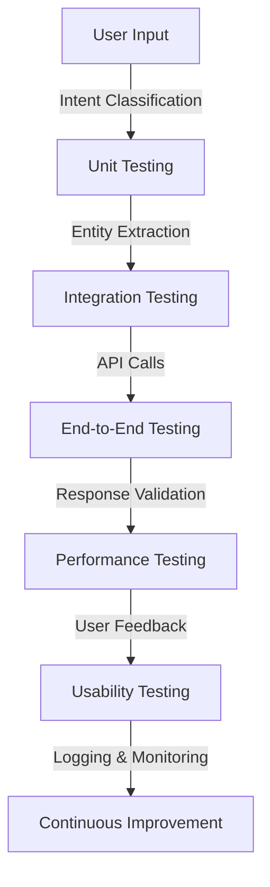

# **Testing Strategies for Chatbots**
### **Table of Contents**

- [**1. Introduction**](#1-introduction)
- [**2. Types of Testing for Chatbots**](#2-types-of-testing-for-chatbots)
- [**3. Tools for Chatbot Testing**](#3-tools-for-chatbot-testing)
- [**4. Testing in CI/CD Pipelines**](#4-testing-in-cicd-pipelines)
- [**5. Best Practices for Chatbot Testing**](#5-best-practices-for-chatbot-testing)
- [**6. Further Reading**](#6-further-reading)

---

## **1. Introduction**

Ensuring chatbots provide **accurate, seamless, and engaging interactions** requires thorough testing. This guide covers different **testing types, tools, and best practices** to create reliable chatbot solutions.

> **Tip:** Automated testing should complement manual testing to ensure comprehensive quality assurance.

### **Chatbot Testing Workflow**



---

## **2. Types of Testing for Chatbots**

### **2.1 Unit Testing**

Unit testing validates **individual chatbot components**, such as **intent classification and API calls**.

|**Example**|**Test**|
|---|---|
|Intent Recognition|Ensure correct mapping of user inputs to intents.|
|Response Generation|Validate chatbot replies to standard queries.|
|API Call Responses|Confirm backend API integrations return expected results.|

> **Tool Suggestion:** Use `unittest` (Python) or `Jest` (JavaScript) to streamline unit tests.

---

### **2.2 Integration Testing**

Integration testing ensures **smooth interaction between different chatbot components**.

|**Scenario**|**Objective**|
|---|---|
|Database Integration|Validate chatbot's ability to read/write user data.|
|API Communication|Ensure proper connectivity with third-party services.|
|Middleware Processing|Test message enrichment layers for correct preprocessing.|

> **Example:** A chatbot integrating with a **payment API** should successfully handle **successful transactions, failures, and timeouts**.

---

### **2.3 End-to-End Testing**

End-to-end (E2E) testing **mimics real user interactions** to evaluate chatbot performance across its workflow.

|**Focus Area**|**Example**|
|---|---|
|User Input Flow|Validate chatbot’s ability to manage multi-turn conversations.|
|Edge Case Handling|Test responses to **ambiguous** or **unexpected** inputs.|
|UI Integration|Ensure smooth **rendering** and **interaction** across chat platforms.|

> **Recommended Tool:** `Cypress` or `Selenium` for simulating user interactions.

---

### **2.4 Performance Testing**

Performance testing **evaluates chatbot efficiency** under various loads.

|**Metric**|**Test Objective**|
|---|---|
|Concurrent Users|Simulate multiple users to measure chatbot scalability.|
|Latency|Track **response times** to identify processing bottlenecks.|
|Resource Utilization|Monitor **CPU, memory, and network usage** under load.|

> **Tool Suggestion:** `Locust` or `JMeter` for **load testing** and **stress testing**.

---

### **2.5 Usability Testing**

Usability testing ensures the chatbot delivers a **smooth and intuitive user experience**.

|**Aspect**|**Focus**|
|---|---|
|Conversational Flow|Check if the dialogue **feels natural**.|
|Accessibility|Ensure compliance with **WCAG** for visually impaired users.|
|Feedback Mechanisms|Validate mechanisms for collecting **user feedback**.|

> **Example:** A **voice-enabled chatbot** should accommodate **speech recognition errors** and **offer retry options**.

---

## **3. Tools for Chatbot Testing**

|**Tool**|**Purpose**|
|---|---|
|**Botium**|End-to-end testing and intent validation.|
|**Postman**|API testing and response verification.|
|**Cucumber**|Behavior-driven testing using **Gherkin syntax**.|
|**Microsoft Bot Framework**|Native testing tools for Azure chatbot deployments.|

---

## **4. Testing in CI/CD Pipelines**

Integrating chatbot tests into **CI/CD pipelines** ensures continuous validation of new code deployments.

### **Steps to Automate Chatbot Testing**

1. **Add Unit Tests**
    - Run unit tests for every **code commit**.
2. **Trigger Integration Tests**
    - Verify API calls and database queries.
3. **Run End-to-End Tests**
    - Simulate real user interactions before deployment.
4. **Generate Reports**
    - Use **Jenkins**, **GitHub Actions**, or **Azure DevOps** to track test results.

#### **Example: CI/CD Pipeline with GitHub Actions**

```yaml
name: Chatbot Testing CI/CD

on:
  push:
    branches:
      - main

jobs:
  test:
    runs-on: ubuntu-latest

    steps:
      - uses: actions/checkout@v2
      - name: Install Dependencies
        run: npm install
      - name: Run Unit Tests
        run: npm test

  e2e:
    runs-on: ubuntu-latest
    needs: test

    steps:
      - uses: actions/checkout@v2
      - name: Run E2E Tests
        run: npx cypress run
```

---

## **5. Best Practices for Chatbot Testing**

1. **Prioritize Critical Flows**
    - Focus on **high-impact** chatbot functions before expanding coverage.
2. **Automate Repetitive Tests**
    - **Unit, integration, and regression tests** should be automated.
3. **Include Negative Testing**
    - Validate chatbot responses for **invalid inputs** and **unexpected user behavior**.
4. **Use Mock Data**
    - Simulate backend API responses to **test chatbot logic in isolation**.
5. **Monitor Logs**
    - Analyze chatbot logs to **identify errors and optimize responses**.

> **Example:** A chatbot should handle a **database timeout** gracefully instead of showing a **system error** to users.

---

## **6. Further Reading**

- [Botium Documentation](https://botium.ai/documentation/)
- [Cucumber BDD Testing](https://cucumber.io/docs/)
- [Postman API Testing](https://www.postman.com/)
- [Microsoft Bot Framework Testing](https://learn.microsoft.com/en-us/azure/bot-service/testing-bots)

> **Cross-Reference:** For **advanced automated testing strategies**, see **[automated_testing_guide](automated_testing_guide.md)**.

---

### **Next Step**

- [04_Security_and_Optimization](../04_Security_and_Optimization/04_Security_and_Optimization.md)
