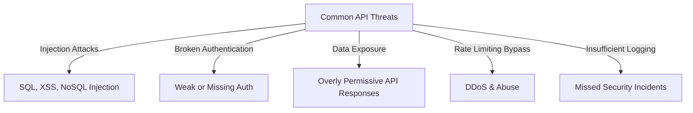

# **API Security Best Practices**


---

## **1. Introduction**

APIs (Application Programming Interfaces) **enable communication** between different services and applications, making them essential in modern development. However, they also present **significant security risks** due to the sensitive data they expose.

This guide provides best practices to protect APIs from **unauthorized access, data breaches, and cyberattacks**.

> **Example:** A misconfigured API can lead to **unauthorized data access**, exposing **user credentials and payment details**.

---

## **2. Why API Security is Crucial**

|**Reason**|**Impact**|
|---|---|
|**Protect Sensitive Data**|Prevents unauthorized access to **personal, financial, or system-critical data**.|
|**Ensure Service Availability**|Prevents **DDoS attacks** and excessive API usage.|
|**Compliance & Regulations**|Ensures adherence to **GDPR, HIPAA, PCI-DSS**, and other compliance requirements.|
|**Prevent API Abuse**|Stops **unauthorized data scraping, rate-limiting bypass, and replay attacks**.|

> **Example:** In 2021, an API misconfiguration at **Facebook exposed 533 million user records** due to weak access controls.

---

## **3. Common Threats to APIs**



|**Threat**|**Description**|
|---|---|
|**Injection Attacks**|Attackers inject malicious code via API inputs (**SQL, NoSQL, XSS attacks**).|
|**Broken Authentication**|Weak authentication allows attackers to **gain unauthorized access**.|
|**Excessive Data Exposure**|APIs return **more data than needed**, increasing exposure risk.|
|**Rate-Limiting Bypass**|Attackers flood APIs with requests, leading to **DDoS attacks**.|
|**Lack of Logging**|Missed security breaches due to **poor monitoring**.|

> **Example:** **Tesla's API** once allowed **unauthorized vehicle access** due to **missing authentication checks**.

---

## **4. Best Practices for Securing APIs**

### **4.1 Enforce HTTPS (TLS)**

- Always use **HTTPS** to encrypt data and prevent **MITM (Man-in-the-Middle) attacks**.
- Redirect all HTTP traffic to **HTTPS** automatically.

#### **Example (Nginx Configuration):**

```nginx
server {
    listen 80;
    return 301 https://$host$request_uri;
}
```

---

### **4.2 Implement Strong Authentication**

- Use **OAuth 2.0, JWT, or API keys** for secure authentication.
- Enforce **Multi-Factor Authentication (MFA)** for sensitive endpoints.

#### **Example (JWT Payload):**

```json
{
  "sub": "user123",
  "iat": 1683246598,
  "exp": 1683250198,
  "roles": ["admin"]
}
```

---

### **4.3 Set Rate Limits and Throttling**

- **Limit API requests per second** per user or IP.
- Implement **exponential backoff** to prevent **brute force attacks**.

#### **Example (Rate-Limiting with API Gateway):**

```yaml
rate-limiting:
  requests: 100
  time-unit: 1h
```

---

### **4.4 Validate and Sanitize Inputs**

- **Reject malformed requests** and **sanitize inputs** to prevent **injection attacks**.
- Use **JSON Schema validation**.

#### **Example (JSON Schema for Input Validation):**

```json
{
  "type": "object",
  "properties": {
    "username": { "type": "string" },
    "age": { "type": "integer", "minimum": 0 }
  },
  "required": ["username", "age"]
}
```

---

### **4.5 Use API Gateway and WAF**

- **Deploy API Gateway** (e.g., AWS API Gateway, Azure API Management) for centralized security.
- **Enable Web Application Firewall (WAF)** to block **malicious traffic**.

> **Example:** AWS **WAF blocks SQL injection** and **cross-site scripting (XSS)** threats.

---

### **4.6 Secure API Keys and Tokens**

- **Do not expose API keys in code repositories**.
- Store secrets in **AWS Secrets Manager, Azure Key Vault, or HashiCorp Vault**.

#### **Example (Storing API Key in Environment Variable)**

```bash
export API_KEY=your-secure-api-key
```

---

### **4.7 Implement Logging and Monitoring**

- Log **all authentication attempts**, **failed API calls**, and **anomalous behavior**.
- Use **SIEM tools** (e.g., **Azure Sentinel**, **Splunk**) for threat detection.

#### **Example (API Log Entry)**

```json
{
  "timestamp": "2025-02-01T10:30:00Z",
  "request": {
    "method": "POST",
    "endpoint": "/login",
    "status": 401
  },
  "alert": "Failed authentication attempt"
}
```

---

## **5. Step-by-Step Guide to Securing an API**

1. **Enable HTTPS (TLS)**
2. **Implement OAuth 2.0 or JWT authentication**
3. **Set Rate Limits & Throttling**
4. **Validate & Sanitize Inputs**
5. **Deploy API Gateway & WAF**
6. **Enable Logging & Monitoring**
7. **Perform Security Testing (OWASP ZAP, Burp Suite)**
8. **Rotate API Keys Regularly**

---

## **6. Common Mistakes and How to Avoid Them**

|**Mistake**|**Solution**|
|---|---|
|**Hardcoding API Keys**|Store in **vaults or environment variables**.|
|**Overexposing Data**|Return **only required fields**.|
|**Ignoring Authentication Expiry**|Implement **short-lived tokens** with **refresh mechanisms**.|
|**Weak Error Handling**|Use **generic error messages** to avoid leaking system details.|

---

## **7. Tools for API Security**

|**Tool**|**Purpose**|
|---|---|
|**OWASP ZAP**|Identifies API vulnerabilities.|
|**Postman**|API testing & validation.|
|**Burp Suite**|Security scanning & penetration testing.|
|**Azure API Management**|Manages and secures API access.|

---

## **8. Further Reading**

- [OWASP API Security Best Practices](https://owasp.org/www-project-api-security/)
- [OAuth 2.0 Security Best Practices](https://oauth.net/2/)
- [API Security Testing with Postman](https://www.postman.com/)
- [Azure API Management Documentation](https://learn.microsoft.com/en-us/azure/api-management/)

> **Next Steps:** Explore **[security_best_practices_chatbots](security_best_practices_chatbots.md)**.