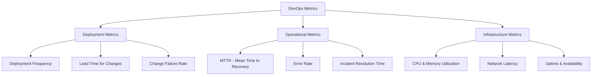

# **DevOps Metrics and KPIs: A Comprehensive Guide**

---

## **1. Introduction to DevOps Metrics**

DevOps metrics provide **quantifiable insights** into software development, delivery, and operational efficiency. These metrics help teams **identify bottlenecks, improve processes, and ensure system reliability**.

> **Tip:** Metrics should be aligned with both **technical and business objectives** to drive meaningful improvements.

---

## **2. Why Metrics and KPIs Matter in DevOps**

|**Benefit**|**Description**|
|---|---|
|**Improved Visibility**|Enables tracking of **deployment speed, system health, and failures**.|
|**Data-Driven Decisions**|Helps teams **prioritize improvements** based on actual performance trends.|
|**Better Collaboration**|Aligns **development, operations, and business** goals.|
|**Continuous Improvement**|Identifies areas for **automation and process enhancement**.|

> **Example:** A **high change failure rate** may indicate **insufficient testing**, leading teams to invest in **automated QA processes**.

---

## **3. Categories of DevOps Metrics**

### **3.1 Deployment Metrics**

|**Metric**|**Description**|**How to Improve**|
|---|---|---|
|**Lead Time for Changes**|Time taken from **code commit to deployment**.|Automate CI/CD pipelines and streamline review processes.|
|**Deployment Frequency**|Number of **deployments per time period**.|Use microservices and feature flags to reduce deployment risks.|
|**Change Failure Rate**|Percentage of **failed deployments**.|Increase test coverage and enforce code reviews.|

---

### **3.2 Operational Metrics**

|**Metric**|**Description**|**How to Improve**|
|---|---|---|
|**MTTR (Mean Time to Recovery)**|Time taken to **restore service after failure**.|Implement **better monitoring and automated rollback mechanisms**.|
|**Error Rate**|Percentage of **failed requests or operations**.|Strengthen **QA, logging, and alerting mechanisms**.|
|**Incident Resolution Time**|Time taken to **identify and resolve issues**.|Use **incident response automation tools**.|

---

### **3.3 Infrastructure Metrics**

|**Metric**|**Description**|**How to Improve**|
|---|---|---|
|**CPU & Memory Utilization**|Measures **resource consumption**.|Auto-scale infrastructure and optimize workloads.|
|**Network Latency**|Time taken for **data transmission**.|Optimize **CDNs and API gateways**.|
|**Uptime & Availability**|Percentage of **time system is operational**.|Implement **redundancy and failover mechanisms**.|

---

## **4. How to Measure DevOps Metrics**

### **Step-by-Step Approach**

1. **Automate Data Collection**
    - Use tools like **Prometheus, ELK Stack, Azure Monitor** for automated logging.
2. **Define Baselines & SLAs**
    - Establish expected **performance thresholds**.
3. **Track Trends**
    - Identify **recurring issues** and **bottlenecks**.
4. **Incorporate Metrics into CI/CD**
    - Automate metric tracking **in deployment pipelines**.

> **Example:** Set an alert for **high error rates** in production using **Grafana & Prometheus**.

---

## **5. Best Practices for Using Metrics**

1. **Prioritize Actionable Metrics**
    - Focus on **metrics that drive improvement**, not vanity stats.
2. **Ensure Data Accuracy**
    - Validate data sources to **eliminate inconsistencies**.
3. **Align with Business Objectives**
    - Ensure **metrics reflect business needs** (e.g., reliability, speed, cost).
4. **Avoid Metric Overload**
    - Too many metrics can lead to **analysis paralysis**.

---

## **6. Visualizing DevOps Metrics**

Use dashboards for **real-time visibility**.

|**Tool**|**Visualization Features**|
|---|---|
|**Grafana**|Custom dashboards for real-time monitoring.|
|**Azure Monitor**|Tracks application & infrastructure health.|
|**DataDog**|Correlates performance metrics with traces.|

> **Tip:** Use **color-coded thresholds** (e.g., red for issues, green for normal) for easy interpretation.

---

## **7. Common Pitfalls and How to Avoid Them**

|**Pitfall**|**Solution**|
|---|---|
|**Focusing on Vanity Metrics**|Use **meaningful, outcome-driven metrics**.|
|**Ignoring Context**|Always **interpret metrics within a broader context**.|
|**Lack of Automation**|Automate metric collection **to ensure consistency**.|

> **Example:** Tracking **only deployment frequency** without **measuring failure rates** can lead to misleading conclusions.

---

## **8. Tools for Tracking DevOps Metrics**

|**Tool**|**Primary Use**|
|---|---|
|**Prometheus**|Real-time monitoring & alerting.|
|**Jenkins**|Tracks CI/CD performance metrics.|
|**ELK Stack**|Logs analysis & infrastructure monitoring.|
|**Splunk**|Security & operational analytics.|
|**Azure DevOps Analytics**|Provides pipeline performance metrics.|

---

## **9. Further Reading**

- [Accelerate Metrics Guide](https://cloud.google.com/devops/)
- [Prometheus Documentation](https://prometheus.io/docs/)
- [Azure DevOps Metrics Overview](https://learn.microsoft.com/en-us/azure/devops/)
- [Grafana Dashboards](https://grafana.com/tutorials/)

> **Next Steps:** [security_best_practices_chatbots](security_best_practices_chatbots.md)

