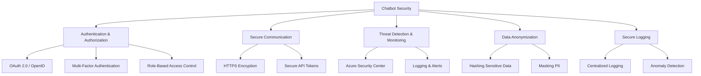

# **Implementation Guide: Security Best Practices for Chatbots**
### **Table of Contents**

- [**1. Introduction**](#1-introduction)
- [**2. Why Security Matters**](#2-why-security-matters)
- [**3. Authentication and Authorization**](#3-authentication-and-authorization)
- [**4. Securing Communication**](#4-securing-communication)
- [**5. Using Azure Key Vault**](#5-using-azure-key-vault)
- [**6. Secure Logging Practices**](#6-secure-logging-practices)
- [**7. Monitoring and Threat Detection**](#7-monitoring-and-threat-detection)
- [**8. Data Anonymization**](#8-data-anonymization)
- [**9. Best Practices**](#9-best-practices)

---
## **1. Introduction**

Chatbots process **sensitive user data**, making security a critical aspect of their deployment. This guide outlines essential **authentication mechanisms, encryption methods, secure logging, and monitoring strategies**.



> **Tip:** Secure chatbot infrastructure **from the design phase** to reduce vulnerabilities later.

---

## **2. Why Security Matters**

|**Aspect**|**Purpose**|
|---|---|
|**User Trust**|Ensures users feel confident that their data is safe.|
|**Compliance**|Meets regulatory standards (e.g., GDPR, HIPAA, CCPA).|
|**Threat Mitigation**|Reduces risks from **data leaks, unauthorized access, and cyberattacks**.|

> **Example:** A chatbot processing **payment transactions** must comply with **PCI DSS** security standards.

---

## **3. Authentication and Authorization**

### **3.1 Secure User Authentication**

- Use **OAuth 2.0 & OpenID Connect** for standardized authentication.

```python
from msal import PublicClientApplication

app = PublicClientApplication("client_id")
token = app.acquire_token_by_username_password(
    username="user@example.com",
    password="user_password",
    scopes=["User.Read"]
)
print(token)
```

- **Multi-Factor Authentication (MFA)** adds extra security by requiring SMS codes or authenticator apps.

### **3.2 Role-Based Access Control (RBAC)**

- Restrict access **based on roles**.

```bash
az role assignment create --assignee user@example.com --role Contributor --scope /subscriptions/{subscription-id}/resourceGroups/{resource-group}
```

> **Tip:** Regularly **audit access roles** to apply the **least privilege principle**.

---

## **4. Securing Communication**

### **4.1 Enforce HTTPS**

- Encrypt all communication channels with HTTPS.

```bash
sudo certbot --nginx -d example.com -d www.example.com
```

### **4.2 Encrypt Sensitive Data**

- Use **AES encryption** to secure data at rest.

```python
from cryptography.fernet import Fernet

key = Fernet.generate_key()
cipher = Fernet(key)
encrypted_data = cipher.encrypt(b"Sensitive user data")
print(encrypted_data)
```

---

## **5. Using Azure Key Vault**

Secure **API keys, certificates, and sensitive secrets**.

### **Steps to Implement:**

1. **Create an Azure Key Vault:**
    
    ```bash
    az keyvault create --name MyKeyVault --resource-group MyResourceGroup --location westeurope
    ```
    
2. **Store a Secret:**
    
    ```bash
    az keyvault secret set --vault-name MyKeyVault --name MySecret --value "super-secret-value"
    ```
    
3. **Access a Secret in Code:**
    
    ```python
    from azure.identity import DefaultAzureCredential
    from azure.keyvault.secrets import SecretClient
    
    credential = DefaultAzureCredential()
    client = SecretClient(vault_url="https://mykeyvault.vault.azure.net/", credential=credential)
    
    secret = client.get_secret("MySecret")
    print(secret.value)
    ```
    

---

## **6. Secure Logging Practices**

### **6.1 Redact Sensitive Data**

- **Do not log** personally identifiable information (PII).

```python
logging.info("User logged in: [REDACTED]")
```

### **6.2 Centralized Logging**

- Use **Azure Monitor** or **ELK Stack** for centralized log management.

### **6.3 Set Log Retention Policies**

- Store logs **only as long as required** for **compliance and debugging**.

---

## **7. Monitoring and Threat Detection**

### **7.1 Azure Security Center**

- Scans **Azure-based** chatbots for vulnerabilities and security threats.

### **7.2 Azure Sentinel**

- Uses **machine learning** for **real-time security event detection**.

```kql
requests
| where resultCode == 401
| summarize count() by userAgent, clientIP
```

> **Tip:** Set up alerts for **suspicious login attempts or failed authentication spikes**.

---

## **8. Data Anonymization**

### **8.1 Hash Sensitive Data**

- Hash **user information** before storage.

```python
import hashlib

hashed_email = hashlib.sha256("user@example.com".encode()).hexdigest()
print(hashed_email)
```

### **8.2 Mask PII (Personally Identifiable Information)**

- **Mask or tokenize** sensitive data **before processing**.

> **Example:** Convert **John Doe** → **J*** D**.

---

## **9. Best Practices**

|**Security Measure**|**Implementation**|
|---|---|
|**Least Privilege Access**|Restrict access to only what’s necessary.|
|**Automate Security Scans**|Use OWASP ZAP, Snyk, and Azure Defender.|
|**Rotate API Keys Regularly**|Use Azure Key Vault for **automatic key rotation**.|
|**Enable SSL/TLS by Default**|Ensure **all APIs enforce HTTPS**.|

> **Tip:** Regularly **audit security policies** to stay ahead of **evolving threats**.

---

> **Cross-Reference:** For a comparison of security tools, check **[security_tools_overview](security_tools_overview.md)**.
