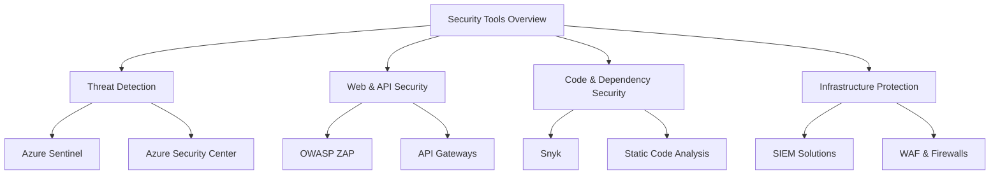

# **Comprehensive Security Tools Overview**
### **Table of Contents**

- [**1. Introduction**](#1-introduction)
- [**2. Overview of Security Tools**](#2-overview-of-security-tools)
- [**3. Comparative Analysis**](#3-comparative-analysis)
- [**4. Integration with Azure Resources**](#4-integration-with-azure-resources)
- [**5. Best Practices for Using Security Tools**](#5-best-practices-for-using-security-tools)
- [**6. Further Reading**](#6-further-reading)

---

## **1. Introduction**

Security tools play a **critical role in detecting vulnerabilities, protecting sensitive data, and ensuring compliance** with industry regulations. This document provides a **detailed comparison** of various security tools, their use cases, and best practices for **integrating them into Azure environments**.

> **Tip:** A **layered security approach** using multiple tools is **more effective** than relying on a single solution.

---

## **2. Overview of Security Tools**

### **2.1 Azure Security Center**

Azure Security Center provides **unified security management** and **threat protection** for Azure and hybrid environments.

|**Feature**|**Benefit**|
|---|---|
|**Threat Protection**|Detects and mitigates security threats using AI insights.|
|**Compliance Monitoring**|Tracks compliance with regulatory standards like GDPR and HIPAA.|
|**Secure Score**|Provides security recommendations based on best practices.|

#### **Common Use Cases**

- **Identifying misconfigurations** in Azure resources.
- **Monitoring hybrid environments** for potential security risks.
- **Ensuring compliance** with industry regulations.

---

### **2.2 Azure Sentinel**

Azure Sentinel is a **cloud-native SIEM** (Security Information and Event Management) tool designed for **threat detection and automated response**.

|**Feature**|**Benefit**|
|---|---|
|**Threat Detection**|Uses **machine learning** to analyze log data for anomalies.|
|**Incident Investigation**|Provides a **visual timeline** of security events.|
|**Automated Response**|Creates **playbooks** for real-time threat mitigation.|

#### **Integration Example**

- **Monitor Office 365 logs** to detect **unusual login activities**.
- **Automate security responses** for detected threats.

---

### **2.3 OWASP ZAP**

OWASP ZAP (Zed Attack Proxy) is an **open-source security tool** for identifying vulnerabilities in **web applications and APIs**.

|**Feature**|**Benefit**|
|---|---|
|**Automated Scanning**|Finds **common vulnerabilities** like **SQL Injection and XSS**.|
|**Passive Scanning**|Monitors API requests **without modifying traffic**.|
|**Custom Scripts**|Enhances testing with **automation capabilities**.|

#### **Common Use Cases**

- **Testing chatbot API endpoints** for vulnerabilities.
- **Integrating into CI/CD pipelines** for **automated security scans**.

---

### **2.4 Snyk**

Snyk is a **developer-focused** security tool that helps **identify and fix vulnerabilities** in **code, dependencies, and container images**.

|**Feature**|**Benefit**|
|---|---|
|**Dependency Scanning**|Identifies vulnerabilities in **third-party libraries**.|
|**Container Security**|Analyzes **Docker images** for security flaws.|
|**Fix Recommendations**|Provides **actionable remediation steps** for detected issues.|

> **Example:** Use **Snyk with GitHub Actions** to automatically scan repositories for insecure packages.

---

## **3. Comparative Analysis**

|**Tool**|**Best For**|**Strengths**|**Limitations**|
|---|---|---|---|
|**Azure Security Center**|Cloud & Hybrid Security|Comprehensive Azure integration|Azure-specific|
|**Azure Sentinel**|Threat Detection & Response|AI-driven SIEM capabilities|Requires log ingestion setup|
|**OWASP ZAP**|Web & API Security|Flexible open-source tool|Limited enterprise support|
|**Snyk**|Code & Dependency Security|Fast developer-friendly scanning|Premium features required for advanced options|

---

## **4. Integration with Azure Resources**

### **4.1 Azure Security Center**

- **Enable Security Center** on all **subscriptions** for **centralized security monitoring**.
- **Use Secure Score** to identify **high-priority security tasks**.

### **4.2 Azure Sentinel**

- **Connect Sentinel to Azure Log Analytics** for **real-time security alerts**.
- **Use Power Automate** to **trigger remediation workflows** for detected threats.

### **4.3 OWASP ZAP**

- **Automate API security scans** in **Azure DevOps CI/CD pipelines**.
- **Export vulnerability reports** to **Azure Monitor** for centralized analysis.

### **4.4 Snyk**

- **Integrate Snyk into Azure DevOps** to block deployments **if security vulnerabilities exist**.
- **Scan Docker images** stored in **Azure Container Registry (ACR)**.

---

## **5. Best Practices for Using Security Tools**

1. **Use a Multi-Layered Approach**
    
    - Combine **SIEM, code security, network monitoring, and API security tools**.
2. **Automate Security Scanning**
    
    - Integrate **OWASP ZAP and Snyk** into **CI/CD pipelines**.
3. **Monitor Continuously**
    
    - Use **Azure Monitor and Sentinel** to aggregate security **alerts**.
4. **Prioritize High-Impact Fixes**
    
    - Address **critical vulnerabilities first**, rather than focusing on minor issues.
5. **Educate Security Teams**
    
    - Conduct **regular training** on **secure coding practices**.

---

## **6. Further Reading**

- [Azure Security Center Documentation](https://learn.microsoft.com/en-us/azure/security-center/)
- [Azure Sentinel Overview](https://learn.microsoft.com/en-us/azure/sentinel/)
- [OWASP ZAP Guide](https://owasp.org/www-project-zap/)
- [Snyk Documentation](https://snyk.io/docs/)

> **Cross-Reference:** For specific chatbot security configurations, refer to **[security_best_practices_chatbots](security_best_practices_chatbots.md)**.

---
