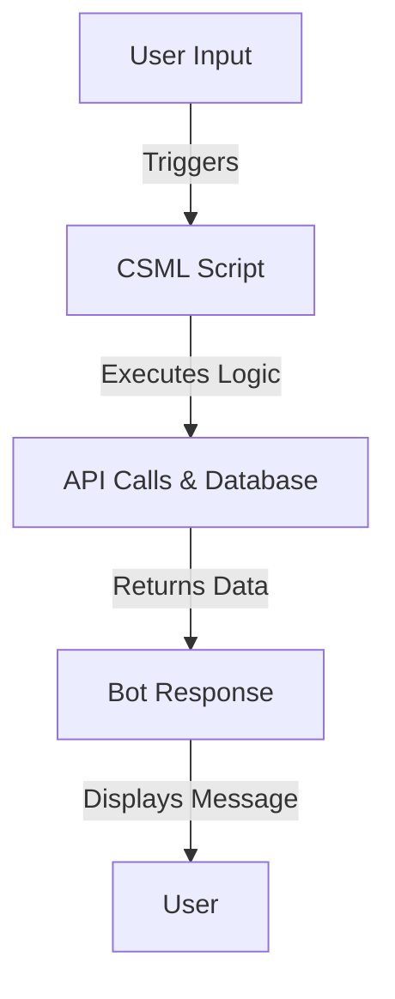

# **CSML Overview: Conversational Scripting Language**
### **Table of Contents**

- [**1. Introduction**](#1-introduction)
- [**2. Core Features**](#2-core-features)
- [**3. Why Choose CSML?**](#3-why-choose-csml)
- [**4. CSML Workflow**](#4-csml-workflow)
- [**5. Example Scripts**](#5-example-scripts)
- [**6. Best Practices**](#6-best-practices)
- [**7. Further Reading & Tools**](#7-further-reading--tools)

---

## **1. Introduction**

CSML (**Conversational Scripting Markup Language**) is a programming language tailored for designing **chatbots** and **voice assistants**. It simplifies **conversation management**, integrates seamlessly with APIs, and provides **event-driven workflows** for real-time interactions.



> **Key Benefit:** CSML bridges the gap between developers and business users by enabling **easy-to-read** chatbot scripting.

---

## **2. Core Features**

### **2.1 Flexible Dialogues**

|**Feature**|**Benefit**|
|---|---|
|**Dynamic Responses**|Generate personalized messages|
|**Multilingual Support**|Create bots for multiple languages|
|**Reusable Components**|Modular scripts improve maintainability|

---

### **2.2 Integration-Friendly**

CSML supports **seamless API calls** and **database connectivity**.

|**Integration Type**|**Examples**|
|---|---|
|**RESTful APIs**|Fetch user data, weather info|
|**Databases**|Query MySQL, MongoDB, Firebase|
|**CRM Systems**|Connect to HubSpot, Salesforce|

#### **Example: Fetching User Data via API**

```csml
start:
  do var user = call "https://api.example.com/user/{{event.user_id}}";
  say "Hello, {{user.name}}! How can I assist you?"
  hold
```

---

### **2.3 Event-Based Architecture**

|**Scenario**|**How CSML Handles It**|
|---|---|
|**User Message**|Triggers chatbot responses|
|**API Event**|Executes workflows based on external triggers|
|**Time-Based**|Sends scheduled reminders|

> **Example:** A **customer support chatbot** triggers an API request when a user requests **order status**.

---

## **3. Why Choose CSML?**

|**Advantage**|**Explanation**|
|---|---|
|**Easy to Learn**|Readable syntax, intuitive flow|
|**API First**|Built-in API integration|
|**Scalable**|Supports high-concurrency workloads|
|**Cross-Platform**|Deployable on Web, Messenger, Slack|

---

## **4. CSML Workflow**

CSML scripts operate in **logical stages**, allowing **natural conversation flow**.

1️⃣ **Define User Interaction**  
2️⃣ **Process Input with Variables**  
3️⃣ **Call APIs or External Services**  
4️⃣ **Return a Response to the User**

---

### **Basic Flow Example**

```csml
start:
  say "Welcome! What do you need help with?"
  hold
```

### **Handling User Input**

```csml
start:
  if event.payload == "support" then goto support_flow
  else say "I didn't understand that."
  hold
```

---

## **5. Example Scripts**

### **5.1 Simple Greeting**

```csml
start:
  say "Hello! How can I assist you?"
  hold
```

---

### **5.2 Conditional Responses**

```csml
start:
  if event.payload == "order_status" then goto order_flow
  else say "I'm not sure how to help with that."
  hold
```

---

### **5.3 API Integration for Dynamic Responses**

```csml
start:
  do var weather = call "https://api.weather.com/today";
  say "Today's weather is {{weather.description}}."
  hold
```

---

## **6. Best Practices**

1️⃣ **Keep Scripts Modular** – Use reusable components for better maintainability.  
2️⃣ **Validate API Responses** – Ensure external services return expected data.  
3️⃣ **Use Structured Logging** – Monitor chatbot performance using logs.  
4️⃣ **Optimize for Performance** – Reduce unnecessary API calls.  
5️⃣ **Test Edge Cases** – Handle unexpected user inputs gracefully.

---

## **7. Further Reading & Tools**

- 📖 [**CSML Official Documentation**](https://csml.dev/)
- 🛠️ [**CSML Playground (Test Scripts Online)**](https://playground.csml.dev/)
- 🚀 [**CSML Studio (Cloud-Based Bot Builder)**](https://studio.csml.dev/)
- 🔗 [**Integration Examples**](https://csml.dev/docs/integrations)

> **Explore Next:** Check out **[testing_strategies_chatbots](../03_Testing_and_Monitoring/testing_strategies_chatbots.md)** for chatbot testing best practices.

---

### **Next Step:**

- 📌 **[bot_framework_azure](bot_framework_azure.md)**