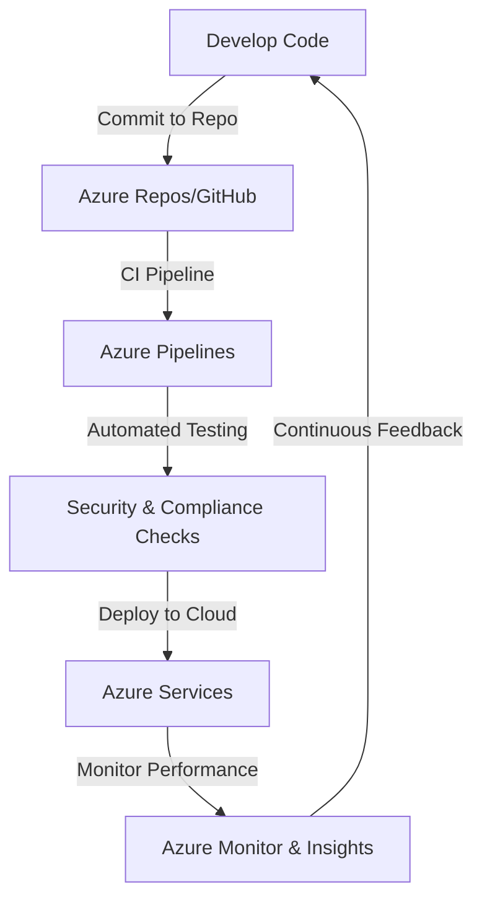

# **Handout: Azure, DevOps, and Azure DevOps**

### **Table of Contents**

- [**Azure Overview**](#azure-overview)
- [**What is DevOps?**](#what-is-devops)
- [**Azure + DevOps: A Powerful Combination**](#azure--devops-a-powerful-combination)
- [**Azure DevOps Explained**](#azure-devops-explained)
- [**Practical Applications**](#practical-applications)
- [**Comparison: Azure DevOps vs. Alternatives**](#comparison-azure-devops-vs-alternatives)
- [**Best Practices**](#best-practices)
- [**Further Resources**](#further-resources)

---

## **Azure Overview**

Microsoft Azure is a cloud computing platform offering **global infrastructure** and a **wide range of services**.

### **Azure Services Overview**

|**Category**|**Examples**|**Use Cases**|
|---|---|---|
|**Compute**|Virtual Machines, Azure Kubernetes Service|Scalable hosting, containerized services|
|**Storage**|Blob Storage, SQL Database|Structured & unstructured data storage|
|**AI & Analytics**|Azure ML, Cognitive Services|AI-powered apps, chatbot interactions|
|**Networking**|Virtual Networks, Load Balancer|Secure, global networking setups|
|**Monitoring**|Azure Monitor, App Insights|Performance tracking & troubleshooting|

### **Why Azure?**

- 🌎 **Global Reach**: Available in **60+ regions**.
- 🔄 **Scalability**: Adjusts resources dynamically.
- 🔗 **Seamless Integrations**: Works with **Microsoft & open-source** tech.

> **Example:** A fintech company uses **Azure Functions** for serverless transactions and **Azure SQL** for scalable, secure data storage.

---

## **What is DevOps?**

DevOps is a methodology that **combines development (Dev) and operations (Ops)** to improve **collaboration, automation, and delivery speed**.

### **DevOps Practices**

|**Practice**|**Purpose**|
|---|---|
|**Continuous Integration (CI)**|Automates code merging and testing.|
|**Continuous Deployment (CD)**|Automates releases after testing.|
|**Infrastructure as Code (IaC)**|Uses code to manage infrastructure.|
|**Monitoring & Feedback**|Analyzes performance and user behavior.|

> **Outcome:** **Faster releases, fewer bugs, and improved collaboration.**

---

## **Azure + DevOps: A Powerful Combination**

Azure and DevOps together provide a **seamless ecosystem** for building, deploying, and maintaining applications.

### **Key Benefits**

✔ **Automated Deployments** – Use **Azure Pipelines** for CI/CD.  
✔ **Real-Time Monitoring** – **Azure Monitor** provides app insights.  
✔ **Security & Compliance** – Built-in security with **Azure Policies & RBAC**.

> **Example:** A **global retail platform** automates deployments using **Azure DevOps + Kubernetes**, ensuring zero-downtime updates.

---

## **Azure DevOps Explained**

Azure DevOps is **Microsoft’s integrated DevOps platform** providing tools for the entire software lifecycle.

### **Core Components**

|**Component**|**Purpose**|
|---|---|
|**Azure Boards**|Agile project tracking (Kanban, Scrum)|
|**Azure Repos**|Git-based version control|
|**Azure Pipelines**|CI/CD automation across cloud & on-prem|
|**Azure Test Plans**|Manual & automated testing tools|
|**Azure Artifacts**|Secure package management|

### **Why Azure DevOps?**

- 🌍 **Cross-Platform** – Supports **Windows, Linux, and macOS**.
- 🔄 **Works with GitHub, Jenkins, Terraform** and more.
- 🔧 **Cloud & On-Prem** – Flexible hosting for **small teams & enterprises**.

> **Tip:** Use **Azure DevOps REST APIs** to automate workflows.

---

## **Practical Applications**

### **For Teaching**

✔ **Agile Methodologies** – Scrum & Kanban with **Azure Boards**.  
✔ **CI/CD Demonstrations** – Automate deployments with **Azure Pipelines**.  
✔ **Infrastructure as Code** – Deploy labs using **Terraform on Azure**.

### **For Research**

✔ **Data Pipelines** – Automate **ML training & analytics workflows**.  
✔ **Secure Dev Environments** – Use **Azure VMs for pre-configured coding labs**.  
✔ **Reproducibility** – Standardize experiments using **IaC (Terraform/ARM)**.

---

## **Comparison: Azure DevOps vs. Alternatives**

|**Feature**|**Azure DevOps**|**GitHub Actions**|**GitLab CI/CD**|**Jenkins**|
|---|---|---|---|---|
|**Ease of Use**|🟠 Medium|🟢 Easy|🟠 Medium|🔴 Steep|
|**CI/CD Support**|✅ Full|✅ Full|✅ Full|✅ Full|
|**Integration**|✅ Azure, GitHub|✅ GitHub|✅ GitLab|✅ Any|
|**Best For**|**Azure-heavy projects**|**Small teams**|**GitLab-based workflows**|**On-prem setups**|

> **Tip:** Use **GitHub Actions** for simple workflows, and **Azure DevOps** for enterprise-scale projects.

---

## **Best Practices**

### ✔ **Automate Everything**

- Use **CI/CD Pipelines** to remove manual steps.

### 🔒 **Secure Your Infrastructure**

- Store secrets in **Azure Key Vault**.
- Implement **RBAC & Policies**.

### 📊 **Monitor Performance**

- Use **Azure Monitor** & **App Insights** for real-time feedback.

### 💬 **Collaborate Effectively**

- Track work with **Azure Boards**.
- Use **pull requests + code reviews** in **Azure Repos**.

---

## **Further Resources**

📚 **Azure Learning Paths:**

- [Azure DevOps Documentation](https://learn.microsoft.com/en-us/azure/devops/)
- [Terraform on Azure](https://learn.microsoft.com/en-us/azure/developer/terraform/overview)
- [Azure for Education](https://azure.microsoft.com/en-us/education/)

> **Next:** See **[ci_cd_tools_comparison](../02_Setup_and_Configuration/CI_CD/ci_cd_tools_comparison.md)** for hands-on implementation.

---

### Next Step:

📌 [README](../../README.md)
