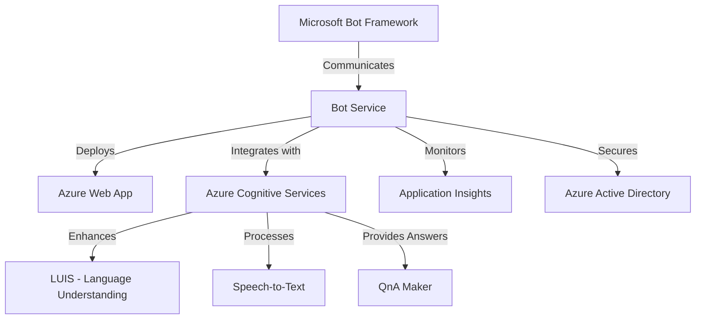

# **Microsoft Bot Framework and Azure**

### **Table of Contents**

- [**1. Introduction**](#1-introduction)
- [**2. Microsoft Bot Framework Overview**](#2-microsoft-bot-framework-overview)
- [**3. Why Integrate Bot Framework with Azure?**](#3-why-integrate-bot-framework-with-azure)
- [**4. Core Components of the Microsoft Bot Framework**](#4-core-components-of-the-microsoft-bot-framework)
- [**5. Azure Services for Bots**](#5-azure-services-for-bots)
- [**6. Deploying a Bot on Azure**](#6-deploying-a-bot-on-azure)
- [**7. Best Practices for Building and Hosting Bots**](#7-best-practices-for-building-and-hosting-bots)
- [**8. Real-World Use Cases**](#8-real-world-use-cases)
- [**9. Further Reading**](#9-further-reading)

---

## **1. Introduction**

The **Microsoft Bot Framework**, combined with **Azure services**, enables developers to build, deploy, and scale conversational AI solutions efficiently. Whether for **customer support**, **e-commerce**, or **enterprise applications**, this combination provides a **robust foundation** for intelligent virtual agents.

> **Fun Fact:** Microsoft Bot Framework supports **20+ communication channels**, including **Teams, Slack, and WhatsApp**.

---

## **2. Microsoft Bot Framework Overview**

The **Microsoft Bot Framework** is an open-source platform for building chatbots and **AI-driven** conversational applications. It provides:

- **Natural Language Understanding (NLU)**
- **Multi-Channel Support**
- **Advanced Dialog Management**
- **Seamless Integration with Azure AI Services**

---

## **3. Why Integrate Bot Framework with Azure?**

|**Advantage**|**Benefit**|
|---|---|
|**Scalability**|Azure ensures your bot can handle **high traffic loads**.|
|**AI-Powered Features**|Integrate **LUIS, Speech-to-Text, and QnA Maker** for **intelligent conversations**.|
|**Unified Monitoring**|Track bot performance using **Application Insights**.|
|**Secure Deployments**|Leverage **Azure Active Directory** for **authentication and access control**.|

> **Example:** An **HR chatbot** can use **LUIS for intent recognition**, **Azure Bot Service for multi-channel support**, and **Azure Storage for employee records**.

---

## **4. Core Components of the Microsoft Bot Framework**

### **4.1 Bot Builder SDK**

A **powerful SDK** that supports **C#, JavaScript, and Python** for developing bots.

|**Feature**|**Benefit**|
|---|---|
|**Dialog Management**|Handles **multi-turn conversations**.|
|**Adaptive Cards**|Creates **rich UI elements** inside chat interfaces.|
|**LUIS Integration**|Enables **AI-powered language understanding**.|

---

### **4.2 Bot Framework Composer**

A **low-code** tool for visually designing chatbots.

|**Feature**|**Benefit**|
|---|---|
|**Graphical Interface**|Drag-and-drop UI **reduces coding complexity**.|
|**Prebuilt Templates**|Speed up bot development.|
|**Local Emulator**|Test bot conversations before deployment.|

---

### **4.3 Bot Connector**

A **universal API** for connecting bots to **multiple messaging channels**.

|**Channel**|**Features**|
|---|---|
|**Microsoft Teams**|Supports **file sharing, adaptive cards, and rich interactions**.|
|**Slack**|Allows **interactive buttons, message formatting, and channels**.|
|**Facebook Messenger**|Enables **multimedia messaging**.|
|**WhatsApp**|Handles **structured messages and quick replies**.|

---

## **5. Azure Services for Bots**

### **5.1 Azure Bot Service**

A **fully managed** bot hosting service that **automates deployment and scaling**.

|**Feature**|**Benefit**|
|---|---|
|**Multi-Channel Support**|Deploy bots on **20+ platforms**.|
|**Security Integration**|Supports **Azure AD authentication**.|
|**Auto-Scaling**|Handles **traffic spikes** efficiently.|

---

### **5.2 Azure Cognitive Services**

|**Service**|**Use Case**|
|---|---|
|**LUIS (Language Understanding)**|Extracts **user intent and entities** from messages.|
|**QnA Maker**|Creates a **knowledge base** from FAQs.|
|**Speech-to-Text**|Converts **voice commands** into text.|
|**Computer Vision**|Analyzes **images and videos** shared by users.|

> **Example:** A **healthcare chatbot** can use **Speech-to-Text for voice interactions** and **LUIS to identify symptoms**.

---

### **5.3 Azure Application Insights**

A **monitoring service** for tracking bot performance.

|**Feature**|**Benefit**|
|---|---|
|**Latency Monitoring**|Detects **slow responses**.|
|**User Analytics**|Tracks **common queries and engagement trends**.|
|**Exception Logging**|Captures **errors and failures** automatically.|

---

## **6. Deploying a Bot on Azure**

### **Step 1: Develop a Bot using Bot Framework Composer**

1. **Download** and install [Bot Framework Composer](https://github.com/microsoft/BotFramework-Composer).
2. **Create conversation flows** using the visual interface.
3. **Test locally** using the built-in emulator.

### **Step 2: Deploy to Azure**

1. **Package the bot** from Composer.
2. **Log in to the Azure Portal**.
3. **Create a Web App Bot** in **Azure Bot Service**.
4. **Upload your bot package** and configure deployment settings.

### **Step 3: Connect to Channels**

1. Navigate to **Channels** in **Azure Bot Service**.
2. Enable **Teams, Slack, or WhatsApp** integrations.
3. Test interactions across platforms.

---

## **7. Best Practices for Building and Hosting Bots**

1. **Optimize for Performance**
    - Use **Azure Auto-Scaling** to manage high-traffic events.
2. **Enhance Natural Language Understanding**
    - Train **LUIS models** with real user data.
3. **Secure API Calls**
    - Implement **OAuth authentication** for protected endpoints.
4. **Monitor User Behavior**
    - Leverage **Application Insights** to analyze bot interactions.
5. **Implement Multi-Turn Conversations**
    - Design **context-aware** dialogues with **memory state management**.

---

## **8. Real-World Use Cases**

|**Industry**|**Use Case**|
|---|---|
|**Customer Support**|Automate **FAQs, order tracking, and complaint resolution**.|
|**E-Commerce**|Provide **product recommendations and cart management**.|
|**Healthcare**|Assist with **symptom analysis and appointment scheduling**.|
|**Education**|Deliver **automated tutoring and exam preparation**.|

---

## **9. Further Reading**

- [Microsoft Bot Framework Documentation](https://learn.microsoft.com/en-us/azure/bot-service/)
- [Azure Bot Service Quickstart](https://learn.microsoft.com/en-us/azure/bot-service/quickstart-basic-deployment)
- [LUIS Documentation](https://learn.microsoft.com/en-us/azure/cognitive-services/luis/)
- [QnA Maker Tutorials](https://learn.microsoft.com/en-us/azure/cognitive-services/qnamaker/)

> **Explore Next: [code_examples_devops](code_examples_devops.md)
