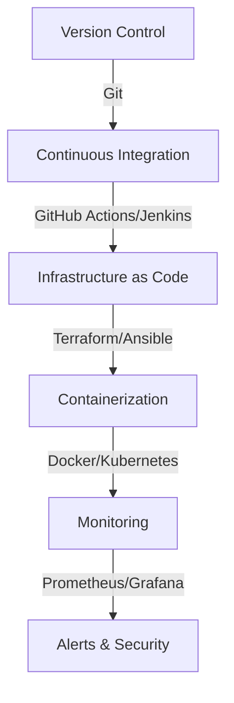

# **Code Examples for DevOps Practices**
### **Table of Contents**

- [**1. Introduction**](#1-introduction)
- [**2. Version Control**](#2-version-control)
- [**3. Continuous Integration (CI)**](#3-continuous-integration-ci)
- [**4. Infrastructure as Code (IaC)**](#4-infrastructure-as-code-iac)
- [**5. Containerization and Orchestration**](#5-containerization-and-orchestration)
- [**6. Monitoring and Alerts**](#6-monitoring-and-alerts)

---

## **1. Introduction**

This guide provides practical **code examples** for implementing **DevOps best practices** using **Git, CI/CD, IaC, Docker, Kubernetes, and monitoring tools**.



> **Tip:** These examples can be **modified** to fit specific **DevOps pipelines**.

---

## **2. Version Control**

Version control ensures **code integrity** and **collaboration**.

### **2.1 Git Basics**

```bash
# Initialize a repository
git init

# Clone a repository
git clone https://github.com/example/repo.git

# Create a new branch
git checkout -b feature-branch

# Stage and commit changes
git add .
git commit -m "Initial commit"

# Push to remote repository
git push origin feature-branch

# Merge branches
git checkout main
git merge feature-branch
```

> **Tip:** Use **branching strategies** like **GitFlow** for effective collaboration.

---

## **3. Continuous Integration (CI)**

CI automates **testing and building**.

### **3.1 GitHub Actions Workflow**

```yaml
name: CI Pipeline

on:
  push:
    branches:
      - main

jobs:
  build:
    runs-on: ubuntu-latest

    steps:
      - uses: actions/checkout@v2

      - name: Set up Node.js
        uses: actions/setup-node@v2
        with:
          node-version: '16'

      - run: npm install
      - run: npm test
      - run: npm run build
```

### **3.2 Jenkins Pipeline**

```groovy
pipeline {
    agent any
    stages {
        stage('Build') {
            steps {
                sh 'npm install'
            }
        }
        stage('Test') {
            steps {
                sh 'npm test'
            }
        }
        stage('Deploy') {
            steps {
                sh 'npm run deploy'
            }
        }
    }
}
```

> **Tip:** Use **CI/CD pipelines** to **automate testing** before deployment.

---

## **4. Infrastructure as Code (IaC)**

IaC ensures **repeatability** and **automation**.

### **4.1 Terraform for Azure**

```hcl
provider "azurerm" {
  features {}
}

resource "azurerm_resource_group" "example" {
  name     = "example-resources"
  location = "East US"
}

resource "azurerm_virtual_network" "example" {
  name                = "example-vnet"
  address_space       = ["10.0.0.0/16"]
  location            = azurerm_resource_group.example.location
  resource_group_name = azurerm_resource_group.example.name
}
```

### **4.2 Ansible Playbook**

```yaml
- hosts: web_servers
  become: yes
  tasks:
    - name: Install Nginx
      apt:
        name: nginx
        state: present

    - name: Start Nginx
      service:
        name: nginx
        state: started
```

> **Tip:** Use **Terraform for provisioning** and **Ansible for configuration management**.

---

## **5. Containerization and Orchestration**

Containers ensure **consistency across environments**.

### **5.1 Dockerfile**

```dockerfile
FROM node:16
WORKDIR /app
COPY package*.json ./
RUN npm install
COPY . .
EXPOSE 3000
CMD ["npm", "start"]
```

### **5.2 Kubernetes Deployment**

```yaml
apiVersion: apps/v1
kind: Deployment
metadata:
  name: example-app
spec:
  replicas: 3
  selector:
    matchLabels:
      app: example
  template:
    metadata:
      labels:
        app: example
    spec:
      containers:
      - name: example-container
        image: example-image:v1
        ports:
        - containerPort: 80
```

> **Tip:** Use **Kubernetes Helm charts** for **simplified deployments**.

---

## **6. Monitoring and Alerts**

Monitor infrastructure and detect anomalies.

### **6.1 Prometheus Alert Rule**

```yaml
groups:
  - name: example-alerts
    rules:
      - alert: HighCPUUsage
        expr: node_cpu_seconds_total > 80
        for: 5m
        labels:
          severity: warning
        annotations:
          summary: "High CPU usage detected"
          description: "CPU usage is above 80% for the past 5 minutes."
```

### **6.2 Grafana Dashboard**

```json
{
  "dashboard": {
    "title": "Example Dashboard",
    "panels": [
      {
        "type": "graph",
        "title": "CPU Usage",
        "targets": [
          {
            "expr": "node_cpu_seconds_total",
            "legendFormat": "{{cpu}}"
          }
        ]
      }
    ]
  }
}
```

> **Tip:** Use **Grafana** with **Prometheus** for **real-time insights**.

---
### **7.  Next step:**
- [guide_setting_up_redis](guide_setting_up_redis.md)