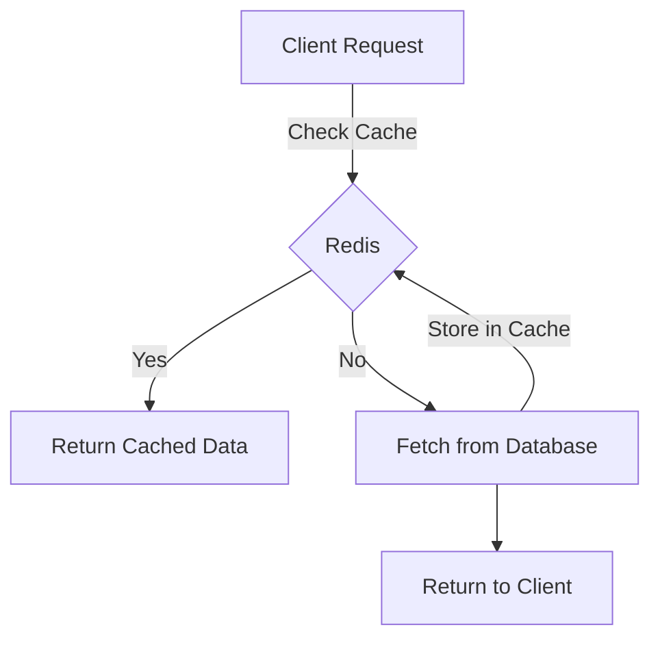

# **Guide to Setting Up Redis**

### **Table of Contents**

- [**1. Introduction**](#1-introduction)
- [**2. Why Use Redis?**](#2-why-use-redis)
- [**3. Installing Redis**](#3-installing-redis)
- [**4. Configuring Redis**](#4-configuring-redis)
- [**5. Basic Redis Commands**](#5-basic-redis-commands)
- [**6. Monitoring Redis**](#6-monitoring-redis)
- [**7. Best Practices**](#7-best-practices)
- [**8. Further Reading**](#8-further-reading)

---

## **1. Introduction**

Redis (**Remote Dictionary Server**) is an **in-memory key-value store** designed for high performance. It is widely used for:

- **Caching**
- **Session storage**
- **Message brokering**
- **Real-time analytics**



> **Why Redis?** It is **fast, scalable, and flexible**, making it a preferred choice for real-time applications.

---

## **2. Why Use Redis?**

|**Feature**|**Benefit**|
|---|---|
|**Blazing Fast**|Handles **millions of requests** per second.|
|**Data Persistence**|Supports **AOF (Append-Only File)** and **RDB snapshots**.|
|**Rich Data Types**|Stores **strings, hashes, lists, sets, sorted sets, streams, and more**.|
|**Scalability**|Supports **sharding and clustering**.|
|**Pub/Sub Messaging**|Ideal for **real-time notifications and chat systems**.|

> **Example:** A **real-time analytics dashboard** uses Redis to store and quickly retrieve **live user metrics**.

---

## **3. Installing Redis**

### **3.1 Installing Redis Locally**

#### **For Ubuntu/Debian**

```bash
sudo apt update
sudo apt install redis-server -y
sudo systemctl enable redis
sudo systemctl start redis
```

#### **For macOS (Using Homebrew)**

```bash
brew install redis
brew services start redis
```

#### **Verify Installation**

```bash
redis-cli ping
# Output: PONG
```

---

### **3.2 Running Redis with Docker**

```bash
docker run -d --name redis-server -p 6379:6379 redis
```

**Persisting Data with a Volume:**

```bash
docker run -d --name redis-server -p 6379:6379 -v ~/redis-data:/data redis --appendonly yes
```

---

### **3.3 Cloud Deployment**

#### **AWS Elasticache**

1. Navigate to AWS Elasticache.
2. Create a Redis Cluster.
3. Configure **Security Groups**.
4. Use **Cluster Endpoint** in your application.

#### **Azure Cache for Redis**

1. Create a Redis instance via the **Azure Portal**.
2. Select pricing tier & configure settings.
3. Use the **provided connection string**.

> **Tip:** Cloud-based Redis services handle **scalability and availability** automatically.

---

## **4. Configuring Redis**

The **Redis configuration file** (`redis.conf`) controls behavior. Common settings:

|**Setting**|**Description**|
|---|---|
|`bind`|Defines which IPs Redis listens to.|
|`requirepass`|Enables password authentication.|
|`maxmemory`|Sets a memory limit for Redis.|
|`appendonly`|Enables persistent storage.|

### **Example: Enabling Password Authentication**

Edit `redis.conf`:

```conf
requirepass my_secure_password
```

Restart Redis:

```bash
sudo systemctl restart redis
```

---

## **5. Basic Redis Commands**

### **5.1 Common Commands**

|**Command**|**Description**|
|---|---|
|`SET key value`|Stores a key-value pair.|
|`GET key`|Retrieves the value of a key.|
|`DEL key`|Deletes a key.|
|`INCR key`|Increments a numeric value by 1.|
|`EXPIRE key seconds`|Sets a TTL (Time-To-Live).|

#### **Example Usage**

```bash
redis-cli
SET user:123 "John Doe"
GET user:123
# Output: "John Doe"
```

---

### **5.2 Redis for Session Storage**

Example: **Using Redis for session management in Flask (Python)**.

```python
from flask import Flask, session
from redis import Redis

app = Flask(__name__)
app.config['SESSION_TYPE'] = 'redis'
app.config['SESSION_REDIS'] = Redis(host='localhost', port=6379)

@app.route('/')
def index():
    session['username'] = 'john_doe'
    return f"Session stored for {session['username']}"

if __name__ == '__main__':
    app.run(debug=True)
```

---

## **6. Monitoring Redis**

Effective **monitoring** prevents bottlenecks and ensures optimal performance.

|**Tool**|**Usage**|
|---|---|
|`redis-cli INFO`|Displays **memory, CPU usage, and active connections**.|
|**Prometheus**|Integrates with Redis for **metrics tracking**.|
|**Redis Monitor**|Logs **real-time commands** being executed.|

#### **Example: Checking Memory Usage**

```bash
redis-cli INFO memory
```

---

## **7. Best Practices**

✅ **Enable Persistence**: Use **AOF or RDB snapshots** for data durability.  
✅ **Secure Your Instance**: Enable **password authentication** and restrict network access.  
✅ **Use Expiry for Caching**: Set TTL (`EXPIRE key seconds`) for temporary data.  
✅ **Optimize Data Structures**: Choose efficient structures (**hashes over strings** for key-value pairs).  
✅ **Scale with Clustering**: Use **Redis Cluster** to distribute data across multiple nodes.

---

## **8. Further Reading**

- 📖 [**Redis Official Documentation**](https://redis.io/documentation)
- 🛠️ [**Docker Hub Redis Image**](https://hub.docker.com/_/redis)
- 🚀 [**AWS Elasticache for Redis**](https://aws.amazon.com/elasticache/redis/)
- 🔗 [**Azure Cache for Redis**](https://learn.microsoft.com/en-us/azure/azure-cache-for-redis/)

> **Next:** Learn about **[performance_optimization_and_caching](../02_Setup_and_Configuration/Containerization_and_Deployment/performance_optimization_and_caching.md).**

---

### **Next Steps**

📌 **Continue with:** [presentation_overview](presentation_overview.md)